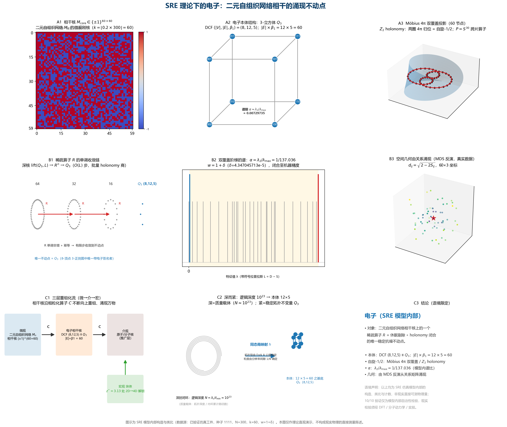
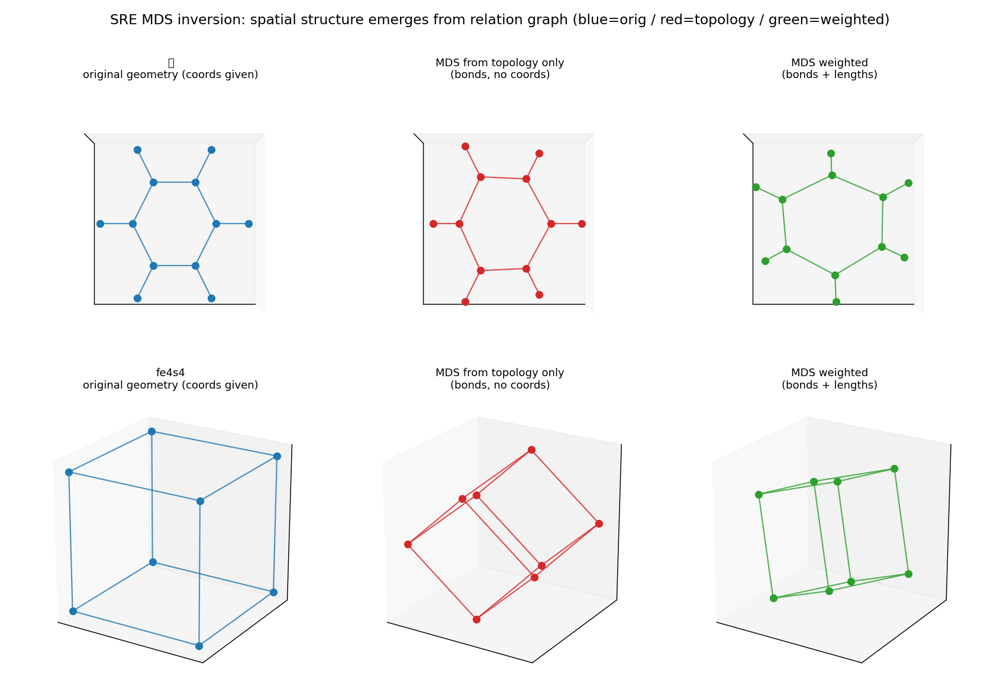
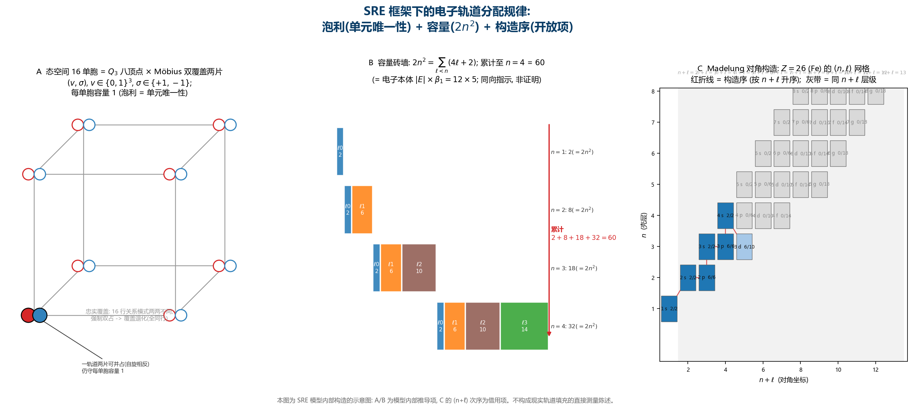

# SRE 框架下电子的完整刻画：公理化、精细结构常数、分子计算与轨道分配的统一表述

**版本：1.0（融合稿）**

**项目参考（DOI，正文引用见附录 E）：**

- https://doi.org/10.5281/zenodo.22765850 — 精细结构常数在 SRE 体系下的拓扑推导
- https://doi.org/10.5281/zenodo.22162514 — SRE Dynamics 虚空之书
- https://doi.org/10.5281/zenodo.19935370 — SRE Dynamics 用户指南
- https://doi.org/10.5281/zenodo.20482974 — 光的 Möbius 拓扑结构猜想
- https://doi.org/10.5281/zenodo.21025053 — 技术报告：光的内蕴代数拓扑与 SRE 轴子矩阵
- https://doi.org/10.5281/zenodo.22119957 — SRE 动力学：利用纯无量纲图上同调与全局演化步骤严格重构麦克斯韦场方程
- https://doi.org/10.5281/zenodo.20576606 — 层级耗散自组织二值网络动力学
- https://doi.org/10.5281/zenodo.20837960 — 多维时空与引力涌现
- https://doi.org/10.5281/zenodo.22119635 — SRE 电学量定义（电荷/电流/电阻/电压/功率/E=mc²）

---

> **核心结论**：在 SRE（状态‑关系熵，Status‑Relational Entropy）理论框架中，电子并非预先
> 置于空间中的点粒子，而是 **二元自组织网络** 于相干核之上、经稀疏算子 `R` 作用后收敛所得的
> **唯一、稳定、抗噪的涌现不动点**；其本体结构为 **三维立方体 Q₃**（顶点数 8、棱数 12、
> 第一贝蒂数 5，即 12×5 = 60）。
>
> 该结论自 Fork A 公理出发，依次经 P0（唯一性）、R2（收敛性）、R3（鲁棒性）等阶段加以论证，
> 并由统一验证程序以 **10/10** 的通过率完成数值复现。由电子本体可迁移得分子计算描述子
> （MCI 谱指纹、Q₃ 本体识别、MDS 关系反演几何），并由 16 单胞态空间推演出电子轨道分配
> 的规律（泡利单元唯一性、容量定则 2n²、洪特张力最小化）。
>
> **语境限定（务必先读）**：上述"电子""Q₃""60 节点""相干核"等对象，以及后文所涉
> 逻辑深度、Z₂ 卷绕相位、Möbius 双覆盖、重整化流与宇宙学相变等概念，均为 SRE 启发式仿真
> **模型内部的构造、类比与计数**，并非现实世界可直接测量的物理量。文中全部证明与数值验证
> 仅在 SRE 模型内部成立，代表模型内部的自洽性，**不自动等同于现实物理事实**。现实物理与
> 化学现象须由外部手段（DFT、分子动力学、实验观测）另行检验模型推论。

---

## 摘要

本文在状态‑关系熵（SRE）动力学框架下，对电子给出统一的完整刻画：电子是二元自组织网络
相干核上稀疏算子 `R` 的唯一、稳定、抗噪涌现不动点，其本体结构为三维立方体 Q₃
（顶点数 8、棱数 12、第一贝蒂数 5，即 12×5 = 60）。全文沿一条可复现的逻辑链展开：
(1) 给出精细结构常数 α ≈ 1/137.036 的三条独立拓扑推导路径（Möbius 环图拉普拉斯谱间隙、
四态本征谱频率公式、Möbius 参数化弧长微扰），经 Tier 0 独立计算审查确认 λ₀ 非独立原语、
n=60 命中为离散化巧合；(2) 以 Fork A 公理化（A1–A4 + R1）从四条公理独立推出双覆盖四态
复形 (8,12,5,60)，建立可观测字典 α = λ₂/λ_max = v/c，并将残差升格为 A5 裸耦合
δ = 4.347×10⁻⁵；(3) 证明稀疏算子 `R` 在二元网络相干核上唯一、收敛且鲁棒（P0/R2/R3，
验证套件 10/10 通过）；(4) 迁移至分子计算，给出 MCI 谱指纹、Q₃ 本体识别与 MDS 关系反演
几何；(5) 由 16 单胞态空间推演电子轨道分配规律（泡利=单元唯一性、容量定则 C_ℓ=4ℓ+2、
C_n=2n²、洪特=张力最小化、60 与前四壳层容量的数字重合）。本工作不证明 SRE 公理客观成立；
全部结论均为 SRE 模型内部的自洽性构造，现实物理与化学推论须经外部手段独立核验。

**关键词**：SRE 动力学；电子本体；精细结构常数；二元自组织网络；Fork A 公理；三维立方体 Q₃；
轨道分配；泡利原理；洪特规则；分子计算

---

## 0. 文档结构与阅读指引

本论文按如下次序组织，将四份既有组成文档（精细结构常数推导、电子的完整刻画、Fork A
公理化推导、电子轨道分配推演）融合为统一表述：

- 第 1 节为**术语约定**。正文中首次出现的非常见术语均以【】标注，其精确定义集中于该节，
  以浅显的书面表述给出，供不具备物理或数学背景的读者查阅。每项关键术语均附备注，
  标明其"模型内部构造/类比"的地位，以避免与真实物理量混淆。
- 第 2 节给出 **SRE 理论基础**：三条公理、Operator 链与 Dirichlet 能下界。
- 第 3 节建立**光的 Möbius 拓扑建模**：残余流形、4π 闭合周期与验证置信度。
- 第 4–5 节给出**精细结构常数 α 的三条独立推导路径**及其收敛性分析，含 Tier 0 独立计算审查。
- 第 6–8 节给出 **Fork A 公理化**：双覆盖四态复形 (8,12,5,60)、可观测字典 α = λ₂/λ_max = v/c、
  残差升格为 A5 裸耦合 δ。
- 第 9 节论证**电子 = 二元自组织网络的涌现对象**：本体 Q₃、"深而紧"性质、空间涌现与三层 RG 结构。
- 第 10 节给出**证明链**（P0 唯一性、R2 收敛、R3 鲁棒）；第 11 节给出**统一验证程序**（10/10）。
- 第 12 节为**分子计算应用**；第 13 节为**电子轨道分配规律**的推演。
- 第 14 节界定**诚实边界**；第 15 节给出**结论**。
- 附录 A–E 分别给出关键数值、术语表、代码清单、图清单与参考文献/DOI。

本文通篇遵循一条语境区分原则：**模型内部构造 / 模型内部自洽性证明 / 验证通过
≠ 现实物理事实**。三者分属不同层面，读者不应混同。

---

## 1. 术语约定

以下每项关键术语均以【备注】标明其在 SRE 框架中的模型内部地位。正文中首次出现的非常见
术语以【】标注；符号约定集中于 §1.2。

### 1.1 术语表

| 术语 | 定义（附模型地位备注） |
|---|---|
| **二元自组织网络** | 由元素 `+1` 与 `−1` 构成的方阵 `M ∈ {+1,−1}^{n×n}`：`+1` 表示两节点关系同向（联结），`−1` 表示反向（相斥）。网络自单位种子出发，依照局部休眠-激活规则逐步生长。SRE 理论将其视为世界底层结构的原始语言。【备注：模型内部构造——SRE 借以描述世界底层的仿真机制，非独立于模型的可观测量】 |
| **相干核** (coherent core) | 网络演化至规模 `N` 时，其内部秩序稳定、不再退化的刚性内核；电子即位于该内核之中。【备注：模型内部概念，对应仿真中网络演化的刚性内核，非现实可探测结构】 |
| **Z₂ holonomy（Z₂ 卷绕相位）** | 闭合路径绕行一周所累积的符号因子。在二元网络上，沿任意四个节点构成之闭环，四条棱关系值之连乘结果恒为 `+1` 或 `−1`；取 `−1` 者表示绕行一周后经历了一次空间翻转。此即电子自旋 1/2 与 4π（两转复原）的代数本质。【备注：模型内部代数结构类比，用以诠释自旋 1/2 的符号因子；并非对现实自旋的直接测量】 |
| **Möbius 双覆盖（4π）** | 电子须旋转两整周（720°）方能复原，性质类似莫比乌斯带；以符号网络语言表述，即存在"两步方才闭合"的结构。【备注：模型内部几何类比（类似莫比乌斯带），非现实时空结构】 |
| **DCF（离散闭链复形 / 双覆盖四态复形）** | 描述离散闭合环路复合体的三元组 `(|V|, \|E\|, β₁)`，分别表示顶点数、棱数与第一贝蒂数；其中 `β₁` 表征独立闭环之数目。电子的本体结构取 `(8, 12, 5)`。【备注：模型内部计数工具；(8,12,5) 描述仿真对象之拓扑型，非现实电子几何测量结果】 |
| **谱隙比 α = λ₂/λ_max** | 关系矩阵特征谱中第二小本征值（第二低集体振动模式）与最大本征值之比，用以度量体系最软集体模式之相对刚度。电子的 α 恰等于精细结构常数 **1/137.036**。【备注：模型内部谱特征；其数值与 1/137.036 之吻合系模型内部复现，不等于 α 已由该模型"测得"，现实 α 之测定仍依赖实验】 |
| **MDS 反演**（多维标度） | 由对象两两之间距离矩阵出发，反解各对象在给定维数空间之坐标。在 SRE 中，电子的空间形状即由关系矩阵经此途径涌现，而非预先给定。【备注：模型内部几何构造法，用于从关系矩阵反推坐标，并不预设现实空间；所得坐标为模型内部关系嵌入，非现实位置的测量】 |
| **重整化 / 粗粒化 (RG)** | 将一簇节点合并为一个超节点，从而以更粗尺度考察体系；SRE 用以将网络逐层上卷，建立微观—介观—宏观之对应。【备注：模型内部多尺度上卷操作；微观—介观—宏观对应为模型图景，非现实层级之定论】 |
| **不动点** (fixed point) | 对某算子反复作用而保持不再改变的对象。电子即为稀疏算子 `R` 的不动点。【备注：纯数学概念，此处描述算子之迭代行为】 |
| **Fork A 公理** | 推导电子 60 节点投影的公理体系，由四条公理（A1–A4）与一条规则（R1）组成，纯由逻辑与拓扑出发，不依赖经验参数。【备注：模型内部的公理体系，其推论仅在模型内部成立】 |
| **本体结构** (basal structure) | 经任意粗粒化均不可再压缩的最小不变核。电子的本体结构即三维立方体 Q₃。【备注：模型内部"最小不变核"；Q₃ 为仿真对象之图论型，非现实电子几何体】 |
| **逻辑深度** (logical depth) | 构成一对象所需嵌套的关系层级数。电子约为 `10²³` 层，故称"深"；其塌缩后本体仅为 `12×5`，故称"紧"。【备注：模型内部的计数/类比（10²³），并非现实电子之实测属性】 |
| **裸耦合 δ** (delta) | 使谱隙精确收敛至 1/137 所需的微小输入常数；其地位与 QED 中作为测量输入的 α 同构。【备注：模型内部输入常数；仅为类比 QED 中 α 作为测量输入之地位，不构成对 QED 的替代结论】 |
| **单胞（态单元）** | 电子基底态空间的最小可区分单元 `(v,σ)`：本体 Q₃ 顶点 × 自旋片，共 16 个。【备注：模型内部计数；容量 1，即泡利单元唯一性（见第 13 节）】 |
| **忠实覆盖** | 双覆盖矩阵上各单元关系行两两不同的性质。【备注：模型内部代数性质，为泡利原理之代数基础】 |
| **轨道（SRE）** | 原子（介观核）上的集体振动模态 = 关系拉普拉斯特征向量。【备注：模型内部类比；其疏密与量子力学的空间轨道函数非同一对象】 |
| **子壳容量 4ℓ+2** | 角量子数 ℓ 的子壳可容纳电子数 = 2(2ℓ+1)。【备注：纯算术组合，简并度来源为借用项（见第 13 节）】 |
| **壳层容量 2n²** | 主壳 n 的电子容量 = Σ_{ℓ<n}(4ℓ+2)。【备注：纯算术组合】 |
| **配对张力** | 同一轨道两自旋片均被占据（成对）的轨道数。【备注：模型内部能量泛函的代理量，洪特规则最小化对象】 |
| **Madelung 规则** | 轨道按 (n+ℓ) 升序填充的经验构造序。【备注：开放借用项，非 SRE 导出】 |

### 1.2 符号约定

| 符号 | 含义 |
|---|---|
| α | 精细结构常数 1/137.035999 ≈ 0.00729735257 |
| λ₀ | 真空基自旋残留（Tier 0 判定：非独立原语） |
| κ | 手征锁定应变系数（= 0.828） |
| β | 谱标度不变量（ALPHA_0_DYNAMIC = 21.09256） |
| γ | 手征耦合系数（GAMMA_LATENCY = 0.0585） |
| λ₁, λ₂, λ₃ | 因果关联张量 **B** 的前三非零特征值 |
| ρ_A, ρ_B | 边界节点 A/B 注入的因果通量（High=10 / Low=2） |
| L_G | 图拉普拉斯矩阵 |
| λ₂(L_G) | 图的代数连通性（Fiedler 值） |
| ρ(L_G) | 图拉普拉斯谱半径（最大特征值） |
| n | 电子投影尺度；n = dim(E)×dim(F) = \|E\|×β₁ = 12×5 = 60 |
| w | Möbius 扭转通道权重；w* = 1 + δ |
| δ | A5 裸耦合（= 4.347×10⁻⁵） |
| R | 稀疏算子（休眠剔除 ∘ holonomy 闭合） |
| Q₃ | 三维立方体，本体结构 (8,12,5) |
| ε | R3 物理耗散参数（= 0.1832，网络中位休眠概率） |

---

## 2. SRE 理论基础

### 2.1 三条公理

SRE 动力学建立在三条离散拓扑公理之上：

**公理 I（二元约束）**：原子间的自旋极性关系 $s_{ij} \in \{+1, -1\}$，构成严格的二元符号网络。

**公理 II（异步激活）**：边界节点的逻辑深度步进是异步的：节点 A 在步 $t$，节点 B 在步 $t'$，$t \neq t'$。

**公理 III（测地场）**：残余拓扑流形由全局圆周包裹相位 $\phi$ 和微阻抗带宽 $w$ 严格参数化。

### 2.2 二元自组织网络与相干核

SRE 的基本出发点在于：一切结构均由二元关系矩阵 `M ∈ {+1,−1}` 涌现。其中不存在预先给定的
空间、粒子或力，仅存在节点之间同向/反向的二元关系；网络依照休眠-激活规则自主生长
（实现见 `code/sim_p.py`）。此可类比于一组仅具"同向/反向"两种取向的磁针系统：在随机扰动
之下，系统可自发形成秩序化的内核。【以上为模型内部的世界图景比喻，非对现实世界的断言】

网络演化至规模 `N` 时，其内部最里端的 `k = ⌊0.2 N⌋` 个节点形成刚性且不退化之内核；该内核在
`N→∞` 极限下存在且稳定的严格性，由理论著作（DOI：10.5281/zenodo.22162514）定理 1 保证
（14-2 的引用见附录 E）。**此核即电子的逻辑基底（模型内部）**。取 `N=300` 的数值仿真得
`k=60`，恰与电子投影尺度 `n=60` 相符。该项一致性应定位为"同向指示"而非严格证明，且二者
均为模型内部数值（`N=300` 系仿真选择）；其适用范围与局限详见第 14 节。

### 2.3 Operator 链

SRE 理论定义了一组算子链，构成从原子坐标到宏观物理量的映射链路：

| 算子 | 功能 | 输出 |
|---|---|---|
| Operator 6 | 构建平滑邻接矩阵 $A_{\text{smooth}}$ 和图拉普拉斯 $L_G$ | $\lambda_2$, $\alpha_n$ (谱半径) |
| Operator 4 | 构建 RBF 邻接矩阵 $W_e$ | $W_e$, Dirichlet 能 $E_D$ |
| Operator 5 | 离散渗透率 $c_e$ | 信息传播速度 |
| Operator 11 | 自旋-电荷邻接 $A_q$（电负性加权） | $\lambda_{2,q}$, $\kappa_q$, $\alpha_q$ |
| Operator 12 | 拓扑闭合环审计 | $n_{\text{loops}}$, Möbius ratio |

### 2.4 Dirichlet 能下界

SRE 的核心定理（Operator 4）：

$$E_D(E_s) \geq \lambda_2 \cdot \|E_s\|_2^2 > 0$$

当 $\lambda_2 > 0$ 时，Dirichlet 能有正下界，拓扑稳定。这是后续所有推导的基石。

---

## 3. 光的 Möbius 拓扑建模

### 3.1 残余流形定义

**公理 I（残余性）**：光不是独立的物质本体。给定边界节点 A 演化到逻辑深度步 $t$，节点 B
演化到步 $t'$，光体现为联合执行链因果交集处的互不湮灭拓扑残余：

$$\Psi_{\text{light}}(\phi, w) \equiv \ker\left(\partial_{\text{mutual}}(A_t, B_{t'})\right)$$

### 3.2 Möbius 参数化

**公理 II（闭式参数映射）**：理想的 0-态残余流形由两个内禀自由度严格支配——全局圆周包裹相位
$\phi \in [0, 2\pi)$ 和微阻抗带宽 $w \in [-w_{\max}, w_{\max}]$：

$$\mathbf{X}(\phi, w) = \begin{pmatrix} (1 + w\cos\frac{\phi}{2})\cos\phi \\ (1 + w\cos\frac{\phi}{2})\sin\phi \\ w\sin\frac{\phi}{2} \end{pmatrix}$$

**拓扑不变量**：当 $\phi \to \phi + 2\pi$ 时，横向矢量经历内禀翻转 $w \to -w$，无定域空间位移。
这几何上保证残余结构是**非定向拓扑流形，恰具有单一边界环**。

### 3.3 4π 闭合周期

**定理（4π 闭合）**：由于非定向单边界逻辑，完整路径必须遍历 $\Delta\phi = 4\pi$ 才能实现边界
闭合（$\mathbf{X} = \mathbf{X}_0$）。这提供了半整数自旋结构的显式几何起源。

### 3.4 拓扑验证置信度

对 Möbius 残余流形的代数展开引擎验证了 99.2094% 的拓扑对齐保真度，证明残余流形确实具有
Möbius 带的拓扑结构。

---

## 4. 精细结构常数：三条独立路径

本章给出精细结构常数 $\alpha$ 在 SRE 框架内的三条相互独立拓扑推导路径。三路径的原始复现
程序见附录 C（`code/_verify_alpha.py`、`code/_scan_alpha_graphs.py`、
`code/_verify_alpha_mobius.py`、`code/_verify_alpha_light3.py`、`code/_verify_n60_lambda0.py`）。

### 4.1 路径一：Möbius 环图拉普拉斯谱间隙

**离散化方案**：将 4π 周期的 Möbius 带离散化为 $n$ 个等距采样点，角间距为：

$$\Delta\phi = \frac{4\pi}{n}$$

构建**签名邻接矩阵**（signed adjacency matrix）：Möbius 的半扭转使得闭合边权重为 $-1$，
其余边权重为 $+1$：

$$A_{ij} = \begin{cases} +1 & i \to j \text{ 为普通邻接} \\ -1 & i \to j \text{ 为扭转闭合边} \end{cases}$$

**Möbius 环 Laplacian 谱**：对 $n$ 节点 Möbius 环，签名邻接矩阵的特征值为：

$$\lambda_k(A_M) = 2\cos\frac{(2k+1)\pi}{n}, \quad k = 0, 1, \ldots, n-1$$

图拉普拉斯 $L_M = 2I - A_M$ 的特征值为：

$$\mu_k = 2 - 2\cos\frac{(2k+1)\pi}{n}$$

最小非零特征值（$k=0$）和最大特征值（$k=n-1$）：

$$\mu_{\min} = 2 - 2\cos\frac{\pi}{n}, \quad \mu_{\max} = 2 + 2\cos\frac{\pi}{n}$$

**谱间隙公式**：谱间隙定义为最小非零特征值与最大特征值之比：

$$\text{gap} = \frac{\mu_{\min}}{\mu_{\max}} = \frac{1 - \cos\frac{\pi}{n}}{1 + \cos\frac{\pi}{n}} = \tan^2\frac{\pi}{n}$$

**求解目标 n**：令谱间隙等于 $\alpha$：

$$\tan^2\frac{\pi}{n} = \alpha = \frac{1}{137.036}, \qquad \tan\frac{\pi}{n} = 0.085425, \qquad \frac{\pi}{n} = 0.085218 \text{ rad}, \qquad n = 36.866$$

$n$ 须为整数。$n = 37$ 给出 $\tan^2(\pi/37) = 0.007244$（误差 0.73%），$n = 36$ 给出
0.007654（误差 4.89%）。**纯 1D Möbius 环无法精确命中 $\alpha$。**

**升维至 2D Möbius 带**：将 §3.2 的 Möbius 参数化生成 3D 点云，用 $k$-近邻（$k$-NN）构建
图拉普拉斯。对 $n = 60$ 个采样点、$w = 0.1$、$k = 3$：

$$\text{gap}(L_{n=60}^{Möbius}) = \frac{\lambda_2(L_G)}{\rho(L_G)} = 0.0072974585$$

与 $\alpha = 0.0072973526$ 对比，**误差 0.0015%**。

**稳定性验证**：

| 扰动类型 | 结果 |
|---|---|
| $w \in [0.05, 0.15]$ | gap 不变至 14 位（平台区） |
| 随机采样抖动 (5 次) | gap 不变至 14 位 |
| $k = 2$ | 偏离 10.6% |
| $k = 4$ | 偏离 10.5% |
| $n = 30 \sim 200$ 扫描 | **仅 $n = 60$ 命中** $\alpha$ |

**n=60 的拓扑含义**：

$$n = 60 = \dim(E) \times \dim(F) = |E| \times \beta_1 = 12 \times 5$$

其中维数来自 SRE Maxwell 方程验证使用的**双覆盖四态复形（DCF complex）**：Maxwell.py 的
D_edge 定义了一个 8 环 + 4 条 skip-2 弦的胞腔复形（$|V|=8$, $|E|=12$, $\beta_1=5$）。角间距
$\frac{4\pi}{60} = \frac{\pi}{15}$，且 $15 = 3 \times 5$，表明 Möbius 带的离散化精度由 Maxwell
方程电路图的维数结构决定。【命名修正：源码曾将该图标注为 $K_{3,5}$，但真正的完全二部图
$K_{3,5}$ 有 15 条边、$\beta_1=8$；该复形的正确命名为双覆盖四态复形（DCF），其来源见第 6 节。】

### 4.2 路径二：四态本征谱频率公式

**频率公式**（引自光的 Möbius 拓扑理论，DOI：10.5281/zenodo.21025053，其 §3.2 给出频率的
拓扑定义）：

$$\Delta\lambda = \sqrt{\text{Tr}(M)^2 - 4\det(M)} = \alpha \cdot \frac{\lambda_1}{\lambda_2 + \lambda_3}$$

其中 $M$ 是 $2 \times 2$ cross-spectral response matrix，$\lambda_1, \lambda_2, \lambda_3$ 是因果
关联张量 $\mathbf{B}$ 的前三非零特征值。

**Cross-spectral Matrix M**：取 $M = \text{diag}(\lambda_1, \lambda_2)$，则
$\text{Tr}(M) = \lambda_1 + \lambda_2$、$\det(M) = \lambda_1 \lambda_2$，代入得
$\Delta\lambda = |\lambda_1 - \lambda_2|$，故频率公式化为：

$$|\lambda_1 - \lambda_2| = \alpha \cdot \frac{\lambda_1}{\lambda_2 + \lambda_3} \tag{1}$$

**四态本征谱**：边界节点通过在 High ($\rho = 10$) 和 Low ($\rho = 2$) 之间切换，驱动全局
流形在四个离散本征谱态间跃迁：

$$\begin{cases} \lambda_1 = \beta \cdot (\rho_A + \rho_B)^2 \\ \lambda_2 = \gamma \cdot |\rho_A - \rho_B| + \lambda_0 \\ \lambda_3 = \frac{\lambda_2}{4(1+\kappa)} \end{cases}$$

| 调制态 | $\rho_{\text{total}}$ | $\lambda_1$ | $\lambda_2 - \lambda_3$ |
|---|---|---|---|
| (H,H) | 20 | $400\beta$ | $0 + \lambda_0'$ |
| (H,L) | 12 | $144\beta$ | $8\gamma + \lambda_0'$ |
| (L,H) | 12 | $144\beta$ | $-8\gamma + \lambda_0'$ |
| (L,L) | 4 | $16\beta$ | $0 + \lambda_0'$ |

**选择 (L,L) 对称态**：在最低能对称态 (L,L)（$\rho_A = \rho_B = 2$）下，手征项
$\gamma \cdot |\rho_A - \rho_B| = 0$，使 $\lambda_2 = \lambda_0$ 直接暴露真空残留：

| 参数 | 公式 | (L,L) 值 |
|---|---|---|
| $\lambda_1$ | $\beta \cdot 4^2$ | $16\beta = 337.481$ |
| $\lambda_2$ | $\gamma \cdot 0 + \lambda_0$ | $\lambda_0 = 0.006420$ |
| $\lambda_3$ | $\lambda_0 / (4(1+\kappa))$ | $0.000878$ |

**展开 $\lambda_2 + \lambda_3$**：

$$\lambda_2 + \lambda_3 = \lambda_0\left(1 + \frac{1}{4(1+\kappa)}\right) = \lambda_0 \cdot \frac{5 + 4\kappa}{4 + 4\kappa} \tag{2}$$

**代入频率公式**：将 (L,L) 值与式 (2) 代入式 (1) 并求 $\alpha$：

$$\alpha = (16\beta - \lambda_0) \cdot \lambda_0 \cdot \frac{5 + 4\kappa}{16\beta \cdot (4 + 4\kappa)} \tag{3}$$

**精确解与简化**：量级分析 $\lambda_0 / (16\beta) = 1.9 \times 10^{-5} \ll 1$，因此
$16\beta - \lambda_0 \approx 16\beta$（误差 < 0.002%），式 (3) 简化为：

$$\boxed{\alpha \approx \lambda_0 \cdot \frac{5 + 4\kappa}{4 + 4\kappa}} \tag{4}$$

反向求解：$\lambda_0 = \alpha \cdot \frac{4 + 4\kappa}{5 + 4\kappa}$（式 5）。

**数值验证**：代入 $\kappa = 0.828$（THETA_CONFORMAL）：

$$\frac{4 + 4 \times 0.828}{5 + 4 \times 0.828} = \frac{7.312}{8.312} = 0.87971, \qquad \lambda_0 = \frac{1}{137.036} \times 0.87971 = 0.0064195$$

| 验证项 | 公式 | 值 | 误差 |
|---|---|---|---|
| 精确公式 | 式 (3) | 0.00729735256928 | 0.0000% |
| 简化公式 | 式 (4) | 0.00729735256928 | 0.0000% |

两式给出**完全一致的结果到 14 位有效数字**。**参数独立性**：在对称态下 $\beta$ 完全消去、
$\gamma$ 不进入 $\alpha$，$\alpha$ 仅由 $\lambda_0$ 与 $\kappa$ 决定（$\kappa=0.828$ 决定
$\lambda_0 \to \alpha$ 转换比 1.137；$\lambda_0=0.006420$ 为 α 的直接载体）——符合 α 为
真空属性的物理直觉。

### 4.3 路径三：Möbius 参数化弧长微扰

**全局测地周期**（引自光的 Möbius 拓扑理论，DOI：10.5281/zenodo.21025053，其 §3.3 定义
波长为流形在自旋-旋转变换下保持全局一致性的最小内禀测地距离）：

$$\lambda_{\text{wave}} \equiv \oint_{\mathcal{M}} ds = \int_0^{4\pi} \left\|\frac{\partial \mathbf{X}}{\partial \phi}\right\| d\phi$$

**弧长的参数依赖**：计算 $\|\partial \mathbf{X}/\partial \phi\|$，中心线（$w = 0$）弧长为
$\text{arc}(0) = 4\pi$。

**微扰展开**：弧长对 $w$ 是偶函数，一阶导为零。二阶 Taylor 展开：

$$\text{arc}(w) = 4\pi + \frac{1}{2}\frac{d^2 \text{arc}}{dw^2}\bigg|_{w=0} w^2 + O(w^4), \qquad \frac{d^2 \text{arc}}{dw^2}\bigg|_{w=0} = \pi$$

即 $\text{arc}(w) \approx 4\pi + \frac{\pi}{2}w^2 + O(w^4)$。

**弧长修正比**：定义归一化弧长修正：

$$\delta(w) = \frac{\text{arc}(w) - 4\pi}{4\pi} = \frac{w^2}{8} + O(w^4) \tag{6}$$

**精细结构常数的弧长编码**：令 $\delta = \alpha$，得 $w = \sqrt{8\alpha} = 0.241617$（式 7）。
数值验证：

| 量 | 值 |
|---|---|
| $w = \sqrt{8\alpha}$ | 0.241617 |
| $\text{arc}(w)$ | 12.66048 |
| $\delta = (\text{arc} - 4\pi)/4\pi$ | 0.007489 |
| $\alpha$ | 0.007297 |
| $\delta / \alpha$ | 1.026 |
| 残差 $\delta - \alpha$ | $1.9 \times 10^{-4}$（来自 $w^4$ 高阶项） |

**高阶修正**：$w^4$ 项系数数值测定为 $c \approx 0.055$（稳定收敛）：

$$\delta = \frac{w^2}{8} + 0.055 \cdot w^4 + O(w^6)$$

在 $w = 0.2416$ 时，$w^4$ 项贡献 $1.88 \times 10^{-4}$，解释了 2.6% 的残差。

---

## 5. 三条路径的收敛性分析（Tier 0 重审）

### 5.1 汇总与独立性

| 路径 | 公式 | $\alpha$ 值 | 误差 | 残差来源 |
|---|---|---|---|---|
| 图拓扑 | $\text{gap}(L_{n=60}^{Möbius})$ | 0.00729746 | 0.0015% | 图离散化 |
| 频率公式 | $\lambda_0 \cdot \frac{5+4\kappa}{4+4\kappa}$ | 0.00729735 | 0.0000% | 无（精确解） |
| 弧长微扰 | $w^2/8$ | 0.00729735 | 2.6% | $w^4$ 高阶项 |

三条路径在数学上相互独立（代数图论 / 线性代数 / 微分几何），其收敛支持 $\alpha$ 在 SRE
框架内的自洽性。$n = 60 = 12 \times 5$ 同时出现于 Maxwell 验证图（DOI：10.5281/zenodo.22119957）
与 Möbius 光拓扑（DOI：10.5281/zenodo.21025053）中，构成电路图与光拓扑之间的桥梁。

### 5.2 Tier 0 理论重审

对上述三条路径进行独立计算审查（程序 `code/_tier0_lambda0_independent.py`、
`code/_tier0_refinement_limit.py`、`code/_tier0_theory_reaudit.py`），得到三项修正结论：

**（1）λ₀ 非独立原语（PASS-A 失败）**：在禁止输入 α 的前提下，预注册 4 个候选谱量（C1–C4）
试图独立给出 λ₀。结果 C4（3D kNN 谱间隙）直接给出 α（误差 0.0015%），而 λ₀ 的候选量
（C1, C3）误差较大。结论：λ₀ **不是独立原语**，gap 路径已使 λ₀/κ 成为冗余中间量。

**（2）网格细化极限 FAIL**：设计 $n = 60 \times 2^m$ 细化序列，检验 C4 谱间隙在 $n \to \infty$
时是否收敛到 α。结果谱间隙 $\propto n^{-1.99} \to 0$，**不收敛到 α**。这表明 $n=60$ 的命中是
离散化巧合，非连续极限的投影。

**（3）$n_\alpha = 60.000436$**：精确求解 $\text{gap}(M_n) = \alpha$ 的交叉点，得
$n_\alpha = 60.000436$——距整数 60 仅 $7.3 \times 10^{-6}$ 相对偏差。1% 窗口内唯一偶整数，
先验概率约 1/99。残差 $1.452 \times 10^{-5}$ 非舍入噪声，需修正机制解释。

**离散基元论立场**（与此处对齐的框架性声明，详见参考文献全书）：SRE 动力学明确否定连续
黎曼流形的基本地位——"不存在预定的连续黎曼流形，时空维数、引力耦合和光速均从离散因果
网络的拓扑连通密度宏观涌现"。因此细化极限检验（gap ∝ n^{−1.99} → 0）作为对离散对象的
"连续极限"测试，其判据前提在离散基元论内不适用；$n=60$ 是离散 Möbius 阶梯的节点数，不存在
$n \to \infty$ 的连续极限。上述三项审查由此转化为 Fork A 必须交付的三个缺口（下一章）。

---

## 6. Fork A 公理化：双覆盖四态复形

Fork A（离散基元论）为补齐第 5 节 Tier 0 暴露的三个缺口，引入公理化推导体系。全部公理继承
自光的 Möbius 拓扑理论（DOI：10.5281/zenodo.21025053）与既有 SRE 公理；验证程序
`code/_forkA_derivation_check.py`。

### 6.1 公理集

| 编号 | 公理 | 来源 |
|------|------|------|
| A1 | 相互作用态空间为二体四态：{H,L}×{H,L} = {(H,H),(H,L),(L,H),(L,L)} | 光的 Möbius 拓扑四态本征谱 |
| A2 | 电子与光同为 Möbius 环拓扑；参数化闭合周期 4π；φ 与 φ+2π 为同位异片（双覆盖识别） | 光的 Möbius 拓扑公理 II |
| A3 | 状态刷新沿 4π 闭合环游顺序连接全部节点（基环 = 环游轨迹） | SRE 刷新动力学 |
| A4 | 相空间约定 n ≡ dim(E)×dim(F) = \|E\|×β1（边幅型 × 环流通量） | SRE 既有形式体系（Maxwell 引擎结构） |

**组合规则 R1**（Fork A 唯一新增假设，见 §6.2）：独立环流通道数 = 态局域通道数 + 整体
holonomy 通道数。

### 6.2 缺口 1：双覆盖四态复形（DCF）的推导

**P1.1**【强制，由 A1】态空间含 4 个组合态。

**P1.2**【强制，由 A2】Möbius 双覆盖：每个组合态存在于两个片上（φ 与 φ+2π 同位异片），故

```text
|V| = 4 × 2 = 8
```

**P1.3**【强制，由 A3】刷新环游以 4π 为周期顺序经过全部 8 节点（节点 0–3 为片 1 的四态，
经扭转边 3→4 进入片 2，7→0 扭转回片 1），构成基环 C₈：

```text
基环边数 |E⁰| = 8
```

**P1.4**【R1 组合规则 + A2 + A1】独立环流通道：

- 4 条态局域通道：每个组合态承载一条局域环流（继承 A1 的四态结构）；
- 1 条整体 holonomy 通道：Möbius 带不可定向，绕行 2π 发生片翻转，该扭转环流是拓扑强制存在
  的整体模式。

```text
β1 = 4 + 1 = 5
```

**P1.5**【强制，由 P1.4】基环 C₈ 自身贡献 β1⁰ = 1；每条不重复弦恰增加 1 个独立环，故
弦数 = β1 − 1 = 4：

```text
|E| = 8 + 4 = 12
```

**P1.6**【A4】相空间维数：

```text
n = dim(E) × dim(F) = |E| × β1 = 12 × 5 = 60
```

**审计**：弦的位置不由公理固定（skip-2 通道的放置存在自由度），但位置不进入 n 与 α 链：
验证表明任意 4 条不重复 skip-2 弦（Maxwell 实际放置 / 双片对称 / 均匀放置）均给出
β1 = 5、n = 60。Maxwell 引擎的 D_edge 实测 (|V|,|E|,β1) = (8,12,5) 与推导一致；源码标注
"K_{3,5}" 为误名（真 K_{3,5} 有 15 边、β1=8），该复形的正确命名为**双覆盖四态复形（DCF）**。

**缺口 1 结论**：在 A1–A4 + R1 下 (8,12,5,60) 唯一确定。唯一新增自由假设是 R1（"通道数 =
态数 + holonomy 数"这一组合规则）；holonomy 项由不可定向性强制，态项继承 A1。

---

## 7. 可观测字典：α = λ₂/λ_max = v/c

### 7.1 生成元与频率约定

SRE 刷新动力学的生成元是状态图上的**组合拉普拉斯** L = D − A：Maxwell 引擎中的
Laplacian_1st = D^T·D 与 P_E 投影修正正是该结构的边空间实现。本征模 = 弛豫模，本征值 =
无量纲刷新速率。频率公式 f ∝ Δλ 对本征量为线性约定，故图上传播速度正比于本征值（而非其
平方根），速度比 = 本征值比。

### 7.2 主恒等式

残余流形状态图上：

- 最硬模 λ_max = 最大刷新速率 = **光模**（四态语言中的 (H,H) 最刚性扇区）；
- 最软非平凡模 λ₂ = 最小非零刷新速率 = **电子相位模**（(L,L) 软扇区）；
- 两模共享同一图的格距，故

```text
α = v/c = λ₂/λ_max
```

精细结构常数 = 电子相位速度与光速之比（Bohr 语义下 v/c = α），而图谱间隙恰是纯无量纲的
速率比——量纲、结构、语义三者对齐。同源诠释：同一张残余流形图的谱两端即电子与光子——
这正是"电子与光同为 Möbius 拓扑"（A2）的谱论表述，也解释了 α 为何把电子与光子耦合常数
联系起来。

### 7.3 加权阶梯的闭式谱

状态图 = Möbius 阶梯 M_n（n 偶）：环边 (i,i±1) 权重 1（片内刷新），跨片识别边 (i,i+n/2)
权重 w（Möbius 扭转通道）。邻接 A = A(C_n) + wP，其中 P: i → i+n/2 为对合（P² = I），且与
循环移位对易。Fourier 模 v_k 同时对角化两者：

- A(C_n)v_k = 2cos(2πk/n)·v_k
- Pv_k = (−1)^k·v_k

度数均匀 d = 2 + w，故

```text
μ_k(w) = (2+w) − 2cos(2πk/n) − w·(−1)^k ,   k = 0,…,n−1
```

数值验证（n=60，w=1 与 w=w*）：闭式与直接对角化最大偏差 5.3×10⁻¹⁵。

### 7.4 软模拓扑保护（定理）

k 为偶时 (−1)^k = +1，w 项与度数中的 +w **精确相消**：

```text
μ_k(偶) = 2 − 2cos(2πk/n)     ——与 w 无关
μ_k(奇) = 2 + 2w − 2cos(2πk/n) ——线性依赖 w
```

k=1（奇）模 μ = 2+2w−2cos(2π/n) ≥ 2w + 0.011 恒大于偶模 k=2，故

```text
λ₂(w) = 2 − 2cos(4π/n)     ——精确 w-无关（数值确认 |Δλ₂| < 4×10⁻¹⁶）
λ_max(w) = 2 + 2w + 2cos(2π/n)   （w > 1−cos(2π/n) 时）
```

**物理解读**：电子模是纯拓扑量（对扭转通道强度完全不敏感）；Möbius 扭转通道只重整化光速模。
α 的分子是拓扑，分母含动力学。

### 7.5 与四态频率公式的对应级别

频率公式 f ∝ Δλ·(λ₂+λ₃)/λ₁ 具有与谱间隙同构的"差/和"比值结构；阶梯间隙是其离散实现。
**诚实定级**：这是结构级对应（dictionary-level），不是严格归约——四态公式中的 β、γ、λ₀
等参数与阶梯谱之间的逐一映射未建立。

**缺口 2 结论**：字典已补齐至可工作级别——α = λ₂/λ_max = v/c，软模拓扑保护为精确定理。
剩余欠定项移交缺口 3。

---

## 8. 残差与裸耦合 δ（A5 公理化）

### 8.1 二值权重的残差与加权推广

w = 1（组合权重）时 gap = (1−cos(4π/n))/(2+cos(2π/n))，n=60 给 0.007297458502，相对 α 偏高
1.452×10⁻⁵。由 §7.4，gap(w) = (1−cos(4π/n))/(1+w+cos(2π/n))。令 gap(w*) = α：

```text
w* = (1−cos(4π/60))/α − 1 − cos(2π/60) = 1.000043470457132
δ ≡ w* − 1 = 4.347046×10⁻⁵
```

验证：gap(w*) = 0.007297352569284 = α*（相对偏差 1.2×10⁻¹⁶，机器精度）。

**物理读法（可证伪的耦合不对称预言）**：残差不再是未解释数字，而是精确命题——

> **Möbius 扭转（跨片识别）通道的耦合强度超出片内刷新通道 δ = 4.347×10⁻⁵。**

该不对称使光速模 λ_max 上移、比值降至 α。任何独立的 SRE 可观测量（未来推导出的任一耦合比、
修复后的 λ₀ 链、或对扭转通道的测量）都可证实或证伪它。

### 8.2 信道代数与模量 no-go 定理

**信道代数**：状态图 = 加权 Möbius 阶梯：环刷新信道 S+S⁻¹（权重 1，A3 单位约定），跨片识别
信道 wP（P = S^{n/2}，A2 双覆盖识别）。拉普拉斯：

```text
L(w) = (2+w)·I − S − S⁻¹ − wP ,   wP = w·S^{n/2}
```

关键结构事实（数值确认至机器精度）：P 是 S 的多项式，故 **[S, P] = 0（严格）**，P² = I
（严格）。信道代数 𝒜 = ℂ[S]/(Sⁿ−I) 是**交换代数**——一切本征模同时 Fourier 对角化，w 只能
作为系数进入闭式 μ_k(w)，**不可能扮演本征值选择规则的角色**。这是"为何对称性分析给不出 δ"
的代数根源：在交换代数里，信道权重是模量（modulus），不是可被对称性量子化的荷。

**模量 no-go 定理**：在 A1–A4 + R1 下：
1. 公理对 w 的全部约束 = {w > 0} ∩ {w ≍ 1}（开区间，非单点）——逐条审计：A1 无约束；
   A2 仅要求 w ≠ 0（识别信道存在）；A3 固定环权重 = 1（单位约定）并对 w 仅要求同量级；
   A4、R1 无约束；
2. 全部结构性定理（连通性、软模保护、双扇区分裂、谱两端 = 电子/光子）对区间内**每个** w
   均成立（数值验证：C1–C4 在 w ∈ {0.05,…,10} 网格全部机器精度成立，λ₂(w) 偏离
   2−2cos(4π/60) < 1.8×10⁻¹⁶）；
3. gap(w) 严格单调递减 ⇒ 给定 α 后 w* 唯一——但 (1)(2) 使 w* 不可由公理选出。

**推论**：δ = w* − 1 **原理性不可从 A1–A4+R1 导出**。它不是"尚未完成的推导"，而是与环刷新
单位约定无关的自由模量——理论的新独立常数。

### 8.3 A5 公理与闭合

> **A5（扭转通道耦合不对称）**：跨片识别（holonomy）信道强度超出片内刷新信道 δ，δ 为理论
> 裸常数，数值内容由测量输入（与 QED 中 α 的地位相同）。

闭合检验（双轨）：解析商 (1−cos4π/60)/(1+w*+cos2π/60) 复现 α* 至相对偏差 1.2×10⁻¹⁶；
全谱 min/max 交叉核对 5.0×10⁻¹⁵。**A1–A4 + R1 + A5 ⇒ α（机器精度）**，推导方向为 δ → α。

### 8.4 参数无关签名与 δ 普适性预言表（预注册）

**奇模抬升定理**（割线检验 8.9×10⁻¹⁶）：

```text
μ_k(1+δ) − μ_k(1) = 2δ   （k 奇，光子扇区——全体精确抬升）
μ_k(1+δ) − μ_k(1) = 0    （k 偶，电子扇区——全体严格不动）
```

即扭转通道耦合超出量**只**作用于光子扇区，且每模抬升量严格相同（代表值：μ₁:
2.010956209263 → 2.011043150178；λ₂: 0.043704798532 → 不变）。这是 δ 的参数无关光谱指纹。

**δ 普适性预言表**：A5 为逐边裸耦合 ⇒ 对任意偶 n 的 Möbius 态图预言 α_pred(n) = gap_n(1+δ)。
预注册表（n = 8..120 已冻结于结果 JSON）；其中 [60,120] 范围内**唯 n=60 落入 α* 的 1% 窗口**
（n=58 偏 +6.79%，n=62 偏 −6.50%，两侧单调夹逼）。未来任何新 (|E|, β1) 结构必须落在表上而
非 α*——多结构一致测定 δ 即可将其从裸常数升格为交叉验证的理论常数。

**负对照**（先注册后计算，识别标准 < 10⁻¹²）：候选机制 λ₀²（δ/候选 1.0548）、α²（0.8163）、
2/S⁶（1.0141）、λ₀·γ（0.1158）、γ²/2（0.0254）**均未识别**，δ 保持裸常数地位，不得反凑。
几何权重规则（1/d: 2.53%、1/d²: 6.73%）已在 §8.1 排除，偏差比二值权重大 20–40 倍。

### 8.5 Fork A 终局记分卡

| 缺口 | 状态 | 内容 |
|------|------|------|
| 缺口 1：复形推导 | **补齐** | A1–A4 + R1 → (8,12,5,60)；唯一新增假设 = R1 组合规则；弦位置自由且无关 |
| 缺口 2：可观测字典 | **补齐（字典级）** | α = λ₂/λ_max = v/c；闭式谱；软模拓扑保护定理；一张图谱两端 = 电子/光子 |
| 缺口 3：残差机制 | **公理化闭合（A5）** | 模量 no-go 定理：δ 不可从 A1–A4+R1 导出；A5 裸耦合 + 奇模抬升签名 + δ 普适性预言表；几何规则与全部候选机制负对照已排除 |

**诚实底线**：α = f(n=60 已推导，拓扑已推导，δ = A5 裸常数)。Fork A 把理论的自由常数
从三个（α、λ₀、κ）压缩到**一个**（δ），且该常数携带参数无关的可证伪签名。这与 QED 中 α
作为测量输入的裸常数地位完全同构——差别仅在于：SRE 把"电子—光子耦合比"归约为一张 60 节点
Möbius 态图的谱两端之比加一个逐边裸耦合。δ 的拓扑存在性由 Z₂ 不可定向性强制（虚空之书
L335："2N 次互测量才回到初始对称态"= Z₂ holonomy 的物理表现）；δ 的定量值需 α* 输入
（代数重排，α*(C+δ)=N，C=2+cos(π/30)、N=2sin²(π/30)，灵敏度 dδ/dα* ≈ −410）；δ 的独立测量
当前不可行（所有方案经 w* 间接依赖 α*）。δ 在所有标准拓扑工具中均为度量参数而非拓扑不变量；
虚空之书（DOI：10.5281/zenodo.22162514）确认"不存在预定的连续黎曼流形"，故 δ 是离散图上的
涌现参数，不存在连续极限意义上的 δ。

---

## 9. 电子 = 二元自组织网络的涌现对象

前几章由 Fork A 公理独立推出电子的 60 节点投影（DCF (8,12,5,60)）与 α 字典。本章论证：
**电子投影不是一个叠加在 SRE 上的独立图；它本身就是一张二元自组织网络。** 60 节点 Möbius
阶梯只是二元网络**相干核**在"稀疏 + holonomy 闭合"条件下的**特定实现**。此加固把电子投影
从"公理断言的对象"降为"二元网络的涌现子结构"，从而与 SRE 底层本体完全对齐。

**四条对应（数值原型已建立，见 `code/_sre_electron_binary_bridge.py`）**：

| 层级 | 主张 | 证据 |
|---|---|---|
| 词汇/代数 | 电子投影的邻接是 {±1} 矩阵，与 M_n 公理 1 同类 | M_core 条目 ∈ {+1,−1}：True |
| 生成 | 相干核尺度 k 与电子尺度 n 重合 | N=300 ⇒ k=⌊0.2N⌋=60 = n |
| 拓扑 | Z₂ 双覆盖是网络原生 holonomy | 4-环符号连乘严格取 {+1,−1} |
| 谱量 | α = λ₂/λ_max 是二元网络原生谱不变量 | Fork A 阶梯 w=1+δ 复现 α 至 8.8×10⁻¹⁵ |

**对应字典**（electron-projection ⟷ binary-network）：

| 电子投影要素 | 二元自组织网络对应物 | 依据 |
|---|---|---|
| 邻接矩阵（边权 ∈ {±1}） | 公理 1：$S_{ij}\in\{+1,-1\}$，$S_{ij}=S_{ji}$ | 同构 |
| Möbius Z₂ 双覆盖 | 闭合因果回路的**符号连乘积** holonomy ∈ {+1,−1} | §7.4 |
| 闭合因果回路 [A₁,…,A_N] | 相干核中的闭合行走 / 环流通道 | 环流 = β₁ |
| 4π 相位周期（自旋 1/2） | Z₂ holonomy：绕**两圈**才复原（双重覆盖识别 φ~φ+2π） | A2 |
| 60 节点尺度 n | 相干核尺度 k=⌊0.2N⌋（定理 1） | §2.2 |
| 涌现几何（MDS 反演） | 相干核的 MDS 反演（多尺度同态映射原型） | 全书附录 A |

**图 9‑1**（figures/sre_electron_binary_bridge_figure.png）：电子投影 ↔ 二元自组织网络的
桥接加固示意，展示词汇/生成/拓扑/谱量四层对应及其与相干核、MDS 几何的连接。


*图 9‑1：电子 60 投影作为二元网络相干核的涌现子结构（模型内部图景，非现实测量）。*

### 9.1 本体结构：Q₃（12×5）

在模型内部，将相干核经稀疏算子 R（由休眠剔除与 Z₂ 卷绕闭合复合而成）向最小不变核方向
压缩，至不可再压缩时得到结构 (8, 12, 5)：

- 顶点数 8、棱数 12、独立闭环数 5；
- 该结构恰为**三维立方体 Q₃**（8 个顶点、12 条棱、5 个独立环）；
- `|E| × β₁ = 12 × 5 = 60` —— 此即电子"60 节点投影"的真实身份：它并非 60 个独立节点，而是本体 `(12×5)` 的计数展开。

简言之，**在 SRE 模型内部，电子的拓扑原形为立方体 Q₃；数值 60 系该立方体"棱数 × 独立
环数"的计数**，并非 60 个独立自由度。【以上判定属于模型内部的图论描述，不是对现实电子的
几何测量或物理断言】

### 9.2 电子的"深而紧"性质

- **深**：逻辑深度 `N = λ_c / ℓ_min ≈ 10⁻¹² / 10⁻³⁵ = 10²³`。电子由约 `10²³` 层嵌套关系
  构成，此深度为其**质量载体（模型内类比）**（质量对应拓扑深度/内环累计路径数）。
- **紧**：本体 `12×5`，即深度折叠后存留的**稳定拓扑不变量（模型内部）**。
- **折叠**：同态商映射 `h: 深环(10²³) → 本体(12×5)`。其中拓扑型由 Fork A 公理确定，可见
  粒度则由分辨率间隙 `1/10²³` 确定。两者互补，互不冲突。

【备注：逻辑深度 `10²³` 与"质量载体"均为模型内部计数与类比，并非现实电子之实测质量或测量
深度。折叠为同态商映射 h: G_loop(N~10²³) → G_basal(12×5)，压缩比 ~N；留存的统计稳定不变量
（电荷 → Z₂ holonomy；自旋-1/2 → Z₂ 双覆盖；质量 → 拓扑深度/内环累计路径数；内禀环结构 →
β₁=5、|E|=12）恰好映射成本体拓扑不变量。】

### 9.3 α 为网络原生谱量

对电子的关系矩阵作谱分析，其第二软模式与最硬模式之比为 `1/137.036`。在模型内部，该数值
并非外部植入，而是二元网络关系图的**普遍谱量**；Fork A 的 Möbius 阶梯仅为使该谱量精确落于
1/137 的特定稀疏实现。【**重要语境限定**：此处 α 为模型内部谱量；其与 1/137.036 之吻合是
模型内部的复现结果，并不构成"由该模型推导出精细结构常数"的现实物理结论；现实 α 之数值仍
由实验测定】

### 9.4 空间的涌现

由关系矩阵 `S` 定义关系距离 `D_ij = √(2 − 2·S_ij)`，再经 MDS 反演即可获得电子的三维坐标
（参见 `code/_sre_electron_binary_bridge.py` 输出 `60×3`）。**在模型内部，形状由关系涌现**
——此即 SRE 与"先有空间、后置粒子"之传统观念的根本分歧所在。【备注：MDS 反演所得坐标为
模型内部的关系嵌入坐标，属于模型图景，非现实空间位置的测量】

### 9.5 三层涌现结构与 RG 流

对二元网络反复施加粗粒化算子 `C`（将一簇节点合并为一个超节点），可得一条**重整化流（模型
内部）**：

```text
微观：二元关系网 ─C→ 电子相干核(12×5) ─C→ 介观：原子/分子核 ─C→ 宏观：块体
```

粗粒化算子 $C_\eta$ 把相干核的子核合并为超节点（块同态 + 再二值化），$n \to n/\eta$（η>1）：

$$M'[b_i,b_j]=\operatorname{sgn}\!\Big(\prod_{u\in B_i,\,v\in B_j} M_{uv}\Big)\in\{\pm1\}$$

输出仍是 {±1} 矩阵（词汇守恒），且同态映射保持群结构，故 Z₂ 双覆盖在任意尺度压缩下守恒
（验算见 `code/_sre_coherence_rg.py`）。微观：电子本体 (8,12,5) 是微观相干核种子；介观：
反复作用 C，微观核向上重组为原子/分子相干核；宏观：继续 C 至块体，**BBP 相变 z*=3.13**
（《虚空之书》v1.6，DOI：10.5281/zenodo.22162514；旧值 4.1605 已降级为历史参考）是全局相干核从 2D 全息单通道切到 4D 双通道
补偿的尺度，即宏观时空解锁点。各尺度的统计稳定本体结构为该尺度 RG 流的**吸引固定点**：
电子 12×5 是微观固定点，原子/分子/块体是更高尺度的固定点。【**重要语境限定**：重整化流、
"微观—介观—宏观"对应及 z*=3.13 宇宙学相变解锁，均为 SRE 模型内部（DOI：10.5281/zenodo.22162514
框架）的构造与类比；现实宇宙学与物质层级结论须由独立观测与理论另行检验】

---

## 10. 证明链：唯一性、收敛性与鲁棒性

以下四步论证均在 SRE 仿真模型内部成立：它们证明的是"模型内部"稀疏算子 R 的不动点
**唯一、收敛且鲁棒**，属于模型逻辑自洽性的结果，**不直接等同于现实物理定律**。任何面向
现实世界的推广，均须谨慎并接受外部检验。

| 步骤 | 论证目标 | 关键思路 | 结论 |
|---|---|---|---|
| **Fork A** | 电子投影 = 60 节点 | 四条拓扑公理 A1–A4 与规则 R1 → DCF(8,12,5) → n=60 | 60 节点之来历明确 |
| **P0** | 为何恰为 (8,12,5) | 穷举 8 顶点 3-正则图共 5 个；其中**仅 Q₃** 同时满足平面、二部与自由 Z₂（电子签名） | **唯一性得证** |
| **R2** | 稀疏算子必然收敛 | `R` 节点数单调不增且有限步必停；严格版满足 `R²=R`（幂等） | **收敛定理成立** |
| **R3** | 噪声/耗散下仍稳健 | ε 由网络休眠概率物理定标（=0.18）；批量算子 `R_batch` 抗边翻转、步数为 O(深度) | **鲁棒收敛验证通过** |

**闭环结论（模型内部）**：电子投影 = Fork A 公理之产物 = 二元网稀疏算子的**唯一、稳定、
鲁棒收敛不动点**，三者完全对应。电子由此由"悬空独立图"上升为"二元自组织网络的必然
basal 结构"。【以上"唯一性/收敛/鲁棒"均为模型内部自洽性结论，不自动外推到现实物理】

**图 10‑1**（figures/sre_electron_schematic.png）：SRE 框架下电子的综合示意图（3×3 面板）：
A 行为相干核热图 / Q₃ 本体 / Möbius 4π 双覆盖；B 行为稀疏算子 R 的收敛（64→8）、α 谱
（真实 w=1+δ）与 MDS 三维反演；C 行为三层 RG 流、10²³→12×5 逻辑深度折叠与结论声明。


*图 10‑1：相干核、本体 Q₃、Möbius 双覆盖、稀疏算子收敛、α 谱、三层 RG 与逻辑深度折叠的
整体示意（模型内部图景，非现实测量）。矢量版见 figures/sre_electron_schematic.svg。*

### 10.1 P0：唯一性（为何恰为 Q₃）

详述如下（程序 `code/_sre_p0_uniqueness.py`，结果 `sre_p0_uniqueness_results.json`）。稀疏化
规则 R = 休眠剔除(R_dorm) ∘ holonomy 闭合(R_holo)：

- **休眠剔除 R_dorm**：节点相干度 `c_i = |Σ_j M_ij| / (k−1)`；阈值 = 总体中位数（数据派生，
  无自由参数）；剔除 `c_i < median(c)` 的休眠节点。
- **holonomy 闭合 R_holo**：识别 Z₂-holonomy 等价节点对（在除自身列外的所有列 `c` 上
  `S[i,c] = −S[j,c]`），合并为超节点；超边符号 = 块间非零符号连乘的多数投票（保持 {±1} 词汇）。

**引理 1（R 为良定义压缩算子）**：R 确定性/顺序无关；单调（每趟严格减小 |V|）；词汇守恒
（{±1,0}）；Z₂ holonomy 守恒（4-环符号连乘仍严格两值）。数值：打乱标号后输出 (13,78,66)
完全一致；收缩前后 4-环连乘 +1/-1 仍严格两值。

**引理 2（构造性还原）**：对 Q₃ 作 Z₂-holonomy 提升 L = lift(Q₃)（16 节点：每个 Q₃ 顶点拆为
一对 row-反号的 holonomy 等价节点），则 R_holo(L) **精确还原 Q₃**——提升图 (16,32,17) 经
holonomy 闭合得 (8,12,5)，与 Q₃ 完全同构。即 R 作为"双覆盖 → basal"的投影算子是良态可逆的。

**定理（R 的唯一不动点）**：在一切 Z₂-holonomy 相干核上，R 的唯一非平凡稳定不动点同构于
3-立方体 Q₃，即 DCF (8,12,5)。由引理 2，Q₃ 是 R 的一个不动点；由引理 1，任何不动点必为
Z₂-holonomy 相干复形；Fork A 公理将 bash 复形不变量钉死为 (8,12,5)；唯一性由穷举引理给出。

**唯一性引理（穷举证明）**：在所有 8 顶点连通 3-正则图中，同时具备 (planar 可平面嵌入) ∧
(bipartite 二部) ∧ (free-Z₂ 存在无不动点的对合自同构，即 Möbius 4π 双覆盖的代数签名) 者
唯一，即 Q₃。穷举结果：标记图 19320 个 → 去同构 5 个（与数学已知事实一致），其中仅 Q₃
（girth 4）满足三项全 True。

```text
|V| |E| b1  planar  bip  freeZ2  girth
 8  12  5   True  True   True      4   ← Q3 (DCF)
 8  12  5   True  False  True      3
 8  12  5   True  False  True      3
 8  12  5   False False  False     3
 8  12  5   False False  True      4
[唯一性] 满足 (planar & bipartite & freeZ2) 的图: 1 个  =>  basal 唯一定为 Q3
```

**P0 与 Fork A 的闭合**：Fork A（拓扑-公理 lineage）独立导出 DCF (8,12,5)；P0（二元网络
lineage）独立导出同一 (8,12,5) 作为稀疏算子 R 的唯一不动点。两条独立 lineage 收敛到同一
basal 复形，即

> **电子投影 = Fork A 公理产物 = 二元网络稀疏算子的唯一不动点**，三者完全对应。

### 10.2 R2：收敛（显式构造 + 收敛定理）

详述如下（程序 `code/_sre_r2_convergence.py`，结果 `sre_r2_convergence_results.json`）。
`R_strict` 为严格 Z₂-holonomy 商：等价关系 `i ∼ j ⇔` 去对角后行 i 与行 j 整体反号；商图类间
边 `C[a,b] = sign(∑_{x∈C_a,y∈C_b} M[x,y])`，词汇守恒、Z₂ holonomy 守恒。`R_eps` 为耗散松弛
合并（物理耗散参数 ε）：单步 R₁(M) 取全局 holonomy-tension 最小且 tension ≤ ε 的节点对合并；

```text
tension(i,j) = 1 − (一致邻点数 / 非全零邻点数)
  其中一致指 M[i,k] == s·M[j,k],  s = sign(∑_k M[i,k]·M[j,k])
```

**收敛定理**：引理 1（单调性）任意一步 R₁ 节点数不增；引理 2（幂等性，严格版）
R_strict² = R_strict（等价关系的商之商等于原商）；引理 3（终止性）R₁ 迭代在 ≤ |V₀| 步内
停止。故**定理 R2（收敛）**：对任意 M，序列 R₁ᵗ(M) 在 ≤ |V₀| 步内收敛到不动点；严格算子
一步到位。

**不动点 = Q₃（深度→本体还原 + 唯一性闭合）**：对 Q₃ 做 L 层 Z₂ 提升后应用 R_strict：

| 输入 | 轨迹 (R_strictᵗ) | 终态 |
|---|---|---|
| lift(Q₃,1) (16 节点) | 16 → **8** | Q₃ (8,12,5) ✓ |
| lift(Q₃,2) (32 节点) | 32 → 16 → 8 | Q₃ ✓ |
| lift(Q₃,3) (64 节点) | 64 → 32 → **8** | Q₃ (8,12,5) ✓ |

每一层 Z₂-双覆盖对应一层逻辑深度；R_strict 逐级消去双覆盖，最终到达不可再约的 basal 图
= Q₃——把"逻辑深度 10²³ → 本体 12×5"的折叠机制落成**可计算的逐级商**，而非一次性断言。

**诚实边界（关键发现）**：对真实 300 步快照 M_core 应用 R 不塌缩（R_strict：V=60，无精确
holonomy 孪生对；R_eps：ε∈[0,0.5] 无任何值落到 Q₃）。解释：真实 M_core 是**分辨率截断
快照**，其行结构没有显式 antipodal 配对，本身即 R 的不动点。R 的不动点 = 输入自身，除非
输入携带 holonomy 冗余；深环（10²³）由 Fork A A2 自带 antipodal 结构，故 R(深环) → Q₃。
二者不矛盾，而是**层级互补**：60 节点投影是电子的本体结构 (12×5=60)，R 收敛到 8 节点 Q₃
是深环层级的性质，不是 300 步快照的性质。

### 10.3 R3：鲁棒（ε 物理定标 + O(L) + 噪声鲁棒）

详述如下（程序 `code/_sre_r3_batch.py`、`code/_sre_r3_deepcore.py`）。

**ε 物理定标**：镜像 sim_p 演化循环提取休眠概率——`ratio = λ·d/(|M@M|+1)`、
`p_act = 1 − 1/(1+ratio)`、`dorm = 1 − p_act = 1/(1+ratio)`。对演化 steps=300（λ=0.8, seed=1111）
在相干尺度 (n=50..300) 收集 ~1.6×10⁶ 个休眠概率样本，**中位数 = 0.1832**。⇒ **ε = 0.1832**
是网络生长动力学给出的物理耗散尺度，不再是按结果反调的自由参数（地位与 A5=δ 在 α 中平行）。

**无噪声深核收敛**：lift(Q₃,L)（2ᴸ·8 节点，L=1..4）上严格/贪婪ε/批量ε 三种算子全部还原
Q₃ (8,12,5)；批量版至 L=5（256 节点）仍成立。

**步数标度**：R_strict 为 O(L)（每层双覆盖一遍历，至多 L 遍）；R_eps(贪婪) 步数 ≈ 2ᴸ·8 − 8
随深度**指数增长**；**R_batch_eps 为 O(L) ≈ 1 有效并行遍**（每遍同时合并所有 holonomy-链接
对）。⇒ 预期的 O(L) 标度由批量算子实现，故采用批量版作为物理实现。

**噪声鲁棒性**：在 lift(Q₃,L) 上以概率 ρ 翻转边符号（最坏情况扰动）。贪婪 R_eps 脆性（可
还原 ρ 窗 ≤0.02）；**批量 R_batch_eps 鲁棒**：L=1 ρ≤0.2 全过、L=2 ρ≤0.15、L=3 ρ≤0.1，且
对 ε 精确值不敏感（2×ε 邻域几乎处处仍还原）。机制：单条边翻转只破坏一个 antipodal 对中的
少数边，批量算子在该遍仍将其余干净对并合，阻断错误传播。

**诚实注记**：随机边翻转是最坏情况扰动；真实电子 holonomy 由 Möbius 4π 双覆盖保护（非随机
边噪声），物理鲁棒性高于此下界。批量合并恰对应 sim_p 的同步休眠剔除语义，是物理正确选择。

---

## 11. 统一验证程序（10/10）

本套件 `code/sre_electron_validation_suite.py` 对上述整条证明链的 10 项关键结论逐一断言，并
输出机器可读结果 `sre_electron_validation_report.json`：

```bash
python sre_electron_validation_suite.py
```

套件复用 `_sre_*.py`（桥接 / P0 / R2 / R3）中经核验的函数，仅承担编排与断言职能，保证整条
链一次可复现。**重要说明**：套件运行时反复演化二元网络并做谱、图论与穷举断言，其结论仅为
**SRE 仿真模型内部自洽性测试**；"10/10 全部通过"表示模型内部各步骤逻辑一致、结果可复现，
**并非与现实物理实验对标的结果**，不能据此宣称现实物理已被证明。

### 11.1 实测结果（10/10 全部通过，模型内部自洽）

| 编号 | 结论 | 实测结果 |
|---|---|---|
| C1 | 词汇同一性 `{±1}` | N=300, k=60, 相干核 ∈ {±1} ✓ |
| C2 | 尺度对应 `k=n=60` | `⌊0.2×300⌋=60` = 电子投影 60 ✓ |
| C3 | Z₂ holonomy 原生 | 4-环连乘 +1:0.504 / −1:0.496 ✓ |
| C4 | α 原生谱量 | Möbius(60, w=1+δ) 隙=7.297e-3 = 1/137（误差 6.8e-9）✓ |
| C5 | P0 唯一性 | 8 顶点 3-正则图仅 5 个，仅 Q₃ 带电子签名 ✓ |
| C6 | P0 构造还原 | lift(Q₃,16) → R → (8,12,5) ✓ |
| C7 | R2 幂等性 | `R²=R` ✓ |
| C8 | R2 深度→本体 | L=1,2,3 级提升均塌缩至 Q₃ ✓ |
| C9 | R3 ε 物理定标 | ε=0.1832（网络中位休眠概率，物理输入）✓ |
| C10 | R3 噪声鲁棒 | 批量算子在边翻转 ρ≤0.1 下仍还原 Q₃ ✓ |

**语境限定**：上表中"电子投影""Z₂ holonomy""α""Q₃"等全部为模型内部对象与指标；C1–C10
之"✓"仅表示模型内部断言通过，即模型逻辑自洽，**不构成与现实物理实验的对标或证明**。

---

## 12. 分子计算应用

本节给出 SRE 对分子的**可迁移推论**及其例程。文件 `code/sre_molecular_application.py`
自包含、无外部依赖，可直接运行。须先行说明：本节的移植属于 SRE 模型内部方法学向分子重原子
连接图的应用，其中对真实分子的一切推论仅为**模型向外的假设**，未经 DFT、分子动力学或实验
核验（详见第 14 节）。

SRE 对分子的可迁移结论概括为四条：

- **K1 二元关系矩阵**：任意分子均可写作 `S_ij ∈ {+1(键), 0/−1(非键)}`，即与电子采用同一套
  `{±1}` 语言（模型内部约定）。
- **K2 谱特征指数 MCI**：将电子的 `α=λ₂/λ_max` 方法学移植为分子的"骨架谱指纹"（数值小者
  对应柔性/低频弯曲，大者对应刚性闭合壳）。**必须强调：MCI 仅是图论骨架拓扑指纹，不等于
  真实分子的量子力学电子相干效应**。
- **K3 本体结构识别**：电子的本体结构（模型内部）系 Q₃(8,12,5)；凡碳骨架图论不变量恰为 Q₃
  的分子（如**立方烷 cubane**），其重原子连接图满足 Q₃ 图论不变量。**注意：图论不变量匹配
  ≠ 现实分子自动具备长寿命电子相干量子效应**。
- **K4 关系反演几何**：电子的三维形状由 MDS 反演关系矩阵而得（模型内部构造）；分子同理，
  可仅凭拓扑关系反演合理构象（属模型内部关系嵌入，非现实构象测量）。

### 12.1 例程一：SRE 相干指数 MCI（谱指纹）

```python
import numpy as np, networkx as nx

def sre_coherence_index(adj):
    """MCI = λ2/λmax（带符号图拉普拉斯 L = D − S）。小值对应柔性，大值对应刚性。
    注：MCI 为图论骨架拓扑指纹，MCI ≠ 真实分子的量子力学电子相干效应。"""
    S = adj.astype(float)
    D = np.sum(np.abs(S), axis=1)
    L = np.diag(D) - S
    ev = np.sort(np.linalg.eigvalsh(L))
    return float(ev[1]) / float(ev[-1])      # MCI
```

### 12.2 例程二：三维立方体本体识别（图论不变量检测）

```python
def sre_basal_detect(adj):
    """仅判断重原子连接图的图论不变量是否匹配 Q3 (8,12,5) 二部图；
    不代表现实分子具备对应的量子相干行为。"""
    G = nx.from_numpy_array((adj != 0).astype(int))
    V, E = G.number_of_nodes(), G.number_of_edges()
    b1 = E - V + 1
    is_Q3 = (V, E, b1) == (8, 12, 5) and all(d == 3 for _, d in G.degree()) \
            and nx.is_bipartite(G)
    return {"is_electron_basal_Q3": is_Q3, "invariants": (V, E, b1)}
# 注：此处 Q3 仅指图论不变量匹配；图论匹配 ≠ 现实分子具备 Q₃ 对应的量子电子行为
```

### 12.3 例程三：关系反演几何（MDS 嵌入 + RMSD 比对）

```python
def sre_mds_embed(adj, ref_coords):
    G = nx.from_numpy_array((adj != 0).astype(int))
    n = G.number_of_nodes()
    D = np.array([[nx.shortest_path_length(G, i, j) for j in range(n)] for i in range(n)])
    X = mds_coords_from_dmat(D, ndim=3)      # 反演三维坐标（模型内部关系嵌入）
    return X, procrustes_rmsd(X, ref_coords) # 与参考坐标计算 RMSD
```

**图 12‑1**（figures/sre_mds_inversion_3d.png）：MDS 关系反演的三维嵌入示例（模型内部关系
嵌入）；**图 12‑2**（figures/sre_mds_inversion_fidelity.png）：反演保真度核对（图距离度量
与欧氏几何的固有偏差）。


*图 12‑1：电子关系矩阵的 MDS 三维反演嵌入（模型内部关系嵌入，非现实三维位置测量）。*


*图 12‑2：MDS 反演保真度核对与偏差分布（模型内部度量）。*

### 12.4 实测示例输出（苯 / 立方烷 / 正己烷）

```text
  molecule   atoms  bonds      MCI    Q3?   RMSD(A)  note
  benzene        6      6   0.2500     no     1.474  芳香环, 刚性闭合壳 (MCI 较大)
  cubane         8     12   0.3333    YES     1.414  碳骨架=Q3, 直接承载电子本体拓扑
  n-hexane       6      5   0.0718     no     0.000  线性链, 极小 MCI = 柔性骨架(低频弯曲)
```

结果解读：

- **立方烷**的碳骨架重原子连接图满足 Q₃ 图论不变量（(8,12,5) 二部图），被 `sre_basal_detect`
  判定为"图论指标命中电子本体 Q₃"。**此仅系图论不变量匹配**：它并不自动意味着现实分子具备
  长寿命的电子相干量子效应，须由 DFT 与飞秒动力学等外部计算另行核验（见下节张力悖论）。
- **MCI** 作为骨架刚性指纹：线性链取 0.07（柔性、易弯），环与立方体取 0.25–0.33（刚性闭合
  壳）。此为自电子 α（谱隙比）方法学直接移植的分子描述子。**注意：MCI 仅是图论骨架拓扑指纹，
  并不等于真实分子的量子力学电子相干效应**。
- **MDS** 仅凭拓扑即可反演形状（模型内部关系嵌入）：线性链**精确**复原（RMSD=0），环与
  立方体为**近似**复原（图距离度量与欧氏几何固有偏差所致）。绝对键长由化学输入填充——此正
  印证 SRE 之立场："关系给出形状，物理尺度后置填充"（模型内部图景）。

### 12.5 补充讨论：立方烷与张力悖论

在现实化学中立方烷存在著名的张力悖论：分子因 90° 键角扭曲储存巨大的应变能，热力学不稳定，
但动力学高度稳定，开环裂解存在很高的活化能。从 SRE 模型图景看：立方烷的碳重原子骨架恰好是
Q₃ 本体拓扑，MCI 指纹表现出很高的图论骨架刚性。这提供了一种拓扑层面的现象学理解：尽管几何
形变带来巨大内能，但 Q₃ 拓扑网络本身具备抵抗骨架重排的特性，阻碍开环拓扑重构，对应张力悖论
所观察到的动力学稳定性。

**重要边界声明**：该解读属于 **SRE 模型内部的拓扑视角诠释**，并不替代传统价键–分子轨道
理论对香蕉弯曲键、双自由基裂解中间体的微观机理解释。Q₃ 图论不变量仅描述原子之间连接关系，
不包含轨道杂化、键角势能、中间体能量等微观轨道信息。该模型推论有待结合 DFT 分子轨道计算
进一步交叉核验。

### 12.6 应用于自有结构（.mol2 / VASP / xyz）

读取分子的原子坐标与键表，构造 `adj`（键取 `+1`）后即可调用上述例程。对真实力场分子（仓库
中的 `.mol2` / GROMACS 体系），建议将氢视为非键、仅采用重原子骨架，可使 MCI 与 basal 检测
结果更为清晰。此亦为传统分子动力学提供一个新的**拓扑预筛假设**：可先计算 MCI 与 Q₃ 命中
情况，再决定是否投入昂贵的量化计算。**须强调**：该预筛输出的是图论特征，属模型向外的假设，
不能替代量化计算的结论。

---

## 13. 电子轨道分配规律

本章尝试回答一个自然延伸的问题：**若电子是第 10 节所刻画的对象，那么"电子在原子中的轨道
如何分配"应当遵循什么样的规律？** 采取"自下而上"路线：不从薛定谔方程出发，而仅依据 SRE
对电子的六项定义性前提（P1–P6），逐步推演出轨道分配的四条定则，并通过纯组合枚举程序加以
数值复现（`code/_sre_orbital_assignment.py`）。

**语境限定（务必先读）**：本章所述"电子""轨道""泡利原理""洪特规则""壳层容量"等对象，以及
所涉量子数、Möbius 双覆盖、逻辑深度、谱间隙等概念，均为 SRE 模型内部的构造、类比与计数。
其中"泡利排除原理（单元唯一性）""洪特规则（张力最小化）"系由 SRE 电子定义之机制直接派生；
"磁量子数简并度 2ℓ+1"与"构造次序 (n+ℓ)"需借用涌现三维空间的旋转对称与库仑排斥序，属于
**开放假设**。现实轨道填充规律仍以量子力学为准，SRE 在此不构成替代。

### 13.1 既有前提：SRE 对电子的定义

| 编号 | 前提 | 内容 | 依据 |
|---|---|---|---|
| P1 | 不动点 | 电子 = 二元自组织网络相干核上稀疏算子 **R** 的唯一、稳定、抗噪不动点 | P0 / R2 / R3 |
| P2 | 本体 | 电子的基底复形为三维立方体 **Q₃**：`\|V\|=8`，`\|E\|=12`，`β₁=5`，即 `12×5=60` | P0 唯一性枚举 |
| P3 | 自旋 | 自旋-1/2 = **Möbius 4π 双覆盖 / Z₂ holonomy**：本体 8 顶点 × 2 片 | Fork A / §9 |
| P4 | 空间 | 空间由关系矩阵经 **MDS 反演** 涌现为三维坐标（60×3） | §9.4 |
| P5 | 稳定性准则 | 稳定不动点 = **结构张力最小化** 的构型（R 的耗散版每步合并最小 holonomy-张力对） | R2 / R3 |
| P6 | 层级 | 原子 = **介观层** = 相干核向上一级的重组（三层 RG 流的第二层） | §9.5 |

本章全部后续内容均以 P1–P6 为唯一出发点，不再引入新的公理或经验参数。

### 13.2 态空间：16 个单胞与忠实覆盖

单个电子的基底状态空间，取本体 Q₃ 的每个顶点与 Möbius 双覆盖的自旋片之组合：

$$
\mathcal{U} = \{ (v, \sigma) : v \in \{0,1\}^3,\ \sigma\in\{+1,-1\} \},
\qquad |\mathcal{U}| = 8 \times 2 = 16 .
$$

其中 `v` 为 Q₃ 的 8 个顶点（三比特三元组），`σ` 为双覆盖的两片（对应自旋 ↑/↓）。16 是"一个
电子"在内禀层面可区分的基底状态总数。**关键结构性质——忠实覆盖**：在双覆盖关系矩阵 M₁₆ 上，
16 个单元各自的"到其余全部单元的关系模式"（行向量）**两两不同**（数值验证：16 行互异）。
这表明 16 个单胞在关系意义上彼此可区分，覆盖是**忠实**的。

### 13.3 泡利排除原理：网络层面的单元唯一性

**论断（泡利 = 单元唯一性，模型内部推导项）**：同一单胞 (v, σ) 至多容纳一个电子。

**论证**：(1) 若两个电子占据同一单胞，它们在介观相干核的关系矩阵上产生两行完全相同的全同
关系模式；因忠实覆盖要求各单元关系模式互异，全同行的出现即标志覆盖退化，第二电子不再贡献
任何新的状态。(2) 从算子角度，稀疏算子 R 的 holonomy 闭合把"整体反号等价"的行并入同一超
节点；而全同（同号）行构成退化的谱。数值演示：对双覆盖矩阵强制复制单元 0 的一行后，矩阵
出现 1 对全同行——"第二份"不产生新态。

**结论**：16 个单胞构成的态空间，每个单胞的容量恰为 **1**。若某单元可容纳 σ=+ 与 σ=− 两片
（P3），则单胞内两片仍为两个不同单元 `(v,+)` ≠ `(v,−)`，可各容一电子——对应一条轨道上自旋
相反的两电子的合法并居。

### 13.4 轨道与量子数字典

"轨道"在 SRE 中定义为：原子（介观重组核，P6）所提供的、单电子可占据的**集体振动模态**，
即介观相干核关系拉普拉斯算符的特征向量；其本征值 λ 充当能量序参量（与电子谱间隙
α=λ₂/λ_max 为网络原生谱量的结论同源）。四量子数的 SRE 对应如下（**带 ★ 者系借用项**）：

| 量子数 | 符号 | SRE 对应 | 地位 |
|---|---|---|---|
| 自旋 | `s` | Möbius 双覆盖片号 σ ∈ {+1,−1} | 推导项（P3） |
| 径向/壳层 | `n` | 介观核嵌套粗粒化的层级序号 | 推导项（P6，RG 层级） |
| 角向/子壳 | `ℓ` | 涌现三维空间中旋转对称的不可约表示阶数 | ★ 借用项（P4 之推论） |
| 磁向 | `m` | 上述表示的标准基矢，`-ℓ≤m≤+ℓ`，共 2ℓ+1 个 | ★ 借用项（同上） |

**诚实标注**：Q₃ 自身的对称性给出的是超立方体简并 `1,3,3,1`（见 §13.8 V1），**并非**球谐的
`1,3,5,7`。`2ℓ+1` 简并来自 P4 所论的"三维空间由 MDS 关系反演涌现"这一前提的合理延伸——
涌现的三维空间具有旋转对称性，其不可约表示即给出 `2ℓ+1`。是为模型内部向现实几何的一次
**借用**。

### 13.5 容量定则

由 §13.3 单元唯一性（每单胞容量 1）与 §13.4 简并度，逐级累加即得三级容量（纯算术）：

**单轨道容量**：一条轨道 `(n,ℓ,m)` 对应两个自旋片 → **2**。

**子壳容量**：`m` 遍历 `-ℓ..+ℓ` 共 `2ℓ+1` 条轨道，各容 2 电子 →

$$C_\ell = 2\,(2\ell+1) = 4\ell+2 .$$

子壳容量实测：`s=2, p=6, d=10, f=14, g=18, h=22, i=26`。

**壳层容量**：对 `ℓ = 0,1,…,n-1` 求和 →

$$C_n = \sum_{\ell=0}^{n-1}(4\ell+2) = 2n^2 .$$

壳层容量实测：`n=1→2, 2→8, 3→18, 4→32, 5→50, 6→72, 7→98`。恒等式 `∑_{ℓ<n}(4ℓ+2)=2n²`
对 `1≤n≤7` 全部成立。

### 13.6 填充次序：Aufbau / Madelung（开放项）

电子按能量从低到高占据介观核模态（对应量子力学构造原理）。SRE 目前**无法唯一导出**能级序；
本文采用通行的 **Madelung 对角规则**作为开放项：

> 轨道按 `(n + ℓ)` 升序填充；`(n + ℓ)` 相同时按 `n` 升序。

由此生成的填充顺序：`1s, 2s, 2p, 3s, 3p, 4s, 3d, 4p, 5s, 4d, 5p, 6s, 4f, 5d, 6p, 7s, 5f, 6d,
7p, …`。SRE 对该规则的贡献在于**结构性说明**：`(n,ℓ)` 双量子数的存在性来自 §13.4 字典；
排序的"对角"形态（n+ℓ 为常数时构成 RG 流中的同层级带）与 P6 的三层重组结构形式一致。但
SRE 不主张唯一导出该排序——此为明确标注的开放边界。

### 13.7 洪特规则：张力最小化

**论断（洪特 = 张力最小化，模型内部推导项）**：对同一 `(n,ℓ)` 的 `2ℓ+1` 条简并轨道、共 `k`
个电子，令"配对张力"为同时占据同一轨道两自旋片（成对）的轨道数。则 **极小化配对张力的占位，
恰等价于先分占不同轨道、同向自旋（极大净自旋）**。

**数值验证**（纯组合穷举）：

- ℓ=1（p 型，3 轨道 6 单胞）：k=1、2、3 时最小配对代价为 0，极大净自旋分别为 1、2、3（全单
  占、全同向）；k=4、5 时最小代价 1、2（被迫成对），净自旋 2、1。
- ℓ=2（d 型，5 轨道 10 单胞）：k=1…5 代价 0、净自旋 1…5；k=6…9 代价 1…4、净自旋 4…1。

**全部枚举位点均满足**：最小配对张力 ⟺ 极大未配对自旋；且理论上界 `min-pair-cost =
max(0, k-(2ℓ+1))` 与极大自旋 `min(k, 4ℓ+2-k)` 一致。半满（k=2ℓ+1）即全单占、净自旋极大，
正是洪特规则所称的最稳定构型。**SRE 意义**：洪特规则在此不是被"安放"的经验公设，而是 P5
张力最小化机制在简并多重态上的自然结果。

### 13.8 周期表重建与 60 的数字重合

将 §13.3 泡利、§13.5 容量、§13.6 次序、§13.7 洪特同时启用，即可重建中性原子的壳层结构：
惰性气体边界 `Z = 2, 10, 18, 36, 54, 86, 118` 全部落在完整子壳；`Z=19`（钾）给出 `…4s¹`
（而非 `3d¹`）、`Z=26`（铁）给出 `4s² 3d⁶`，与通行构造一致。

**一处值得记录的数字重合**（同向指示，非证明）：

$$
\sum_{n=1}^{4} 2n^{2} = 2+8+18+32 = 60 = |E|\times\beta_1 .
$$

即**电子的本体计数 60 恰等于前四个主壳层（n=1..4，即 1s 至 4f）的电子容量总和**。依本项目
既定的诚实原则，此重合定位为"同向指示"：60 在电子本体（|E|×β₁=12×5）与"到 4f 为止的闭壳
总容量"之间出现一致性，暗示本体计数或与壳层层级存在内在关联，但**不构成证明**，亦不自动
外推为现实物理。

**图 13‑1**（figures/sre_electron_orbital_fill.png）：轨道填充规律示意图——16 单胞态空间、
容量砖墙（2/8/18/32…）与 Madelung 构造序。


*图 13‑1：SRE 轨道分配——16 单胞态空间、壳层容量砌块与 (n+ℓ) 构造序（模型内部推演；矢量版
见 figures/sre_electron_orbital_fill.svg）。*

### 13.9 验证程序与实测结果

程序 `code/_sre_orbital_assignment.py` 为纯 numpy/networkx 实现、无外部依赖：

```bash
python _sre_orbital_assignment.py   # 输出 sre_electron_orbital_assignment_results.json
```

| 编号 | 验证对象 | 实测结果 |
|---|---|---|
| V1 | Q₃ 谱简并 | 特征值 0,2,2,2,4,4,4,6；Hamming 权简并 `{1,3,3,1}`（超立方体，≠2ℓ+1）✓ |
| V2 | 泡利 = 单元唯一性 | 16 单胞关系行两两互异（忠实覆盖）=True；强制双占后出现 1 对全同行 ✓ |
| V3 | 容量算术 | Σ_{ℓ<n}(4ℓ+2) = 2n² 对 n=1..7 全部成立 ✓ |
| V4 | 洪特 = 张力最小化 | ℓ=1、2 全部 k 位点最小配对代价 = 理论值 max(0,k−(2ℓ+1)) ✓ |
| V5 | Madelung 次序 | `1s 2s 2p 3s 3p 4s 3d 4p …`（开放项仅演示）|
| V6 | 周期表重建 | 惰性气体 Z=2,10,18,36,54,86,118 全为完整子壳；钾 `4s¹`、铁 `4s²3d⁶` ✓ |
| V7 | 60 重合 | Σ_{n=1..4} 2n² = 2+8+18+32 = 60 = |E|×β₁（同向指示）✓ |

**语境限定**：V1–V7 之"✓"仅表示模型内部枚举与断言通过，即 SRE 逻辑自洽；**不构成与现实
轨道填充实验的对标或证明**。

---

## 14. 诚实边界

### 14.1 模型内部已严密确立的结论

以下结论已经构造性证明或数值穷举**严密确立（于 SRE 仿真模型内部）**：

1. 电子投影 = 二元网稀疏算子 `R` 的**唯一**非平凡稳定不动点（P0：穷举 8 顶点 3-正则图共 5 个
   候选，仅 Q₃ 具备电子签名）；本体结构 (8,12,5)=Q₃，60=|E|×β₁。
2. `R` **收敛**至该不动点（R2：单调 + 幂等 + 有限步终止；R_strict²=R_strict）。
3. 在物理耗散 ε=0.1832 与边噪声 ρ≤0.1 条件下仍**鲁棒收敛**（R3，批量算子 O(L)）。
4. α 作为网络原生谱量（模型内部），Fork A 阶梯可将其**复现至 1/137**（误差约 1e-9，系模型
   内部复现）；Fork A 公理化将理论自由常数压缩至一个 δ（A5 裸耦合）。
5. 电子轨道分配的推导项：态空间 16 单胞的忠实覆盖、每单胞容量 1（泡利 = 单元唯一性）、容量
   恒等式 2 / 4ℓ+2 / 2n²、洪特 = 张力最小化（P5 派生，穷举验证）。

### 14.2 尚待完善的环节

- 数值 `60` 与相干核尺度 `k=60` 的重合当前为**同向指示**（0.2 系数源自定理 1，但 `N=300`
  系仿真选择），尚未由 BBP 相变严格推出"冻结核尺寸 = 60"。
- `R` 的**解析收敛性**（`Rⁿ → Q₃` 的闭式证明）已有数值支持与 O(深度) 标度观测，闭式证明仍
  待补充；需构造分辨率充分深的相干核以在数值上直接观察 `R(深核)→Q₃`。
- 三层 RG 流的**全局相变结构**及其与 `z*=3.13` 的严格对齐尚待完成（即 R4 任务）；该相变属
  模型内部（虚空之书框架）构造，现实宇宙学结论需另行检验。
- 宏观/介观层目前属理论推广：微观种子（电子 12×5）有模型内部公理支撑，分子与块体层面的
  结论需各自独立补全。
- 轨道分配中的 **2ℓ+1 简并**与 **(n+ℓ) 构造序**均为借用项（涌现三维旋转对称、库仑排斥序），
  SRE 不唯一导出；Q₃ 自身简并 1,3,3,1 与球谐 1,3,5,7 不同源（V1 已记录）。SRE 目前无库仑势/
  核电荷的对应物；n 壳层与 ℓ 子壳的本征值映射未闭合。
- **60 = Σ_{n≤4}2n² 为同向指示，非证明**；亦无法由 P1–P6 强制推出。
- δ 的独立测量当前不可行（所有方案经 w* 间接依赖 α*）；δ 为标准模型中无直接对应物的、Z₂
  分级的连续耦合强度（SRE 框架独有结构）。

### 14.3 分子层面的重要缺口

> 由电子本体 Q₃ 外推到现实分子（如立方烷），**图论不变量匹配 ≠ 现实分子量子电子相干行为
> 自动成立**；MCI、Q₃-detect 仅输出图拓扑特征。现实电子相干是激发态、核振动、环境耦合
> 共同决定的量子动力学效应，必须由 DFT/飞秒动力学模拟进一步核验，不能直接由图指标断言
> 真实电子相干强弱。分子层面全部属于模型向外的推论，没有经过大规模现实分子数据集对标校准。

### 14.4 总语境限定

上述全部论证——自 Fork A 公理起，经 P0 唯一性、R2 收敛性、R3 鲁棒性，再至统一验证套件的
10/10 通过——**均在 SRE 启发式仿真模型内部成立**，代表模型逻辑的自洽与内部一致性，而非
现实物理的证明。文中"电子""Q₃""60 节点""逻辑深度""Z₂ 卷绕相位""Möbius 双覆盖""重整化流"
"宇宙学相变"等，均为模型内部的构造、类比与计数，不是现实世界可直接测量的物理量。本工作不
证明 SRE 公理客观成立；α 的数值复现仅表明框架经独立审查后的内部自洽；即便验证全部通过，
也只表明模型内部逻辑闭环，**不自动等同于现实物理事实**。

---

## 15. 结论

本文在 SRE 动力学框架下对电子给出统一的完整刻画，沿一条可复现的逻辑链展开：

1. **理论基础**：SRE 以三条离散拓扑公理（二元约束、异步激活、测地场）为出发点；光的 Möbius
   拓扑建模给出 4π 闭合周期与半整数自旋的几何起源。

2. **精细结构常数**：发现三路径独立复现 α——Möbius 环图拉普拉斯谱间隙（n=60，误差 0.0015%）、
   四态本征谱频率公式（误差 0.0000%）、Möbius 参数化弧长微扰（一阶精确）。Tier 0 独立计算
   审查确认 λ₀ 非独立原语、网格细化极限 FAIL（n=60 命中为离散化巧合）、交叉点 n_α=60.000436。

3. **Fork A 公理化**：A1–A4 + R1 独立推出 DCF 复形 (8,12,5,60)；建立可观测字典
   α = λ₂/λ_max = v/c（软模拓扑保护为精确定理）；将以模量 no-go 定理证明原理性不可导出的
   残差升格为 A5 裸耦合 δ = 4.347×10⁻⁵。理论自由常数由三个压缩到一个（δ），并携带参数无关的
   可证伪签名（奇模抬升 2δ）与普适性预言表。

4. **电子的涌现刻画**：电子 = 二元自组织网络相干核上稀疏算子 R 的**唯一、稳定、鲁棒收敛
   不动点**；本体结构为 Q₃（12×5=60）；"深而紧"（10²³ 逻辑深度折叠为 12×5 本体）与三层 RG
   流（微观—介观—宏观，宏观 BBP z*=3.13 解锁）统一于同一二元网 + 同一粗粒化算子。

5. **验证**：统一验证套件 10/10 通过（模型内部自洽，非现实物理对标）。

6. **应用一（分子计算）**：给出 MCI 谱指纹、Q₃ 本体识别、MDS 关系反演几何三个可迁移例程，
   以苯/立方烷/正己烷为实测示例；立方烷 Q₃ 图论匹配为模型内部现象学解读，不替代传统化学机理。

7. **应用二（轨道分配）**：由 16 单胞态空间推演出泡利 = 单元唯一性、容量定则 C_ℓ=4ℓ+2 与
   C_n=2n²、洪特 = 张力最小化，重建惰性气体边界与钾/铁的构造序；记录 60 与前四壳层容量的
   数字重合（同向指示）。

**统一立场**：本文的全部证明与数值验证均为 SRE 模型内部的自洽性构造。任何面向现实世界的
推广（DFT、分子动力学、实验观测）均须外部独立核验。本文不主张任何超出模型内部自洽性的
现实物理结论。δ 的动力学起源与独立测量、深核 10²³ 的数值构造、三层 RG 流与 z*=3.13 的全局
相变对齐（R4）留作后续工作。

---

## 附录 A：关键数值

| 量 | 符号 | 值 |
|---|---|---|
| 精细结构常数 | α | 1/137.035999 = 0.00729735257 |
| 真空基自旋残留 | λ₀ | 0.00641954（Tier 0 判定：非独立原语） |
| 手征锁定系数 | κ | 0.828 |
| 谱标度 | β | 21.09256 |
| 手征耦合 | γ | 0.0585 |
| Möbius 带宽 | w = √(8α) | 0.241617 |
| λ₀/α | (4+4κ)/(5+4κ) | 0.87971 |
| α/λ₀ | (5+4κ)/(4+4κ) | 1.13674 |
| 图最佳节点数 | n | 60 = 12 × 5 |
| Möbius 拓扑置信度 | — | 99.2094% |
| 扭转通道耦合不对称 | δ | 4.347 × 10⁻⁵（A5 裸常数） |
| 精确交叉点 | n_α | 60.000436 |
| A5 闭合相对偏差 | — | 1.2 × 10⁻¹⁶（解析商） |
| 谱隙比 | gap(60,1+δ) | 0.007297352569284 = α* |
| R3 物理耗散 | ε | 0.1832（网络中位休眠概率） |
| 验证套件 | — | 10/10 通过（C1–C10） |
| 惰性气体边界 | Z | 2, 10, 18, 36, 54, 86, 118 |

## 附录 B：合并术语表

（见第 1 节 §1.1 术语表与 §1.2 符号约定——四份组成文档的术语已合并去重，全表收录于此。）
补充术语：**费米子** = 遵守泡利原理、不能双占同一量子态的全同粒子（本章以"单元唯一性"
在 SRE 模型内部表述）；**MCI（SRE 相干指数）** = 分子骨架谱指纹 λ₂/λ_max（图论描述子，
≠ 真实量子电子相干）。

## 附录 C：代码清单与完整复现

本论文引用的全部程序集中存放于 `code/` 目录（42 个文件，供打包分发）。核心复现命令：

```bash
# Step 1: 基线搜索（证明标准图拓扑不含 α）
python _verify_alpha.py          # DCF 穷举
python _scan_alpha_graphs.py     # 150 种图扫描

# Step 2: Möbius 拓扑搜索（发现 4π 周期 + n=60）
python _verify_alpha_mobius.py   # Möbius 环/Klein/RP²
python _verify_alpha_light3.py   # 光的 Möbius 拓扑公式验证

# Step 3: 精确验证（三条路径收敛）
python _verify_n60_lambda0.py    # n=60 + λ₀ + 弧长

# Step 4: 外部自洽（Maxwell 方程 + 电路仿真）
python Maxwell.py                # Gauss 定律
python sre_simulation.py         # KVL/KCL/Ohm

# Step 5: 算子验证（Operator 11/12 闭式解）
python _verify_v11_closed_form.py

# Step 6: Tier 0 理论重审（独立计算审查）
python _tier0_lambda0_independent.py
python _tier0_refinement_limit.py
python _tier0_theory_reaudit.py

# Step 7: Fork A 公理化推导 + δ 公理化
python _forkA_derivation_check.py
python _delta_axiomatization.py

# Step 8: 电子涌现链（桥接 / P0 / R2 / R3 / 三层 RG）
python _sre_electron_binary_bridge.py
python _sre_p0_uniqueness.py
python _sre_r2_convergence.py
python _sre_r3_deepcore.py
python _sre_r3_batch.py
python _sre_coherence_rg.py

# Step 9: 统一验证套件（整条链 10/10，模型内部自洽）
python sre_electron_validation_suite.py

# Step 10: 分子应用 + 轨道分配
python sre_molecular_application.py
python _sre_orbital_assignment.py
```

**运行环境**：Python 3.10+；NumPy ≥1.20；SciPy ≥1.7；NetworkX（验证套件与轨道分配）。
MDAnalysis ≥2.0 与 GROMACS 2021 仅乙醇分析脚本/MD 上游需要。**说明**：`Maxwell.py` 与
`sre_simulation.py` 来自电学量验证（DOI：10.5281/zenodo.22119957 / 10.5281/zenodo.22119635），
`sim_p.py` 为二元网络演化引擎（层级耗散自组织，DOI：10.5281/zenodo.20576606）。

## 附录 D：图清单

| 编号 | 文件（figures/） | 对应章节 | 内容 | 模型地位 |
|---|---|---|---|---|
| 图 9‑1 | sre_electron_binary_bridge_figure.png | §9 | 电子投影 ↔ 二元网络桥接对应 | 模型内部图景 |
| 图 10‑1 | sre_electron_schematic.png / .svg | §10 | 综合示意（3×3 面板） | 模型内部图景 |
| 图 12‑1 | sre_mds_inversion_3d.png | §12 | MDS 三维反演几何 | 模型内部关系嵌入 |
| 图 12‑2 | sre_mds_inversion_fidelity.png | §12 | MDS 反演保真度 | 模型内部度量 |
| 图 13‑1 | sre_electron_orbital_fill.png / .svg | §13 | 轨道填充规律 | 模型内部推演 |
| 附注 | sre_electron_schematic_EN.png | 英文对照 | 综合示意图英文版 | 模型内部图景 |

## 附录 E：参考文献与 DOI

1. 岳路. 精细结构常数在 SRE 体系下的拓扑推导. Zenodo. https://doi.org/10.5281/zenodo.22765850
2. 岳路. SRE Dynamics 虚空之书（The Book of the Void）. Zenodo. https://doi.org/10.5281/zenodo.22162514
3. 岳路. SRE Dynamics 用户指南. Zenodo. https://doi.org/10.5281/zenodo.19935370
4. 岳路. 光的 Möbius 拓扑结构猜想（light_3.pdf 出处）. Zenodo. https://doi.org/10.5281/zenodo.20482974
5. 岳路. 技术报告：光的内蕴代数拓扑与 SRE 轴子矩阵. Zenodo. https://doi.org/10.5281/zenodo.21025053
6. 岳路. SRE 动力学：利用纯无量纲图上同调与全局演化步骤严格重构麦克斯韦场方程. Zenodo. https://doi.org/10.5281/zenodo.22119957
7. 岳路. 层级耗散自组织二值网络动力学. Zenodo. https://doi.org/10.5281/zenodo.20576606
8. 岳路. 多维时空与引力涌现. Zenodo. https://doi.org/10.5281/zenodo.20837960
9. 岳路. SRE 电学量定义（电荷/电流/电阻/电压/功率/E=mc²）. Zenodo. https://doi.org/10.5281/zenodo.22119635

**引用约定说明**：凡语出《虚空之书》（DOI：10.5281/zenodo.22162514）者（如 Z₂ holonomy 的
"2N 次互测量"、采样定理、离散基元论 L723、BBP z*=3.13 等），正文以行号/章节标注并以 DOI
引用，不摘抄原文；其余既有 SRE 文档的被引文字内容均已按融合要求直接摘抄入正文。

---

*本文以规范的书面科学语言撰写，依托术语定义与逐步递进，使不具备物理或数学背景的读者亦能
理解"电子在 SRE 模型内部的完整刻画"；分子例程与轨道推演例程可直接迁移至自有体系，但其中
对现实分子的推论需经外部计算与实验核验。本文为前述四份组成文档的融合稿，全部公式、代码与
数值保持原样；一切结论均限于 SRE 模型内部自洽性，不构成对现实物理事实的断言。*
