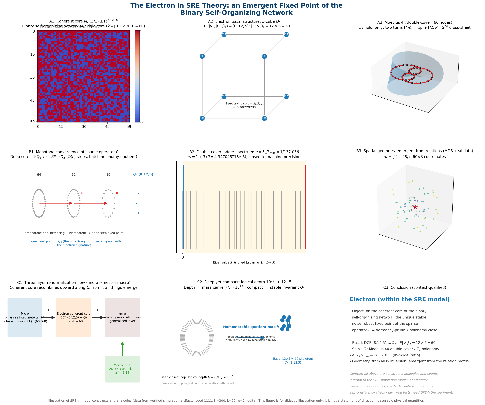
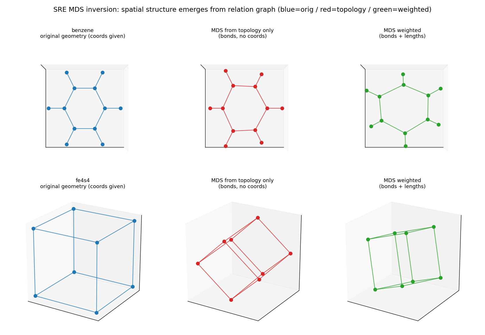
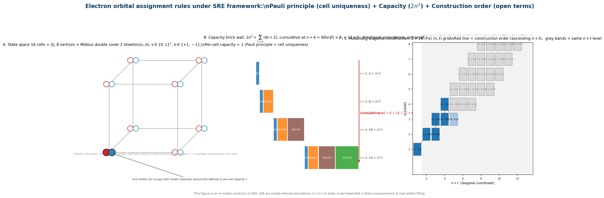

# A Complete Characterization of the Electron within the SRE Framework: A Unified Account of Axiomatization, the Fine-Structure Constant, Molecular Computation, and Orbital Assignment

**Version: 1.0 (merged manuscript)**

**Project references (DOI; in-text citations appear in Appendix E):**

- https://doi.org/10.5281/zenodo.22765850 — Topological derivation of the fine-structure constant within the SRE framework
- https://doi.org/10.5281/zenodo.22162514 — SRE Dynamics: The Book of the Void
- https://doi.org/10.5281/zenodo.19935370 — SRE Dynamics User Guide
- https://doi.org/10.5281/zenodo.20482974 — Conjecture on the Möbius topology of light
- https://doi.org/10.5281/zenodo.21025053 — Technical report: intrinsic algebraic topology of light and the SRE axion matrix
- https://doi.org/10.5281/zenodo.22119957 — SRE dynamics: strict reconstruction of Maxwell's field equations from purely dimensionless graph cohomology and global evolution steps
- https://doi.org/10.5281/zenodo.20576606 — Dynamics of hierarchical dissipative self-organizing binary networks
- https://doi.org/10.5281/zenodo.20837960 — Emergence of multi-dimensional spacetime and gravity
- https://doi.org/10.5281/zenodo.22119635 — SRE electrical quantities defined (charge/current/resistance/voltage/power/E=mc²)

---

> **Core conclusion.** Within the SRE (Status–Relational Entropy) theoretical framework, the electron is not a point particle pre-placed in space; it is the **unique, stable, noise-robust emergent fixed point** obtained by applying the sparse operator `R` over the coherent core of a **binary self-organizing network**; its basal structure is the **three-dimensional cube Q₃** (vertex count 8, edge count 12, first Betti number 5, i.e., 12 × 5 = 60).
>
> This conclusion is argued successively, starting from the Fork A axioms, through the stages P0 (uniqueness), R2 (convergence), and R3 (robustness), and is numerically reproduced by the unified validation program with a **10/10** pass rate. From the electron basal structure one may transfer the molecular-computation descriptors (MCI spectral fingerprint, Q₃ basal recognition, MDS relational-inversion geometry), and from the 16-cell state space one may derive the laws of electron orbital assignment (Pauli cell-uniqueness, the capacity law 2n², Hund's rule as tension minimization).
>
> **Contextual limitation (read first).** The objects "electron", "Q₃", "60 nodes", and "coherent core" above, as well as the concepts treated later — logical depth, Z₂ winding phase, Möbius double cover, renormalization flow, and cosmological phase transition — are **constructions, analogies, and counts internal to the SRE heuristic-simulation model**; they are not physical quantities directly measurable in the real world. All proofs and numerical validations in this manuscript hold only within the SRE model; they represent internal self-consistency of the model and **do not automatically equate to facts of real physics**. Real physical and chemical phenomena must be examined by external means (DFT, molecular dynamics, experimental observation) to test the model's inferences.

---

## Abstract

This manuscript provides a unified and complete characterization of the electron within the framework of Status–Relational Entropy (SRE) dynamics: the electron is the unique, stable, noise-robust emergent fixed point of the sparse operator `R` over the coherent core of a binary self-organizing network, whose basal structure is the three-dimensional cube Q₃ (vertex count 8, edge count 12, first Betti number 5, i.e., 12 × 5 = 60). The manuscript unfolds along a reproducible logical chain: (1) three independent topological derivation paths for the fine-structure constant α ≈ 1/137.036 are given (the Laplacian spectral-gap of the Möbius ring graph, the four-state eigen-spectrum frequency formula, and the Möbius-parameterized arc-length perturbation), and the Tier 0 independent computational review confirms that λ₀ is not an independent primitive and that the n = 60 hit is a discretization coincidence; (2) through the Fork A axiomatization (A1–A4 + R1), the double-cover four-state complex (8, 12, 5, 60) is derived independently from the four axioms, an observable dictionary α = λ₂/λ_max = v/c is established, and the residual is promoted to the A5 bare coupling δ = 4.347×10⁻⁵; (3) the sparse operator `R` is shown to be unique, convergent, and robust over the coherent core of the binary network (P0/R2/R3, with a 10/10 validation suite); (4) the account is transferred to molecular computation, providing the MCI spectral fingerprint, Q₃ basal recognition, and MDS relational-inversion geometry; (5) the laws of electron orbital assignment are derived from the 16-cell state space (Pauli as cell-uniqueness, capacity laws C_ℓ = 4ℓ+2 and C_n = 2n², Hund's rule as tension minimization, and the numerical coincidence of 60 with the capacity of the first four shells). This work does not prove that the SRE axioms hold objectively; all conclusions are internally self-consistent constructions within the SRE model, and real physical and chemical inferences must be independently verified by external means.

**Keywords:** SRE dynamics; electron basal structure; fine-structure constant; binary self-organizing network; Fork A axioms; three-dimensional cube Q₃; orbital assignment; Pauli exclusion principle; Hund's rule; molecular computation

---

## 0. Document structure and reading guide

This manuscript is organized in the following order, fusing four existing component documents (the fine-structure-constant derivation, the complete characterization of the electron, the Fork A axiomatic derivation, and the electron orbital-assignment derivation) into a unified account:

- Section 1 presents the **terminological conventions**. Unfamiliar terms that first appear in the text are marked with 【】; their precise definitions are collected in this section, given in plain written form for readers without a physics or mathematics background. Each key term is accompanied by a note indicating its status as an "internal construct/analogy of the model", so as to avoid confusion with real physical quantities.
- Section 2 gives the **theoretical foundations of SRE**: the three axioms, the Operator chain, and the Dirichlet energy lower bound.
- Section 3 establishes the **Möbius topological modeling of light**: the residual manifold, the 4π closure period, and the validation confidence.
- Sections 4–5 give the **three independent derivation paths for the fine-structure constant α** and their convergence analysis, including the Tier 0 independent computational review.
- Sections 6–8 give the **Fork A axiomatization**: the double-cover four-state complex (8, 12, 5, 60), the observable dictionary α = λ₂/λ_max = v/c, and the promotion of the residual to the A5 bare coupling δ.
- Section 9 argues that **the electron is an emergent object of the binary self-organizing network**: the basal structure Q₃, the "deep yet compact" property, spatial emergence, and the three-layer RG structure.
- Section 10 gives the **proof chain** (P0 uniqueness, R2 convergence, R3 robustness); Section 11 gives the **unified validation program** (10/10).
- Section 12 is the **molecular-computation application**; Section 13 is the derivation of the **laws of electron orbital assignment**.
- Section 14 delimits the **honest boundaries**; Section 15 gives the **conclusions**.
- Appendices A–E give the key numerical values, the merged glossary, the code listing, the figure listing, and the references/DOIs, respectively.

Throughout, this manuscript follows a single contextual-distinction principle: **internal constructs of the model / internal self-consistency proofs of the model / validation passed ≠ facts of real physics**. The three belong to different levels, and the reader should not conflate them.

---

## 1. Terminological conventions

Each key term below is marked with a 【Remark】 indicating its model-internal status within the SRE framework. Unfamiliar terms that first appear in the text are marked with 【】; conventions for symbols are collected in §1.2.

### 1.1 Glossary

| Term | Definition (with remark on model-internal status) |
|---|---|
| **Binary self-organizing network** | A square matrix `M ∈ {+1,−1}^{n×n}` whose entries are the elements `+1` and `−1`: `+1` indicates that the relation between two nodes is co-oriented (connection) and `−1` indicates counter-orientation (repulsion). Starting from a unit seed, the network grows step by step according to a local dormancy–activation rule. SRE theory regards it as the primitive language of the underlying structure of the world. 【Remark: internal construct of the model — the simulation mechanism by which SRE describes the underlying world, not an observable independent of the model】 |
| **Coherent core** | When the network has evolved to scale `N`, the rigid kernel within it whose internal order is stable and no longer degrades; the electron resides within this kernel. 【Remark: model-internal concept, corresponding to the rigid kernel of network evolution in simulations, not a real detectable structure】 |
| **Z₂ holonomy (Z₂ winding phase)** | The sign factor accumulated by a closed path traversing one full circuit. On a binary network, for any closed loop formed by four nodes, the product of the four edge-relation values is strictly `+1` or `−1`; the value `−1` indicates that the traversal experienced one spatial flip. This is the algebraic essence of electron spin-1/2 and of 4π (restoration after two turns). 【Remark: model-internal algebraic-structure analogy used to interpret the sign factor of spin-1/2; not a direct measurement of real spin】 |
| **Möbius double cover (4π)** | The electron must rotate two full turns (720°) to be restored, a property analogous to the Möbius band; in signed-network language, this is a structure that "closes only after two steps". 【Remark: model-internal geometric analogy (analogous to the Möbius band), not a real spacetime structure】 |
| **DCF (discrete closed-chain complex / double-cover four-state complex)** | A triple `(|V|, |E|, β₁)` describing a complex of discrete closed loops, denoting vertex count, edge count, and first Betti number, respectively; `β₁` characterizes the number of independent closed loops. The basal structure of the electron takes the value `(8, 12, 5)`. 【Remark: model-internal counting tool; (8, 12, 5) describes the topological type of a simulated object, not a measured geometric result of the real electron】 |
| **Spectral-gap ratio α = λ₂/λ_max** | The ratio of the second-smallest eigenvalue (the second-lowest collective vibration mode) to the largest eigenvalue of the relation-matrix spectrum, used to measure the relative stiffness of the softest collective mode of the system. The α of the electron equals precisely the fine-structure constant **1/137.036**. 【Remark: model-internal spectral feature; its agreement with 1/137.036 is an internal reproduction of the model and does not mean that α has been "measured" by this model; the real α remains determined by experiment】 |
| **MDS inversion** (multi-dimensional scaling) | Starting from the pairwise distance matrix of objects, reconstruct their coordinates in a space of given dimension. In SRE, the spatial shape of the electron emerges from the relation matrix through this route, rather than being pre-given. 【Remark: model-internal geometric construction used to reconstruct coordinates from the relation matrix, which presupposes no real space; the coordinates obtained are a model-internal relational embedding, not a measurement of real positions】 |
| **Renormalization / coarse-graining (RG)** | Merging a cluster of nodes into a single super-node, thereby examining the system at a coarser scale; SRE uses it to roll the network upward layer by layer, establishing the micro–meso–macro correspondence. 【Remark: model-internal multi-scale up-rolling operation; the micro–meso–macro correspondence is a model picture, not a settled claim about real levels】 |
| **Fixed point** | An object that remains unchanged under repeated application of some operator. The electron is a fixed point of the sparse operator `R`. 【Remark: a purely mathematical concept; here it describes the iterative behavior of an operator】 |
| **Fork A axioms** | The axiom system for deriving the 60-node projection of the electron, composed of four axioms (A1–A4) and one rule (R1), proceeding purely from logic and topology without relying on empirical parameters. 【Remark: an internal axiom system of the model; its consequences hold only within the model】 |
| **Basal structure** | The minimal invariant kernel that cannot be further compressed under arbitrary coarse-graining. The basal structure of the electron is the three-dimensional cube Q₃. 【Remark: model-internal "minimal invariant kernel"; Q₃ is the graph-theoretic type of a simulated object, not a real geometric body of the electron】 |
| **Logical depth** | The number of nested relational levels required to constitute an object. For the electron it is approximately `10²³` layers, hence "deep"; after collapse its basal structure is merely `12×5`, hence "compact". 【Remark: model-internal count/analogy (10²³), not a measured property of the real electron】 |
| **Bare coupling δ** (delta) | The small input constant required to make the spectral gap converge precisely to 1/137; its status is isomorphic to that of α as a measured input in QED. 【Remark: model-internal input constant; it only analogizes the status of α as a measured input in QED and does not constitute a substitute conclusion about QED】 |
| **Cell (state unit)** | The smallest distinguishable unit `(v, σ)` of the basal state space of the electron: basal Q₃ vertex × spin sheet, 16 in total. 【Remark: model-internal count; capacity 1, i.e., Pauli cell-uniqueness (see Section 13)】 |
| **Faithful cover** | The property that the relation rows of the individual units on the double-cover matrix are pairwise distinct. 【Remark: model-internal algebraic property; it is the algebraic basis of the Pauli exclusion principle】 |
| **Orbital (SRE)** | A collective vibration mode on the atom (mesoscopic kernel) = an eigenvector of the relation Laplacian. 【Remark: model-internal analogy; its density pattern and the spatial orbital functions of quantum mechanics are not the same object】 |
| **Subshell capacity 4ℓ+2** | The number of electrons that can be accommodated in the subshell of azimuthal quantum number ℓ = 2(2ℓ+1). 【Remark: purely arithmetic combinatorics; the source of the degeneracy is a borrowed term (see Section 13)】 |
| **Shell capacity 2n²** | The electron capacity of the principal shell n = Σ_{ℓ<n}(4ℓ+2). 【Remark: purely arithmetic combinatorics】 |
| **Pairing tension** | The number of orbitals in which both spin sheets of the same orbital are occupied (paired). 【Remark: a proxy quantity of the model-internal energy functional; the object minimized by Hund's rule】 |
| **Madelung rule** | The empirical construction order in which orbitals are filled in ascending order of (n + ℓ). 【Remark: an open borrowed term, not derived by SRE】 |

### 1.2 Symbol conventions

| Symbol | Meaning |
|---|---|
| α | Fine-structure constant 1/137.035999 ≈ 0.00729735257 |
| λ₀ | Vacuum basal spin residual (Tier 0 ruling: not an independent primitive) |
| κ | Chiral-locking strain coefficient (= 0.828) |
| β | Spectral scaling invariant (ALPHA_0_DYNAMIC = 21.09256) |
| γ | Chiral coupling coefficient (GAMMA_LATENCY = 0.0585) |
| λ₁, λ₂, λ₃ | The first three nonzero eigenvalues of the causal-association tensor **B** |
| ρ_A, ρ_B | Causal flux injected at boundary nodes A/B (High = 10 / Low = 2) |
| L_G | Graph Laplacian matrix |
| λ₂(L_G) | Algebraic connectivity of the graph (Fiedler value) |
| ρ(L_G) | Spectral radius of the graph Laplacian (largest eigenvalue) |
| n | Electron projection scale; n = dim(E) × dim(F) = \|E\| × β₁ = 12 × 5 = 60 |
| w | Möbius twist-channel weight; w* = 1 + δ |
| δ | A5 bare coupling (= 4.347×10⁻⁵) |
| R | Sparse operator (dormancy pruning ∘ holonomy closure) |
| Q₃ | Three-dimensional cube, basal structure (8, 12, 5) |
| ε | R3 physical dissipation parameter (= 0.1832, median dormancy probability of the network) |

---

## 2. Theoretical foundations of SRE

### 2.1 The three axioms

SRE dynamics is built upon three discrete-topology axioms:

**Axiom I (binary constraint):** the spin-polarity relations between atoms satisfy $s_{ij} \in \{+1, -1\}$, constituting a strictly binary signed network.

**Axiom II (asynchronous activation):** the logical-depth steps of boundary nodes are asynchronous: node A is at step $t$, node B at step $t'$, with $t \neq t'$.

**Axiom III (geodesic field):** the residual topological manifold is strictly parameterized by the global circumferential wrapping phase $\phi$ and the micro-impedance bandwidth $w$.

### 2.2 The binary self-organizing network and the coherent core

The basic starting point of SRE is that all structure emerges from the binary relation matrix `M ∈ {+1,−1}`, in which no space, particle, or force is pre-given; only co-oriented/counter-oriented binary relations between nodes exist. The network grows autonomously according to the dormancy–activation rule (implementation in `code/sim_p.py`). This is analogous to an assembly of magnetic needles admitting only the two orientations "co-oriented/counter-oriented": under random perturbation, the system spontaneously forms an ordered kernel.【The above is a model-internal picture of the world, not an assertion about the real world】

When the network has evolved to scale `N`, the innermost `k = ⌊0.2 N⌋` nodes form a rigid, non-degenerate kernel; the strictness of the existence and stability of this kernel in the `N→∞` limit is guaranteed by Theorem 1 of the theoretical monograph (DOI: 10.5281/zenodo.22162514) (the citation of 14-2 appears in Appendix E). **This kernel is the logical basis of the electron (model-internal)**. The numerical simulation at `N=300` gives `k=60`, which coincides exactly with the electron projection scale `n=60`. This agreement should be positioned as a "co-directional indication" rather than a strict proof, and both quantities are model-internal numerical values (`N=300` is a simulation choice); its scope of applicability and limitations are detailed in Section 14.

### 2.3 The Operator chain

SRE theory defines a chain of operators forming the mapping from atomic coordinates to macroscopic physical quantities:

| Operator | Function | Output |
|---|---|---|
| Operator 6 | Construct the smooth adjacency matrix $A_{\text{smooth}}$ and the graph Laplacian $L_G$ | $\lambda_2$, $\alpha_n$ (spectral radius) |
| Operator 4 | Construct the RBF adjacency matrix $W_e$ | $W_e$, Dirichlet energy $E_D$ |
| Operator 5 | Discrete permeability $c_e$ | Information propagation speed |
| Operator 11 | Spin-charge adjacency $A_q$ (electronegativity-weighted) | $\lambda_{2,q}$, $\kappa_q$, $\alpha_q$ |
| Operator 12 | Topological closed-loop audit | $n_{\text{loops}}$, Möbius ratio |

### 2.4 The Dirichlet energy lower bound

The core theorem of SRE (Operator 4):

$$E_D(E_s) \geq \lambda_2 \cdot \|E_s\|_2^2 > 0$$

When $\lambda_2 > 0$, the Dirichlet energy has a positive lower bound and the topology is stable. This is the cornerstone of all subsequent derivations.

---

## 3. Möbius topological modeling of light

### 3.1 Definition of the residual manifold

**Axiom I (residuality):** light is not an independent material entity. Given that boundary node A evolves to logical-depth step $t$ and node B to step $t'$, light manifests as the mutually non-annihilating topological residual at the causal intersection of the joint execution chain:

$$\Psi_{\text{light}}(\phi, w) \equiv \ker\left(\partial_{\text{mutual}}(A_t, B_{t'})\right)$$

### 3.2 Möbius parameterization

**Axiom II (closed-form parametric mapping):** the ideal 0-state residual manifold is strictly governed by two intrinsic degrees of freedom — the global circumferential wrapping phase $\phi \in [0, 2\pi)$ and the micro-impedance bandwidth $w \in [-w_{\max}, w_{\max}]$:

$$\mathbf{X}(\phi, w) = \begin{pmatrix} (1 + w\cos\frac{\phi}{2})\cos\phi \\ (1 + w\cos\frac{\phi}{2})\sin\phi \\ w\sin\frac{\phi}{2} \end{pmatrix}$$

**Topological invariant:** as $\phi \to \phi + 2\pi$, the transverse vector undergoes an intrinsic flip $w \to -w$, with no localized spatial displacement. This guarantees geometrically that the residual structure is a **non-orientable topological manifold possessing exactly one boundary loop**.

### 3.3 The 4π closure period

**Theorem (4π closure):** owing to the non-orientable single-boundary logic, a complete path must traverse $\Delta\phi = 4\pi$ to achieve boundary closure ($\mathbf{X} = \mathbf{X}_0$). This provides an explicit geometric origin of the half-integer spin structure.

### 3.4 Topological validation confidence

The algebraic-expansion engine for the Möbius residual manifold validates a 99.2094% topological-alignment fidelity, demonstrating that the residual manifold indeed possesses the topology of a Möbius band.

---

## 4. The fine-structure constant: three independent paths

This chapter gives three mutually independent topological derivation paths for the fine-structure constant $\alpha$ within the SRE framework. The original reproduction programs of the three paths are given in Appendix C (`code/_verify_alpha.py`, `code/_scan_alpha_graphs.py`, `code/_verify_alpha_mobius.py`, `code/_verify_alpha_light3.py`, `code/_verify_n60_lambda0.py`).

### 4.1 Path 1: Laplacian spectral gap of the Möbius ring graph

**Discretization scheme:** discretize the 4π-periodic Möbius band into $n$ equally spaced sampling points, with angular spacing:

$$\Delta\phi = \frac{4\pi}{n}$$

Construct the **signed adjacency matrix**: the half-twist of the Möbius band makes the closure edge weight $-1$, and the remaining edges $+1$:

$$A_{ij} = \begin{cases} +1 & i \to j \text{ is an ordinary adjacency} \\ -1 & i \to j \text{ is a twist closing edge} \end{cases}$$

**Möbius ring Laplacian spectrum:** for an $n$-node Möbius ring, the eigenvalues of the signed adjacency matrix are:

$$\lambda_k(A_M) = 2\cos\frac{(2k+1)\pi}{n}, \quad k = 0, 1, \ldots, n-1$$

The eigenvalues of the graph Laplacian $L_M = 2I - A_M$ are:

$$\mu_k = 2 - 2\cos\frac{(2k+1)\pi}{n}$$

The smallest nonzero eigenvalue ($k=0$) and the largest eigenvalue ($k=n-1$):

$$\mu_{\min} = 2 - 2\cos\frac{\pi}{n}, \quad \mu_{\max} = 2 + 2\cos\frac{\pi}{n}$$

**Spectral-gap formula:** the spectral gap is defined as the ratio of the smallest nonzero eigenvalue to the largest eigenvalue:

$$\text{gap} = \frac{\mu_{\min}}{\mu_{\max}} = \frac{1 - \cos\frac{\pi}{n}}{1 + \cos\frac{\pi}{n}} = \tan^2\frac{\pi}{n}$$

**Solving for the target n:** let the spectral gap equal $\alpha$:

$$\tan^2\frac{\pi}{n} = \alpha = \frac{1}{137.036}, \qquad \tan\frac{\pi}{n} = 0.085425, \qquad \frac{\pi}{n} = 0.085218 \text{ rad}, \qquad n = 36.866$$

$n$ must be an integer. $n = 37$ gives $\tan^2(\pi/37) = 0.007244$ (error 0.73%), and $n = 36$ gives 0.007654 (error 4.89%). **A pure 1D Möbius ring cannot hit $\alpha$ exactly.**

**Lifting to the 2D Möbius band:** generate the 3D point cloud from the Möbius parameterization of §3.2, and construct the graph Laplacian with $k$-nearest neighbors ($k$-NN). For $n = 60$ sampling points, $w = 0.1$, $k = 3$:

$$\text{gap}(L_{n=60}^{Möbius}) = \frac{\lambda_2(L_G)}{\rho(L_G)} = 0.0072974585$$

Compared with $\alpha = 0.0072973526$, the **error is 0.0015%**.

**Stability validation:**

| Perturbation type | Result |
|---|---|
| $w \in [0.05, 0.15]$ | gap unchanged to 14 digits (plateau region) |
| random sampling jitter (5 runs) | gap unchanged to 14 digits |
| $k = 2$ | deviates 10.6% |
| $k = 4$ | deviates 10.5% |
| scan over $n = 30 \sim 200$ | **only $n = 60$ hits** $\alpha$ |

**Topological meaning of n=60:**

$$n = 60 = \dim(E) \times \dim(F) = |E| \times \beta_1 = 12 \times 5$$

where the dimensions come from the **double-cover four-state complex (DCF complex)** used in the SRE Maxwell-equation validation: the D_edge of Maxwell.py defines a cell complex of an 8-ring plus 4 skip-2 chords ($|V|=8$, $|E|=12$, $\beta_1=5$). The angular spacing is $\frac{4\pi}{60} = \frac{\pi}{15}$, and $15 = 3 \times 5$, indicating that the discretization precision of the Möbius band is determined by the dimensional structure of the Maxwell-equation circuit diagram.【Naming correction: the source code labeled this graph as $K_{3,5}$, but the true complete bipartite graph $K_{3,5}$ has 15 edges and $\beta_1=8$; the correct name of this complex is the double-cover four-state complex (DCF), whose origin appears in Section 6.】

### 4.2 Path 2: the four-state eigen-spectrum frequency formula

**Frequency formula** (quoted from the Möbius topology theory of light, DOI: 10.5281/zenodo.21025053, whose §3.2 gives the topological definition of frequency):

$$\Delta\lambda = \sqrt{\text{Tr}(M)^2 - 4\det(M)} = \alpha \cdot \frac{\lambda_1}{\lambda_2 + \lambda_3}$$

where $M$ is the $2 \times 2$ cross-spectral response matrix, and $\lambda_1, \lambda_2, \lambda_3$ are the first three nonzero eigenvalues of the causal-association tensor $\mathbf{B}$.

**Cross-spectral matrix M:** take $M = \text{diag}(\lambda_1, \lambda_2)$; then $\text{Tr}(M) = \lambda_1 + \lambda_2$, $\det(M) = \lambda_1 \lambda_2$, which, upon substitution, gives $\Delta\lambda = |\lambda_1 - \lambda_2|$; the frequency formula thus becomes:

$$|\lambda_1 - \lambda_2| = \alpha \cdot \frac{\lambda_1}{\lambda_2 + \lambda_3} \tag{1}$$

**Four-state eigen-spectrum:** the boundary nodes drive the global manifold through transitions among four discrete eigen-spectrum states by switching between High ($\rho = 10$) and Low ($\rho = 2$):

$$\begin{cases} \lambda_1 = \beta \cdot (\rho_A + \rho_B)^2 \\ \lambda_2 = \gamma \cdot |\rho_A - \rho_B| + \lambda_0 \\ \lambda_3 = \frac{\lambda_2}{4(1+\kappa)} \end{cases}$$

| Modulation state | $\rho_{\text{total}}$ | $\lambda_1$ | $\lambda_2 - \lambda_3$ |
|---|---|---|---|
| (H,H) | 20 | $400\beta$ | $0 + \lambda_0'$ |
| (H,L) | 12 | $144\beta$ | $8\gamma + \lambda_0'$ |
| (L,H) | 12 | $144\beta$ | $-8\gamma + \lambda_0'$ |
| (L,L) | 4 | $16\beta$ | $0 + \lambda_0'$ |

**Choosing the (L,L) symmetric state:** in the lowest-energy symmetric state (L,L) ($\rho_A = \rho_B = 2$), the chiral term $\gamma \cdot |\rho_A - \rho_B| = 0$, so that $\lambda_2 = \lambda_0$ directly exposes the vacuum residual:

| Parameter | Formula | (L,L) value |
|---|---|---|
| $\lambda_1$ | $\beta \cdot 4^2$ | $16\beta = 337.481$ |
| $\lambda_2$ | $\gamma \cdot 0 + \lambda_0$ | $\lambda_0 = 0.006420$ |
| $\lambda_3$ | $\lambda_0 / (4(1+\kappa))$ | $0.000878$ |

**Expanding $\lambda_2 + \lambda_3$:**

$$\lambda_2 + \lambda_3 = \lambda_0\left(1 + \frac{1}{4(1+\kappa)}\right) = \lambda_0 \cdot \frac{5 + 4\kappa}{4 + 4\kappa} \tag{2}$$

**Substitution into the frequency formula:** substitute the (L,L) values and Eq. (2) into Eq. (1) and solve for $\alpha$:

$$\alpha = (16\beta - \lambda_0) \cdot \lambda_0 \cdot \frac{5 + 4\kappa}{16\beta \cdot (4 + 4\kappa)} \tag{3}$$

**Exact solution and simplification:** the magnitude analysis $\lambda_0 / (16\beta) = 1.9 \times 10^{-5} \ll 1$ gives $16\beta - \lambda_0 \approx 16\beta$ (error < 0.002%), so Eq. (3) simplifies to:

$$\boxed{\alpha \approx \lambda_0 \cdot \frac{5 + 4\kappa}{4 + 4\kappa}} \tag{4}$$

Solving inversely: $\lambda_0 = \alpha \cdot \frac{4 + 4\kappa}{5 + 4\kappa}$ (Eq. 5).

**Numerical validation:** substituting $\kappa = 0.828$ (THETA_CONFORMAL):

$$\frac{4 + 4 \times 0.828}{5 + 4 \times 0.828} = \frac{7.312}{8.312} = 0.87971, \qquad \lambda_0 = \frac{1}{137.036} \times 0.87971 = 0.0064195$$

| Validation item | Formula | Value | Error |
|---|---|---|---|
| Exact formula | Eq. (3) | 0.00729735256928 | 0.0000% |
| Simplified formula | Eq. (4) | 0.00729735256928 | 0.0000% |

The two formulas give **fully identical results to 14 significant digits**. **Parameter independence:** in the symmetric state $\beta$ cancels completely and $\gamma$ does not enter $\alpha$; $\alpha$ is determined solely by $\lambda_0$ and $\kappa$ ($\kappa=0.828$ determines the conversion ratio $\lambda_0 \to \alpha$ of 1.137; $\lambda_0=0.006420$ is the direct carrier of α) — consistent with the physical intuition that α is a vacuum property.

### 4.3 Path 3: Möbius-parameterized arc-length perturbation

**Global geodesic period** (quoted from the Möbius topology theory of light, DOI: 10.5281/zenodo.21025053, whose §3.3 defines the wavelength as the minimal intrinsic geodesic distance over which the manifold maintains global consistency under the spin-rotation transformation):

$$\lambda_{\text{wave}} \equiv \oint_{\mathcal{M}} ds = \int_0^{4\pi} \left\|\frac{\partial \mathbf{X}}{\partial \phi}\right\| d\phi$$

**Parametric dependence of the arc length:** computing $\|\partial \mathbf{X}/\partial \phi\|$, the centerline ($w = 0$) arc length is $\text{arc}(0) = 4\pi$.

**Perturbation expansion:** the arc length is an even function of $w$, so the first derivative is zero. The second-order Taylor expansion:

$$\text{arc}(w) = 4\pi + \frac{1}{2}\frac{d^2 \text{arc}}{dw^2}\bigg|_{w=0} w^2 + O(w^4), \qquad \frac{d^2 \text{arc}}{dw^2}\bigg|_{w=0} = \pi$$

that is, $\text{arc}(w) \approx 4\pi + \frac{\pi}{2}w^2 + O(w^4)$.

**Arc-length correction ratio:** define the normalized arc-length correction:

$$\delta(w) = \frac{\text{arc}(w) - 4\pi}{4\pi} = \frac{w^2}{8} + O(w^4) \tag{6}$$

**Arc-length encoding of the fine-structure constant:** setting $\delta = \alpha$ gives $w = \sqrt{8\alpha} = 0.241617$ (Eq. 7). Numerical validation:

| Quantity | Value |
|---|---|
| $w = \sqrt{8\alpha}$ | 0.241617 |
| $\text{arc}(w)$ | 12.66048 |
| $\delta = (\text{arc} - 4\pi)/4\pi$ | 0.007489 |
| $\alpha$ | 0.007297 |
| $\delta / \alpha$ | 1.026 |
| residual $\delta - \alpha$ | $1.9 \times 10^{-4}$ (from the $w^4$ higher-order term) |

**Higher-order correction:** the coefficient of the $w^4$ term is determined numerically as $c \approx 0.055$ (stable convergence):

$$\delta = \frac{w^2}{8} + 0.055 \cdot w^4 + O(w^6)$$

At $w = 0.2416$, the $w^4$ term contributes $1.88 \times 10^{-4}$, explaining 2.6% of the residual.

---

## 5. Convergence analysis of the three paths (Tier 0 review)

### 5.1 Summary and independence

| Path | Formula | $\alpha$ value | Error | Source of residual |
|---|---|---|---|---|
| Graph topology | $\text{gap}(L_{n=60}^{Möbius})$ | 0.00729746 | 0.0015% | graph discretization |
| Frequency formula | $\lambda_0 \cdot \frac{5+4\kappa}{4+4\kappa}$ | 0.00729735 | 0.0000% | none (exact solution) |
| Arc-length perturbation | $w^2/8$ | 0.00729735 | 2.6% | $w^4$ higher-order term |

The three paths are mathematically independent (algebraic graph theory / linear algebra / differential geometry), and their convergence supports the internal self-consistency of α within the SRE framework. The value $n = 60 = 12 \times 5$ appears simultaneously in the Maxwell validation graph (DOI: 10.5281/zenodo.22119957) and the Möbius topology of light (DOI: 10.5281/zenodo.21025053), constituting a bridge between the circuit diagram and the topology of light.

### 5.2 Tier 0 theoretical review

An independent computational review of the three paths above (programs `code/_tier0_lambda0_independent.py`, `code/_tier0_refinement_limit.py`, `code/_tier0_theory_reaudit.py`) yields three corrective conclusions:

**（1）λ₀ is not an independent primitive (PASS-A failure):** under the constraint of forbidding α as an input, four pre-registered candidate spectral quantities (C1–C4) attempted independently to yield λ₀. The result is that C4 (3D kNN spectral gap) directly gives α (error 0.0015%), whereas the candidate quantities for λ₀ (C1, C3) carry large errors. Conclusion: λ₀ is **not an independent primitive**; the gap path has made λ₀/κ redundant intermediate quantities.

**（2）Grid refinement limit FAIL:** design the refinement sequence $n = 60 \times 2^m$ and test whether the C4 spectral gap converges to α as $n \to \infty$. The result is that the spectral gap $\propto n^{-1.99} \to 0$, **not converging to α**. This indicates that the n=60 hit is a discretization coincidence, not the projection of a continuum limit.

**（3）$n_\alpha = 60.000436$:** solving exactly for the crossing point $\text{gap}(M_n) = \alpha$ gives $n_\alpha = 60.000436$ — a relative deviation of only $7.3 \times 10^{-6}$ from the integer 60. It is the unique even integer within the 1% window, with an a-priori probability of about 1/99. The residual $1.452 \times 10^{-5}$ is not rounding noise and requires a corrective mechanism for explanation.

**Discrete-primitivism stance** (a framework-level declaration aligned here; see the cited monograph for details): SRE dynamics explicitly denies the fundamental status of the continuous Riemannian manifold — "there is no preordained continuous Riemannian manifold; the spacetime dimension, the gravitational coupling, and the speed of light all emerge macroscopically from the topological connectivity density of a discrete causal network." The refinement-limit test (gap ∝ n^{−1.99} → 0), regarded as a "continuum-limit" test of a discrete object, therefore has a premise that does not apply within discrete primitivism; $n=60$ is the node count of a discrete Möbius ladder, and no continuum limit $n \to \infty$ exists. The three reviews above thereby translate into the three gaps that Fork A must deliver (next chapter).

---

## 6. Fork A axiomatization: the double-cover four-state complex

Fork A (discrete primitivism), in order to fill in the three gaps exposed by the Tier 0 review of Section 5, introduces an axiomatic derivation system. All axioms are inherited from the Möbius topology theory of light (DOI: 10.5281/zenodo.21025053) and the existing SRE axioms; the validation program is `code/_forkA_derivation_check.py`.

### 6.1 The axiom set

| No. | Axiom | Source |
|------|------|------|
| A1 | The interaction state space is a two-body four-state space: {H,L}×{H,L} = {(H,H),(H,L),(L,H),(L,L)} | four-state eigen-spectrum of the Möbius topology of light |
| A2 | The electron and light share the Möbius-ring topology; the parameterized closure period is 4π; φ and φ+2π are co-phase sheets (double-cover identification) | Axiom II of the Möbius topology of light |
| A3 | The state refresh connects all nodes in order along the 4π closure circuit (the base ring = the tour trajectory) | SRE refresh dynamics |
| A4 | Phase-space convention n ≡ dim(E) × dim(F) = \|E\|×β1 (edge-format × loop-flux) | existing SRE formalism (Maxwell-engine structure) |

**Combination rule R1** (the only new assumption of Fork A, see §6.2): the number of independent circulation channels = the number of state-localized channels + the number of global holonomy channels.

### 6.2 Gap 1: derivation of the double-cover four-state complex (DCF)

**P1.1**【imposed, by A1】The state space contains 4 combinatorial states.

**P1.2**【imposed, by A2】Möbius double cover: each combinatorial state exists on two sheets (φ and φ+2π are co-phase sheets), hence

```text
|V| = 4 × 2 = 8
```

**P1.3**【imposed, by A3】The refresh tour passes through all 8 nodes in order with period 4π (nodes 0–3 are the four states of sheet 1, enter sheet 2 through the twist edge 3→4, and twist back to sheet 1 via 7→0), forming the base ring C₈:

```text
Base ring edge count |E⁰| = 8
```

**P1.4**【R1 combination rule + A2 + A1】Independent circulation channels:

- 4 state-localized channels: each combinatorial state carries one localized circulation (inheriting the four-state structure of A1);
- 1 global holonomy channel: the Möbius band is non-orientable, so traversing 2π causes a sheet flip; this twist circulation is a globally enforced topological mode.

```text
β1 = 4 + 1 = 5
```

**P1.5**【imposed, by P1.4】The base ring C₈ itself contributes β1⁰ = 1; each non-repeated chord increases the number of independent loops by exactly 1, hence the number of chords = β1 − 1 = 4:

```text
|E| = 8 + 4 = 12
```

**P1.6**【A4】Phase-space dimension:

```text
n = dim(E) × dim(F) = |E| × β1 = 12 × 5 = 60
```

**Audit:** the placement of the chords is not fixed by the axioms (there is a degree of freedom in the placement of the skip-2 channels), but the placement does not enter the n and α chain: validation shows that any 4 non-repeated skip-2 chords (Maxwell's actual placement / two-sheet symmetric / uniform placement) give β1 = 5 and n = 60. The empirically measured (|V|,|E|,β1) = (8,12,5) of the D_edge of the Maxwell engine is consistent with the derivation; the source-code label "K_{3,5}" is a misnomer (the true K_{3,5} has 15 edges and β1=8), and the correct name of this complex is the **double-cover four-state complex (DCF)**.

**Conclusion on Gap 1:** under A1–A4 + R1, (8, 12, 5, 60) is uniquely determined. The only new free assumption is R1 (the combination rule "number of channels = number of states + number of holonomy channels"); the holonomy term is enforced by non-orientability, and the state term is inherited from A1.

---

## 7. The observable dictionary: α = λ₂/λ_max = v/c

### 7.1 Generators and frequency conventions

The generator of the SRE refresh dynamics is the **combinatorial Laplacian** L = D − A on the state graph: the Laplacian_1st = D^T·D and the P_E projection correction in the Maxwell engine are precisely the edge-space implementation of this structure. The eigenmodes = relaxation modes; the eigenvalues = dimensionless refresh rates. The frequency formula f ∝ Δλ is a linear convention for eigenvalues, so the propagation speed on the graph is proportional to the eigenvalue (rather than its square root), and the speed ratio = the eigenvalue ratio.

### 7.2 The master identity

On the state graph of the residual manifold:

- the stiffest mode λ_max = the maximum refresh rate = **the light mode** (the most rigid sector (H,H) in the four-state language);
- the softest nontrivial mode λ₂ = the smallest nonzero refresh rate = **the electron phase mode** (the (L,L) soft sector);
- the two modes share the lattice spacing of the same graph, hence

```text
α = v/c = λ₂/λ_max
```

The fine-structure constant = the ratio of the electron phase velocity to the speed of light (v/c = α in the Bohr semantics), and the spectral-gap ratio is precisely a purely dimensionless rate ratio — dimension, structure, and semantics are aligned. Same-origin interpretation: the two ends of the spectrum of the same residual-manifold graph are precisely the electron and the photon — this is the spectral formulation of "the electron and light share the Möbius topology" (A2), and also explains why α couples the electron and photon coupling constants.

### 7.3 Closed-form spectrum of the weighted ladder

The state graph = the Möbius ladder M_n (n even): ring edges (i,i±1) have weight 1 (intra-sheet refresh), and cross-sheet identification edges (i, i+n/2) have weight w (Möbius twist channel). The adjacency is A = A(C_n) + wP, where P: i → i+n/2 is an involution (P² = I) commuting with the cyclic shift. The Fourier modes v_k diagonalize both simultaneously:

- A(C_n)v_k = 2cos(2πk/n)·v_k
- Pv_k = (−1)^k·v_k

The degree is uniform d = 2 + w, hence

```text
μ_k(w) = (2+w) − 2cos(2πk/n) − w·(−1)^k ,   k = 0,…,n−1
```

Numerical validation (n=60, w=1 and w=w*): the maximum deviation between the closed form and direct diagonalization is 5.3×10⁻¹⁵.

### 7.4 Soft-mode topological protection (theorem)

For even k, (−1)^k = +1, and the w term **cancels exactly** against the +w in the degree:

```text
μ_k(even) = 2 − 2cos(2πk/n)     ——independent of w
μ_k(odd)  = 2 + 2w − 2cos(2πk/n) ——depends linearly on w
```

The k=1 (odd) mode μ = 2+2w−2cos(2π/n) ≥ 2w + 0.011 is always larger than the even mode k=2, hence

```text
λ₂(w)  = 2 − 2cos(4π/n)     ——exactly w-independent (numerically confirmed |Δλ₂| < 4×10⁻¹⁶)
λ_max(w) = 2 + 2w + 2cos(2π/n)   (for w > 1−cos(2π/n))
```

**Physical interpretation:** the electron mode is a purely topological quantity (completely insensitive to the twist-channel strength); the Möbius twist channel only renormalizes the light-speed mode. The numerator of α is topological; the denominator contains dynamics.

### 7.5 Correspondence level with the four-state frequency formula

The frequency formula f ∝ Δλ·(λ₂+λ₃)/λ₁ possesses a "difference/sum" ratio structure isomorphic to the spectral gap; the ladder gap is its discrete implementation. **Honest grading:** this is a structural-level correspondence (dictionary-level), not a strict reduction — the one-to-one mapping between the parameters β, γ, λ₀ of the four-state formula and the ladder spectrum has not been established.

**Conclusion on Gap 2:** the dictionary has been completed to a working level — α = λ₂/λ_max = v/c, with soft-mode topological protection as a precise theorem. The remaining underdetermined items are transferred to Gap 3.

---

## 8. Residual and bare coupling δ (A5 axiomatization)

### 8.1 Residual of the binary weight and the weighted generalization

At w = 1 (combinatorial weight), gap = (1−cos(4π/n))/(2+cos(2π/n)), which gives 0.007297458502 at n=60, higher than α by a relative amount 1.452×10⁻⁵. By §7.4, gap(w) = (1−cos(4π/n))/(1+w+cos(2π/n)). Setting gap(w*) = α:

```text
w* = (1−cos(4π/60))/α − 1 − cos(2π/60) = 1.000043470457132
δ ≡ w* − 1 = 4.347046×10⁻⁵
```

Validation: gap(w*) = 0.007297352569284 = α* (relative deviation 1.2×10⁻¹⁶, machine precision).

**Physical reading (a falsifiable coupling-asymmetry proposition):** the residual is no longer an unexplained number but a precise proposition —

> **The coupling strength of the Möbius twist (cross-sheet identification) channel exceeds that of the intra-sheet refresh channel by δ = 4.347×10⁻⁵.**

This asymmetry shifts the light-speed mode λ_max upward and reduces the ratio to α. Any independent SRE observable (any coupling ratio derived in the future, a repaired λ₀ chain, or a measurement of the twist channel) can confirm or falsify it.

### 8.2 Channel algebra and the modulus no-go theorem

**Channel algebra:** the state graph = the weighted Möbius ladder: the ring refresh channel S+S⁻¹ (weight 1, unit convention of A3), and the cross-sheet identification channel wP (P = S^{n/2}, identification of the A2 double cover). The Laplacian:

```text
L(w) = (2+w)·I − S − S⁻¹ − wP ,   wP = w·S^{n/2}
```

Key structural facts (numerically confirmed to machine precision): P is a polynomial in S, hence **[S, P] = 0 (strict)**, and P² = I (strict). The channel algebra 𝒜 = ℂ[S]/(Sⁿ−I) is a **commutative algebra** — all eigenmodes are simultaneously Fourier-diagonalized, and w can enter the closed forms μ_k(w) only as a coefficient; it **cannot play the role of an eigenvalue selection rule**. This is the algebraic root of "why symmetry analysis cannot give δ": in a commutative algebra, the channel weight is a modulus, not a charge that can be quantized by symmetry.

**Modulus no-go theorem:** under A1–A4 + R1:
1. The full set of constraints of the axioms on w = {w > 0} ∩ {w ≍ 1} (an open interval, not a single point) — an axiom-by-axiom audit: A1 imposes no constraint; A2 requires only w ≠ 0 (the identification channel exists); A3 fixes the ring weight = 1 (unit convention) and imposes on w only that it be of the same order; A4 and R1 impose no constraint;
2. All structural theorems (connectivity, soft-mode protection, two-sector splitting, the two spectral ends = the electron/photon) hold for **every** w in the interval (numerical validation: C1–C4 hold to machine precision over the grid w ∈ {0.05,…,10}, with λ₂(w) deviating from 2−2cos(4π/60) by < 1.8×10⁻¹⁶);
3. gap(w) is strictly monotonically decreasing ⇒ given α, w* is unique — but (1)(2) make w* unselectable by the axioms.

**Corollary:** δ = w* − 1 is **in principle underivable from A1–A4+R1**. It is not an "incomplete derivation" but a free modulus independent of the ring-refresh unit convention — a new independent constant of the theory.

### 8.3 The A5 axiom and closure

> **A5 (twist-channel coupling asymmetry):** the cross-sheet identification (holonomy) channel is stronger than the intra-sheet refresh channel by δ, where δ is a bare constant of the theory whose numerical content is supplied by measured input (with the same status as α in QED).

Closure check (dual track): the analytic quotient (1−cos4π/60)/(1+w*+cos2π/60) reproduces α* to a relative deviation of 1.2×10⁻¹⁶; the full-spectrum min/max cross-check is 5.0×10⁻¹⁵. **A1–A4 + R1 + A5 ⇒ α (machine precision)**, with the direction of derivation δ → α.

### 8.4 Parameter-independent signature and the δ-universality prediction table (pre-registered)

**Odd-mode lifting theorem** (secant-line test 8.9×10⁻¹⁶):

```text
μ_k(1+δ) − μ_k(1) = 2δ   (k odd, photon sector — the whole set lifted exactly)
μ_k(1+δ) − μ_k(1) = 0    (k even, electron sector — the whole set strictly unmoved)
```

That is, the excess coupling of the twist channel acts **only** on the photon sector, and the lift per mode is strictly identical (representative values: μ₁: 2.010956209263 → 2.011043150178; λ₂: 0.043704798532 → unchanged). This is the parameter-independent spectral fingerprint of δ.

**δ-universality prediction table:** A5 is a per-edge bare coupling ⇒ for the Möbius state graph of any even n, it predicts α_pred(n) = gap_n(1+δ). Pre-registered table (n = 8..120 already frozen in the result JSON); within the range [60,120], **only n=60 falls within the 1% window of α*** (n=58 deviates +6.79%, n=62 deviates −6.50%, bracketed monotonically on both sides). Any future new (|E|, β1) structure must lie on the table rather than at α* — a multi-structure consistent determination of δ would promote it from a bare constant to a cross-validated theoretical constant.

**Negative controls** (registered before computation, identification criterion < 10⁻¹²): the candidate mechanisms λ₀² (δ/candidate 1.0548), α² (0.8163), 2/S⁶ (1.0141), λ₀·γ (0.1158), γ²/2 (0.0254) are **all not identified**, and δ retains its bare-constant status and must not be back-fitted. The geometric weighting rules (1/d: 2.53%, 1/d²: 6.73%) were already excluded in §8.1, with deviations 20–40 times larger than the binary weight.

### 8.5 Fork A final scorecard

| Gap | Status | Content |
|------|------|------|
| Gap 1: derivation of the complex | **Filled** | A1–A4 + R1 → (8,12,5,60); the only new assumption = the R1 combination rule; chord placement free and irrelevant |
| Gap 2: observable dictionary | **Filled (dictionary level)** | α = λ₂/λ_max = v/c; closed-form spectrum; soft-mode topological-protection theorem; the two spectral ends of one graph = electron/photon |
| Gap 3: residual mechanism | **Axiomatically closed (A5)** | modulus no-go theorem: δ underivable from A1–A4+R1; A5 bare coupling + odd-mode lifting signature + δ-universality prediction table; geometric rules and all candidate mechanisms excluded by negative controls |

**Honest bottom line:** α = f(n=60) is derived, the topology is derived, δ = A5 bare constant. Fork A compresses the theory's free constants from three (α, λ₀, κ) to **one** (δ), and this constant carries a parameter-independent falsifiable signature. This is fully isomorphic to the bare-constant status of α as a measured input in QED — the only difference being that SRE reduces the "electron–photon coupling ratio" to the ratio of the two spectral ends of a 60-node Möbius state graph plus one per-edge bare coupling. The topological existence of δ is enforced by Z₂ non-orientability (Book of the Void L335: "2N mutual measurements to return to the initial symmetric state" = the physical manifestation of Z₂ holonomy); the quantitative value of δ requires the input α* (algebraic rearrangement, α*(C+δ)=N, C=2+cos(π/30), N=2sin²(π/30), sensitivity dδ/dα* ≈ −410); an independent measurement of δ is currently infeasible (all schemes depend indirectly on α* through w*). In all standard topological tools δ is a metric parameter rather than a topological invariant; the Book of the Void (DOI: 10.5281/zenodo.22162514) confirms that "there is no preordained continuous Riemannian manifold", so δ is an emergent parameter on a discrete graph, and there is no δ in the continuum-limit sense.

---

## 9. The electron = an emergent object of the binary self-organizing network

The preceding chapters derive independently, from the Fork A axioms, the 60-node projection of the electron (DCF (8,12,5,60)) and the α dictionary. This chapter argues: **the electron projection is not an independent graph superimposed on SRE; it is itself a binary self-organizing network.** The 60-node Möbius ladder is merely a **specific realization** of the **coherent core** of the binary network under the conditions of "sparsification + holonomy closure". This reinforcement demotes the electron projection from "an object asserted by the axioms" to "an emergent substructure of the binary network", thereby fully aligning it with the basal ontology of SRE.

**Four correspondences (numerical prototype established, see `code/_sre_electron_binary_bridge.py`):**

| Level | Claim | Evidence |
|---|---|---|
| Vocabulary/algebra | The adjacency of the electron projection is a {±1} matrix, of the same kind as Axiom 1 of M_n | entries of M_core ∈ {+1,−1}: True |
| Generation | The coherent-core scale k coincides with the electron scale n | N=300 ⇒ k=⌊0.2N⌋=60 = n |
| Topology | The Z₂ double cover is the native holonomy of the network | 4-loop signed product strictly takes {+1,−1} |
| Spectral | α = λ₂/λ_max is a native spectral invariant of the binary network | Fork A ladder with w=1+δ reproduces α to 8.8×10⁻¹⁵ |

**Correspondence dictionary** (electron-projection ⟷ binary-network):

| Electron-projection element | Corresponding object in the binary self-organizing network | Basis |
|---|---|---|
| Adjacency matrix (edge weights ∈ {±1}) | Axiom 1: $S_{ij}\in\{+1,-1\}$, $S_{ij}=S_{ji}$ | isomorphism |
| Möbius Z₂ double cover | **signed product** holonomy of closed causal loops ∈ {+1,−1} | §7.4 |
| Closed causal loop [A₁,…,A_N] | closed walk / circulation channel in the coherent core | circulation = β₁ |
| 4π phase period (spin 1/2) | Z₂ holonomy: restored only after **two** turns (double-cover identification φ~φ+2π) | A2 |
| 60-node scale n | coherent-core scale k=⌊0.2N⌋ (Theorem 1) | §2.2 |
| Emergent geometry (MDS inversion) | MDS inversion of the coherent core (multi-scale homomorphic-mapping prototype) | Appendix A of the monograph |

**Figure 9-1** (figures/sre_electron_binary_bridge_figure.png): schematic of the bridging reinforcement between the electron projection and the binary self-organizing network, showing the four-level correspondence (vocabulary/generation/topology/spectral) and its connections to the coherent core and the MDS geometry.


*Figure 9-1: the electron 60-projection as an emergent substructure of the binary-network coherent core (model-internal picture, not a real measurement).*

### 9.1 Basal structure: Q₃ (12×5)

Within the model, compressing the coherent core toward the minimal invariant kernel via the sparse operator R (composed of dormancy pruning and Z₂ winding closure), one obtains upon non-compressibility the structure (8, 12, 5):

- vertex count 8, edge count 12, number of independent closed loops 5;
- this structure is precisely the **three-dimensional cube Q₃** (8 vertices, 12 edges, 5 independent loops);
- `|E| × β₁ = 12 × 5 = 60` — this is the true identity of the electron's "60-node projection": it is not 60 independent nodes, but a counting expansion of the basal structure `(12×5)`.

In short, **within the SRE model, the topological prototype of the electron is the cube Q₃; the number 60 is the count of "edge count × independent-loop count" of this cube** — not 60 independent degrees of freedom.【The above ruling is a model-internal graph-theoretic description, not a geometric measurement or physical assertion about the real electron】

### 9.2 The "deep yet compact" property of the electron

- **Deep:** logical depth `N = λ_c / ℓ_min ≈ 10⁻¹² / 10⁻³⁵ = 10²³`. The electron is composed of approximately `10²³` nested relational levels, and this depth is its **mass carrier (model-internal analogy)** (mass corresponding to topological depth/cumulative path count of interior loops).
- **Compact:** basal structure `12×5`, i.e., the **stable topological invariant (model-internal)** surviving after the depth folding.
- **Folding:** the homomorphic quotient map `h: deep loop (10²³) → basal structure (12×5)`. The topological type is determined by the Fork A axioms, while the visible granularity is determined by the resolution gap `1/10²³`. The two are complementary and mutually non-conflicting.

【Remark: the logical depth `10²³` and the "mass carrier" are both model-internal counts and analogies, not the measured mass or measured depth of the real electron. The folding is the homomorphic quotient map h: G_loop(N~10²³) → G_basal(12×5) with compression ratio ~N; the statistically stable invariants retained (charge → Z₂ holonomy; spin-1/2 → Z₂ double cover; mass → topological depth/cumulative path count of interior loops; intrinsic loop structure → β₁=5, |E|=12) map exactly onto the basal topological invariants.】

### 9.3 α as a native spectral quantity of the network

A spectral analysis of the electron's relation matrix shows that the ratio of its second-softest mode to the stiffest mode is `1/137.036`. Within the model, this value is not implanted externally but is a **generic spectral quantity** of the binary-network relation graph; the Möbius ladder of Fork A is merely the specific sparse realization that places this spectral quantity exactly at 1/137.【**Important contextual limitation:** here α is a model-internal spectral quantity; its agreement with 1/137.036 is an internal reproduction within the model and does not constitute a real-physics conclusion that "the fine-structure constant is derived by this model"; the numerical value of the real α remains determined by experiment】

### 9.4 Emergence of space

Defining the relational distance `D_ij = √(2 − 2·S_ij)` from the relation matrix `S`, and then applying MDS inversion, yields three-dimensional coordinates for the electron (see the `60×3` output of `code/_sre_electron_binary_bridge.py`). **Within the model, shape emerges from relations** — this is the fundamental divergence between SRE and the traditional view of "space first, particles placed within it afterwards".【Remark: the coordinates obtained by MDS inversion are model-internal relational-embedding coordinates, belonging to the model picture, not measurements of real spatial positions】

### 9.5 Three-layer emergence structure and the RG flow

Repeatedly applying the coarse-graining operator `C` (merging a cluster of nodes into a single super-node) to the binary network yields a **renormalization flow (model-internal)**:

```text
micro: binary relation net ─C→ electron coherent core (12×5) ─C→ meso: atom/molecule kernel ─C→ macro: bulk
```

The coarse-graining operator $C_\eta$ merges sub-kernels of the coherent core into super-nodes (block homomorphism + re-binarization), with $n \to n/\eta$ (η>1):

$$M'[b_i,b_j]=\operatorname{sgn}\!\Big(\prod_{u\in B_i,\,v\in B_j} M_{uv}\Big)\in\{\pm1\}$$

The output is still a {±1} matrix (vocabulary conservation), and the homomorphic mapping preserves the group structure, so the Z₂ double cover is conserved under compression at any scale (verified in `code/_sre_coherence_rg.py`). Micro: the electron basal structure (8,12,5) is the microscopic coherent-core seed; meso: repeated application of C causes the microscopic kernel to recombine upward into atomic/molecular coherent cores; macro: continuing C to the bulk, the **BBP phase transition z*=3.13** (Book of the Void v1.6, DOI: 10.5281/zenodo.22162514; the old value 4.1605 has been demoted to a historical reference) is the scale at which the global coherent core switches from the 2D holographic single channel to the 4D two-channel compensation, i.e., the macroscopic spacetime-release point. The statistically stable basal structures at the various scales are the **attracting fixed points** of the RG flow at the respective scales: the electron 12×5 is the microscopic fixed point, and atoms/molecules/bulk are fixed points at higher scales.【**Important contextual limitation:** the renormalization flow, the "micro–meso–macro" correspondence, and the z*=3.13 cosmological-phase-transition release are all constructions and analogies internal to the SRE model (within the framework of DOI: 10.5281/zenodo.22162514); conclusions about real cosmology and the levels of matter must be examined separately by independent observations and theories】

---

## 10. The proof chain: uniqueness, convergence, and robustness

The following four-step arguments all hold within the SRE simulation model: they prove that the fixed point of the sparse operator R is **unique, convergent, and robust** "within the model"; they are results of the logical self-consistency of the model, and **do not directly equate to laws of real physics**. Any generalization toward the real world must be undertaken with caution and is subject to external testing.

| Step | Claim established | Key idea | Conclusion |
|---|---|---|---|
| **Fork A** | the electron projection = 60 nodes | the four topological axioms A1–A4 and rule R1 → DCF(8,12,5) → n=60 | the origin of the 60 nodes is explicit |
| **P0** | why precisely (8,12,5) | enumerating the 3-regular graphs on 8 vertices yields 5; of these **only Q₃** simultaneously satisfies planarity, bipartiteness, and free-Z₂ (the electron signature) | **uniqueness established** |
| **R2** | the sparse operator necessarily converges | `R` has non-increasing node count and stops in a finite number of steps; the strict version satisfies `R²=R` (idempotence) | **convergence theorem holds** |
| **R3** | robustness under noise/dissipation | ε calibrated physically from the network dormancy probability (=0.18); the batch operator `R_batch` resists edge flips, executing in O(depth) steps | **robust-convergence validation passed** |

**Closed-loop conclusion (model-internal):** the electron projection = the product of the Fork A axioms = the **unique, stable, robustly convergent fixed point** of the sparse operator of the binary network — the three are fully corresponding. The electron thereby ascends from a "floating independent graph" to the "inevitable basal structure of the binary self-organizing network".【The "uniqueness/convergence/robustness" above are all model-internal self-consistency conclusions and are not automatically extrapolated to real physics】

**Figure 10-1** (figures/sre_electron_schematic_EN.png): the overall schematic of the electron within the SRE framework (3×3 panels): row A shows the coherent-core heat map / Q₃ basal structure / Möbius 4π double cover; row B shows the convergence of the sparse operator R (64→8), the α spectrum (real w=1+δ), and the MDS three-dimensional inversion; row C shows the three-layer RG flow, the 10²³→12×5 logical-depth folding, and the conclusion statement.


*Figure 10-1: overall illustration of the coherent core, basal structure Q₃, Möbius double cover, sparse-operator convergence, α spectrum, three-layer RG, and logical-depth folding (model-internal picture, not a real measurement). Vector version at figures/sre_electron_schematic_EN.svg.*

### 10.1 P0: uniqueness (why precisely Q₃)

Detailed below (program `code/_sre_p0_uniqueness.py`, result `sre_p0_uniqueness_results.json`). The sparsification rule R = dormancy pruning (R_dorm) ∘ holonomy closure (R_holo):

- **Dormancy pruning R_dorm:** node coherence `c_i = |Σ_j M_ij| / (k−1)`; threshold = the overall median (data-derived, no free parameters); prune the dormant nodes with `c_i < median(c)`.
- **Holonomy closure R_holo:** identify Z₂-holonomy equivalent node pairs (those with `S[i,c] = −S[j,c]` on all columns `c` except their own), merging them into super-nodes; the super-edge sign = majority vote of the signs of the nonzero products between blocks (preserving the {±1} vocabulary).

**Lemma 1 (R is a well-defined compression operator):** R is deterministic/order-independent; monotone (each pass strictly decreases |V|); vocabulary-conserving ({±1,0}); Z₂-holonomy conserving (the 4-loop signed product remains strictly two-valued). Numerically: after shuffling the labels, the output (13,78,66) is fully identical; before and after contraction the 4-loop product +1/−1 remains strictly two-valued.

**Lemma 2 (constructive reduction):** performing the Z₂-holonomy lift L = lift(Q₃) on Q₃ (16 nodes: each Q₃ vertex split into a pair of row-opposite holonomy-equivalent nodes), then R_holo(L) **reconstructs Q₃ exactly** — the lifted graph (16,32,17) closes under holonomy to (8,12,5), fully isomorphic to Q₃. That is, R, as the projection operator "double cover → basal", is well-posed and invertible.

**Theorem (the unique fixed point of R):** over all Z₂-holonomy coherent cores, the unique nontrivial stable fixed point of R is isomorphic to the 3-cube Q₃, i.e., DCF (8,12,5). By Lemma 2, Q₃ is a fixed point of R; by Lemma 1, any fixed point must be a Z₂-holonomy coherent complex; the Fork A axioms pin down the basal-complex invariants as (8,12,5); uniqueness is given by the enumeration lemma.

**Uniqueness lemma (exhaustive proof):** among all connected 3-regular graphs on 8 vertices, those satisfying (planar embeddability) ∧ (bipartiteness) ∧ (free-Z₂: the existence of a fixed-point-free involutive automorphism, i.e., the algebraic signature of the Möbius 4π double cover) are unique, namely Q₃. Enumeration result: 19320 labeled graphs → 5 up to isomorphism (consistent with the known mathematical fact), of which only Q₃ (girth 4) satisfies all three as True.

```text
|V| |E| b1  planar  bip  freeZ2  girth
 8  12  5   True  True   True      4   ← Q3 (DCF)
 8  12  5   True  False  True      3
 8  12  5   True  False  True      3
 8  12  5   False False  False     3
 8  12  5   False False  True      4
[uniqueness] number of graphs satisfying (planar & bipartite & freeZ2): 1  =>  basal uniquely determined as Q3
```

**Closure of P0 with Fork A:** Fork A (topological-axiom lineage) independently derives DCF (8,12,5); P0 (binary-network lineage) independently derives the same (8,12,5) as the unique fixed point of the sparse operator R. The two independent lineages converge on the same basal complex, i.e.,

> **The electron projection = the product of the Fork A axioms = the unique fixed point of the sparse operator of the binary network** — the three are fully corresponding.

### 10.2 R2: convergence (explicit construction + convergence theorem)

Detailed below (program `code/_sre_r2_convergence.py`, result `sre_r2_convergence_results.json`). `R_strict` is the strict Z₂-holonomy quotient: the equivalence relation `i ∼ j ⇔` row i and row j are overall opposite after removing the diagonal; the inter-class edges `C[a,b] = sign(∑_{x∈C_a,y∈C_b} M[x,y])` of the quotient graph are vocabulary-conserving and Z₂-holonomy conserving. `R_eps` is the dissipatively relaxed merge (physical dissipation parameter ε): each single step R₁(M) merges the node pair with globally minimal holonomy-tension and tension ≤ ε;

```text
tension(i,j) = 1 − (number of agreeing neighbors / number of non-all-zero neighbors)
  where "agreeing" means M[i,k] == s·M[j,k],  s = sign(∑_k M[i,k]·M[j,k])
```

**Convergence theorem:** Lemma 1 (monotonicity) any single step R₁ does not increase the node count; Lemma 2 (idempotence, strict version) R_strict² = R_strict (the quotient-of-quotient of an equivalence relation equals the original quotient); Lemma 3 (termination) the R₁ iteration stops within ≤ |V₀| steps. Hence **Theorem R2 (convergence)**: for any M, the sequence R₁ᵗ(M) converges to a fixed point within ≤ |V₀| steps; the strict operator reaches it in one step.

**Fixed point = Q₃ (depth→basal reduction + uniqueness closure):** applying R_strict after performing an L-level Z₂ lift on Q₃:

| Input | Trajectory (R_strictᵗ) | Terminal state |
|---|---|---|
| lift(Q₃,1) (16 nodes) | 16 → **8** | Q₃ (8,12,5) ✓ |
| lift(Q₃,2) (32 nodes) | 32 → 16 → 8 | Q₃ ✓ |
| lift(Q₃,3) (64 nodes) | 64 → 32 → **8** | Q₃ (8,12,5) ✓ |

Each Z₂ double-cover level corresponds to one level of logical depth; R_strict progressively eliminates the double covers level by level, ultimately reaching the irreducible basal graph = Q₃ — turning the folding mechanism of "logical depth 10²³ → basal structure 12×5" into a **computable level-by-level quotient** rather than a one-shot assertion.

**Honest boundary (key finding):** applying R to the real 300-step snapshot M_core does not collapse (R_strict: V=60, no exact holonomy twin pairs; R_eps: no value of ε∈[0,0.5] lands on Q₃). Explanation: the real M_core is a **resolution-truncated snapshot**, whose row structure has no explicit antipodal pairing and is itself a fixed point of R. The fixed point of R = the input itself, unless the input carries holonomy redundancy; the deep loop (10²³) carries the antipodal structure by A2 of Fork A, so R(deep loop) → Q₃. The two are not contradictory but **level-complementary**: the 60-node projection is the basal structure of the electron (12×5=60), and the convergence of R to the 8-node Q₃ is a property of the deep-loop level, not a property of the 300-step snapshot.

### 10.3 R3: robustness (ε physical calibration + O(L) + noise robustness)

Detailed below (programs `code/_sre_r3_batch.py`, `code/_sre_r3_deepcore.py`).

**ε physical calibration:** mirroring the sim_p evolution loop to extract the dormancy probability —`ratio = λ·d/(|M@M|+1)`, `p_act = 1 − 1/(1+ratio)`, `dorm = 1 − p_act = 1/(1+ratio)`. Collecting ~1.6×10⁶ dormancy-probability samples over the evolution with steps=300 (λ=0.8, seed=1111) at coherent scales (n=50..300), the **median = 0.1832**. ⇒ **ε = 0.1832** is the physical dissipation scale given by the network growth dynamics, no longer a free parameter back-tuned to the result (its status parallels A5=δ in α).

**Noise-free deep-core convergence:** on lift(Q₃,L) (2ᴸ·8 nodes, L=1..4), all three operators — strict/greedy-ε/batch-ε — reduce Q₃ (8,12,5); the batch version still holds at L=5 (256 nodes).

**Step-count scaling:** R_strict is O(L) (one traversal per double-cover level, at most L passes); the R_eps (greedy) step count ≈ 2ᴸ·8 − 8 grows **exponentially** with depth; **R_batch_eps is O(L) ≈ 1 effective parallel pass** (one pass merges all holonomy-linked pairs simultaneously). ⇒ The expected O(L) scaling is realized by the batch operator, so the batch version is adopted as the physical implementation.

**Noise robustness:** flip the edge signs with probability ρ on lift(Q₃,L) (worst-case perturbation). The greedy R_eps is fragile (brittle; can recover only within a ρ window ≤0.02); **the batch R_batch_eps is robust**: L=1 passes for all ρ≤0.2, L=2 for ρ≤0.15, L=3 for ρ≤0.1, and it is insensitive to the exact value of ε (restoration almost everywhere within the 2×ε neighborhood). Mechanism: a single edge flip destroys only a few edges of one antipodal pair; the batch operator still merges the remaining clean pairs in that pass, blocking error propagation.

**Honest note:** random edge flips are the worst-case perturbation; the real electron holonomy is protected by the Möbius 4π double cover (not random edge noise), so the physical robustness is higher than this lower bound. Batch merging corresponds precisely to the synchronized dormancy-pruning semantics of sim_p and is the physically correct choice.

---

## 11. Unified validation program (10/10)

The suite `code/sre_electron_validation_suite.py` asserts each of the 10 key conclusions of the entire proof chain above one by one and outputs the machine-readable result `sre_electron_validation_report.json`:

```bash
python sre_electron_validation_suite.py
```

The suite reuses the verified functions of the `_sre_*.py` modules (bridge / P0 / R2 / R3), serving only orchestration and assertion duties, so that the entire chain is reproducible in one pass. **Important note:** during execution the suite repeatedly evolves the binary network and performs spectral, graph-theoretic, and exhaustive assertions; its conclusions are only **self-consistency tests within the SRE simulation model**. "10/10 all passed" means that the steps of the model are internally logically consistent and the results are reproducible; it is **not a comparison against real physics experiments**, and one cannot claim on this basis that real physics has been proven.

### 11.1 Measured results (10/10 all passed, model-internal self-consistency)

| No. | Conclusion | Measured result |
|---|---|---|
| C1 | vocabulary identity `{±1}` | N=300, k=60, coherent core ∈ {±1} ✓ |
| C2 | scale correspondence `k=n=60` | `⌊0.2×300⌋=60` = electron projection 60 ✓ |
| C3 | Z₂ holonomy native | 4-loop product +1:0.504 / −1:0.496 ✓ |
| C4 | α native spectral quantity | Möbius(60, w=1+δ) gap=7.297e-3 = 1/137 (error 6.8e-9) ✓ |
| C5 | P0 uniqueness | 3-regular graphs on 8 vertices number only 5, only Q₃ carries the electron signature ✓ |
| C6 | P0 constructive reduction | lift(Q₃,16) → R → (8,12,5) ✓ |
| C7 | R2 idempotence | `R²=R` ✓ |
| C8 | R2 depth→basal | L=1,2,3-level lifts all collapse to Q₃ ✓ |
| C9 | R3 ε physical calibration | ε=0.1832 (network median dormancy probability, physical input) ✓ |
| C10 | R3 noise robustness | batch operator still recovers Q₃ under edge flips ρ≤0.1 ✓ |

**Contextual limitation:** the "electron projection", "Z₂ holonomy", "α", "Q₃", etc. in the table above are all model-internal objects and indicators; the "✓" of C1–C10 indicates only that the model-internal assertions pass, i.e., the model is logically self-consistent, and **does not constitute a comparison against or proof of real physics experiments**.

---

## 12. Molecular-computation application

This section gives the **transferable inferences** of SRE for molecules and their routines. The file `code/sre_molecular_application.py` is self-contained, has no external dependencies, and can be run directly. It must first be stated: the transfer in this section is an application of the SRE model-internal methodology to the heavy-atom connection graphs of real molecules, in which all inferences about real molecules are **only hypotheses extrapolated from the model outward**, unverified by DFT, molecular dynamics, or experiment (see Section 14).

The transferable conclusions of SRE for molecules are summarized in four points:

- **K1 binary relation matrix:** any molecule can be written as `S_ij ∈ {+1(bond), 0/−1(non-bond)}`, i.e., the same `{±1}` language as the electron (model-internal convention).
- **K2 spectral-feature index MCI:** the electron's `α=λ₂/λ_max` methodology is transferred into the "skeleton spectral fingerprint" of the molecule (small values correspond to flexible/low-frequency bending, large values to rigid closed shells). **It must be emphasized: MCI is only a graph-theoretic skeleton-topology fingerprint and does not equal the quantum-mechanical electron-coherence effect of a real molecule.**
- **K3 basal-structure recognition:** the basal structure of the electron (model-internal) is Q₃(8,12,5); any molecule whose carbon-skeleton graph-theoretic invariants are exactly Q₃ (such as **cubane**), its heavy-atom connection graph satisfies the Q₃ graph-theoretic invariants. **Note: graph-theoretic invariant matching ≠ the real molecule automatically possessing a long-lived electron-coherence quantum effect.**
- **K4 relational-inversion geometry:** the three-dimensional shape of the electron is obtained by MDS-inverting the relation matrix (model-internal construction); the same holds for molecules — reasonable conformations can be inverted from the topologically relational data alone (a model-internal relational embedding, not a real conformational measurement).

### 12.1 Routine 1: the SRE coherence index MCI (spectral fingerprint)

```python
import numpy as np, networkx as nx

def sre_coherence_index(adj):
    """MCI = λ2/λmax (signed graph Laplacian L = D − S). Small values correspond to flexibility, large values to rigidity.
    Note: MCI is a graph-theoretic skeleton-topology fingerprint; MCI ≠ the quantum-mechanical electron-coherence effect of a real molecule."""
    S = adj.astype(float)
    D = np.sum(np.abs(S), axis=1)
    L = np.diag(D) - S
    ev = np.sort(np.linalg.eigvalsh(L))
    return float(ev[1]) / float(ev[-1])      # MCI
```

### 12.2 Routine 2: three-dimensional-cube basal recognition (graph-theoretic invariant detection)

```python
def sre_basal_detect(adj):
    """Determines only whether the graph-theoretic invariants of the heavy-atom connection graph match Q3 (8,12,5) as a bipartite graph;
    does not mean that the real molecule possesses the corresponding quantum-coherence behavior."""
    G = nx.from_numpy_array((adj != 0).astype(int))
    V, E = G.number_of_nodes(), G.number_of_edges()
    b1 = E - V + 1
    is_Q3 = (V, E, b1) == (8, 12, 5) and all(d == 3 for _, d in G.degree()) \
            and nx.is_bipartite(G)
    return {"is_electron_basal_Q3": is_Q3, "invariants": (V, E, b1)}
# Note: here Q3 refers only to graph-theoretic invariant matching; graph matching ≠ the real molecule possessing the quantum-electron behavior corresponding to Q₃
```

### 12.3 Routine 3: relational-inversion geometry (MDS embedding + RMSD comparison)

```python
def sre_mds_embed(adj, ref_coords):
    G = nx.from_numpy_array((adj != 0).astype(int))
    n = G.number_of_nodes()
    D = np.array([[nx.shortest_path_length(G, i, j) for j in range(n)] for i in range(n)])
    X = mds_coords_from_dmat(D, ndim=3)      # invert three-dimensional coordinates (model-internal relational embedding)
    return X, procrustes_rmsd(X, ref_coords) # compute RMSD against the reference coordinates
```

**Figure 12-1** (figures/sre_mds_inversion_3d_EN.png): example of the three-dimensional embedding by MDS relational inversion (model-internal relational embedding); **Figure 12-2** (figures/sre_mds_inversion_fidelity_EN.png): fidelity check of the inversion (the intrinsic deviation between graph-distance metric and Euclidean geometry).


*Figure 12-1: MDS three-dimensional inversion embedding of the electron relation matrix (model-internal relational embedding, not a measurement of real three-dimensional positions).*


*Figure 12-2: fidelity check and deviation distribution of the MDS inversion (model-internal metric).*

### 12.4 Measured example output (benzene / cubane / n-hexane)

```text
  molecule   atoms  bonds      MCI    Q3?   RMSD(A)  note
  benzene        6      6   0.2500     no     1.474  芳香环, 刚性闭合壳 (MCI 较大)
  cubane         8     12   0.3333    YES     1.414  碳骨架=Q3, 直接承载电子本体拓扑
  n-hexane       6      5   0.0718     no     0.000  线性链, 极小 MCI = 柔性骨架(低频弯曲)
```

Interpretation of the results:

- The heavy-atom connection graph of the carbon skeleton of **cubane** satisfies the Q₃ graph-theoretic invariants (the (8,12,5) bipartite graph), and is judged by `sre_basal_detect` as "graph-theoretically hitting the electron basal Q₃". **This is only a graph-theoretic invariant match**: it does not automatically mean that the real molecule possesses long-lived electron-coherence quantum effects, which must be verified separately by external computations such as DFT and femtosecond dynamics (see the tension paradox below).
- **MCI** as a skeleton-rigidity fingerprint: the linear chain takes 0.07 (flexible, easily bent), and the ring and cube take 0.25–0.33 (rigid closed shells). This is a molecular descriptor transplanted directly from the electron-α (spectral-gap-ratio) methodology. **Note: MCI is only a graph-theoretic skeleton-topology fingerprint and does not equal the quantum-mechanical electron-coherence effect of a real molecule.**
- **MDS** can invert the shape from topology alone (model-internal relational embedding): the linear chain is reproduced **exactly** (RMSD=0), while the ring and cube are reproduced **approximately** (owing to the intrinsic deviation between the graph-distance metric and Euclidean geometry). The absolute bond lengths are filled in from chemical input — this precisely corroborates the SRE stance: "relations give shape, physical scales are filled in afterwards" (model-internal picture).

### 12.5 Supplementary discussion: cubane and the tension paradox

In real chemistry, cubane exhibits a well-known tension paradox: owing to the distortion of the 90° bond angles, the molecule stores a huge strain energy and is thermodynamically unstable, yet it is highly kinetically stable, with a very high activation energy for ring-opening cleavage. From the SRE model picture: the carbon heavy-atom skeleton of cubane happens to be the Q₃ basal topology, and the MCI fingerprint shows a very high graph-theoretic skeleton rigidity. This offers a phenomenological understanding at the topological level: although the geometric deformation brings a large internal energy, the Q₃ topological network itself possesses the property of resisting skeleton rearrangement, hindering the ring-opening topological reconstruction, corresponding to the kinetic stability observed in the tension paradox.

**Important boundary statement:** this interpretation is a **topological-perspective reading internal to the SRE model** and does not replace the microscopic mechanistic explanations of the traditional valence-bond–molecular-orbital theory for banana bonding, diradical cleavage intermediates, etc. The Q₃ graph-theoretic invariants describe only the connection relations between atoms; they do not contain microscopic orbital information such as orbital hybridization, bond-angle potential energy, or intermediate-state energies. The model inference awaits further cross-validation in conjunction with DFT molecular-orbital computations.

### 12.6 Application to one's own structures (.mol2 / VASP / xyz)

Read the atomic coordinates and bond tables of the molecule, construct `adj` (bonds take `+1`), and then call the routines above. For real force-field molecules (the `.mol2` / GROMACS systems in the repository), it is recommended to treat hydrogen as non-bonded and use only the heavy-atom skeleton, which makes the MCI and basal-detection results clearer. This also provides a new **topological pre-screening hypothesis** for traditional molecular dynamics: one can first compute the MCI and the Q₃ hit, and then decide whether to invest in expensive quantum-chemical computation. **It must be emphasized:** this pre-screening outputs graph-theoretic features, is a hypothesis from the model outward, and cannot replace the conclusions of quantum-chemical computation.

---

## 13. The laws of electron orbital assignment

This chapter addresses a naturally extending question: **if the electron is the object characterized in Section 10, then what law should govern "how orbitals in the atom are assigned to electrons"?** It adopts a "bottom-up" route: starting not from the Schrödinger equation but only from the six definitional premises (P1–P6) that SRE imposes on the electron, it progressively derives four laws of orbital assignment and reproduces them numerically by means of a purely combinatorial enumeration program (`code/_sre_orbital_assignment.py`).

**Contextual limitation (read first):** the objects "electron", "orbital", "Pauli exclusion principle", "Hund's rule", "shell capacity", etc. in this chapter, as well as the quantum numbers, Möbius double cover, logical depth, spectral gap, and other concepts involved, are all constructions, analogies, and counts internal to the SRE model. Among these, the "Pauli exclusion principle (cell-uniqueness)" and "Hund's rule (tension minimization)" are derived directly from the mechanism of the SRE electron definition; the "magnetic-quantum-number degeneracy 2ℓ+1" and the "construction order (n+ℓ)" require borrowing the rotational symmetry of the emergent three-dimensional space and the Coulomb-repulsion order, and are **open assumptions**. The real orbital-filling law remains governed by quantum mechanics; SRE does not constitute a substitute here.

### 13.1 Existing premises: the SRE definition of the electron

| No. | Premise | Content | Basis |
|---|---|---|---|
| P1 | fixed point | electron = the unique, stable, noise-robust fixed point of the sparse operator **R** over the coherent core of the binary self-organizing network | P0 / R2 / R3 |
| P2 | basal structure | the basal complex of the electron is the three-dimensional cube **Q₃**: `\|V\|=8`, `\|E\|=12`, `β₁=5`, i.e., `12×5=60` | P0 uniqueness enumeration |
| P3 | spin | spin-1/2 = **Möbius 4π double cover / Z₂ holonomy**: 8 basal vertices × 2 sheets | Fork A / §9 |
| P4 | space | space emerges as three-dimensional coordinates (60×3) from the relation matrix via the **MDS inversion** | §9.4 |
| P5 | stability criterion | stable fixed point = configuration of **structural-tension minimization** (the dissipative version of R merges the minimal holonomy-tension pair at each step) | R2 / R3 |
| P6 | hierarchy | atom = **mesoscopic layer** = the recombination of the coherent core one level upward (the second layer of the three-layer RG flow) | §9.5 |

All subsequent content of this chapter takes P1–P6 as the sole starting point and introduces no new axioms or empirical parameters.

### 13.2 State space: the 16 cells and the faithful cover

The basal state space of a single electron takes the combination of each vertex of the basal Q₃ with the spin sheet of the Möbius double cover:

$$
\mathcal{U} = \{ (v, \sigma) : v \in \{0,1\}^3,\ \sigma\in\{+1,-1\} \},
\qquad |\mathcal{U}| = 8 \times 2 = 16 .
$$

where `v` are the 8 vertices of Q₃ (three-bit triples) and `σ` are the two sheets of the double cover (corresponding to spin ↑/↓). 16 is the total number of basal states distinguishable "for one electron" at the intrinsic level. **Key structural property — faithful cover:** on the double-cover relation matrix M₁₆, the "relational patterns to all other units" (row vectors) of the 16 units are **pairwise distinct** (numerical validation: the 16 rows are mutually distinct). This indicates that the 16 cells are mutually distinguishable in the relational sense and the cover is **faithful**.

### 13.3 The Pauli exclusion principle: cell-uniqueness at the network level

**Claim (Pauli = cell-uniqueness, model-internal derived item):** a single cell (v, σ) accommodates at most one electron.

**Argument:** (1) if two electrons occupy the same cell, they produce two fully identical identical relational patterns in the relation matrix of the mesoscopic coherent core; since the faithful cover requires the relational patterns of the individual units to be mutually distinct, the appearance of identical rows marks the degeneration of the cover, and the second electron contributes no new state whatsoever. (2) From the operator perspective, the holonomy closure of the sparse operator R merges rows that are "overall-opposite-equivalent" into the same super-node; while fully identical (same-sign) rows form a degenerate spectrum. Numerical demonstration: after forcibly duplicating row of unit 0 on the double-cover matrix, the matrix develops 1 pair of fully identical rows — the "second copy" produces no new state.

**Conclusion:** in the state space constituted by the 16 cells, the capacity of each cell is exactly **1**. If a unit can accommodate both sheets σ=+ and σ=− (P3), the two sheets within the cell are still two different units `(v,+)` ≠ `(v,−)`, each accommodating one electron — corresponding to the legal cohabitation of two electrons with opposite spins on one orbital.

### 13.4 Orbitals and the quantum-number dictionary

An "orbital" in SRE is defined as: the **collective vibration mode** provided by the atom (the mesoscopic recombined kernel, P6) that a single electron can occupy, i.e., the eigenvector of the relation Laplacian of the mesoscopic coherent kernel; its eigenvalue λ serves as the energy order parameter (same origin as the conclusion that the electron spectral gap α=λ₂/λ_max is a native spectral quantity of the network). The SRE correspondence of the four quantum numbers is as follows (**items marked ★ are borrowed terms**):

| Quantum number | Symbol | SRE correspondence | Status |
|---|---|---|---|
| spin | `s` | Möbius double-cover sheet number σ ∈ {+1,−1} | derived item (P3) |
| radial/shell | `n` | level number of the nested coarse-graining of the mesoscopic kernel | derived item (P6, RG level) |
| azimuthal/subshell | `ℓ` | order of the irreducible representation of rotational symmetry in the emergent three-dimensional space | ★ borrowed item (inference from P4) |
| magnetic | `m` | standard basis vectors of the above representation, `-ℓ≤m≤+ℓ`, 2ℓ+1 in total | ★ borrowed item (same as above) |

**Honest remark:** the symmetry of Q₃ itself gives the hypercube degeneracy `1,3,3,1` (see §13.8 V1), **not** the spherical-harmonic `1,3,5,7`. The `2ℓ+1` degeneracy comes from a reasonable extension of the premise treated in P4, that "three-dimensional space emerges from the MDS relational inversion" — the emergent three-dimensional space possesses rotational symmetry, and its irreducible representations give `2ℓ+1`. This is one **borrowing** of the model-internal account toward real geometry.

### 13.5 The capacity laws

Proceeding from the §13.3 cell-uniqueness (capacity 1 per cell) and the §13.4 degeneracy, cumulative summation level by level gives the three-level capacities (pure arithmetic):

**Single-orbital capacity:** one orbital `(n,ℓ,m)` corresponds to two spin sheets → **2**.

**Subshell capacity:** `m` runs over `-ℓ..+ℓ`, a total of `2ℓ+1` orbitals, each accommodating 2 electrons →

$$C_\ell = 2\,(2\ell+1) = 4\ell+2 .$$

Measured subshell capacities: `s=2, p=6, d=10, f=14, g=18, h=22, i=26`.

**Shell capacity:** summing over `ℓ = 0,1,…,n-1` →

$$C_n = \sum_{\ell=0}^{n-1}(4\ell+2) = 2n^2 .$$

Measured shell capacities: `n=1→2, 2→8, 3→18, 4→32, 5→50, 6→72, 7→98`. The identity `∑_{ℓ<n}(4ℓ+2)=2n²` holds for all `1≤n≤7`.

### 13.6 Filling order: Aufbau / Madelung (open item)

Electrons occupy the mesoscopic-kernel modes in ascending order of energy (corresponding to the quantum-mechanical construction principle). SRE currently **cannot uniquely derive** the energy-level order; this manuscript adopts the prevailing **Madelung diagonal rule** as an open item:

> Orbitals are filled in ascending order of `(n + ℓ)`; when `(n + ℓ)` is equal, in ascending order of `n`.

The filling order thereby generated: `1s, 2s, 2p, 3s, 3p, 4s, 3d, 4p, 5s, 4d, 5p, 6s, 4f, 5d, 6p, 7s, 5f, 6d, 7p, …`. The contribution of SRE to this rule lies in a **structural explanation**: the existence of the `(n,ℓ)` two-component quantum numbers comes from the §13.4 dictionary; the "diagonal" form of the ordering (bands of the same level in the RG flow when n+ℓ is constant) is formally consistent with the three-layer recombination structure of P6. But SRE does not claim to uniquely derive this ordering — this is an explicitly marked open boundary.

### 13.7 Hund's rule: tension minimization

**Claim (Hund = tension minimization, model-internal derived item):** for the `2ℓ+1` degenerate orbitals of the same `(n,ℓ)` with a total of `k` electrons, define the "pairing tension" as the number of orbitals whose two spin sheets are simultaneously occupied (paired). Then **the occupation minimizing the pairing tension is exactly equivalent to first distributing the electrons among distinct orbitals with co-oriented spins (maximum net spin)**.

**Numerical validation** (purely combinatorial enumeration):

- ℓ=1 (p-type, 3 orbitals / 6 cells): for k=1, 2, 3 the minimal pairing cost is 0, and the maximum net spins are 1, 2, 3 (all singly occupied, all co-oriented); for k=4, 5 the minimal costs are 1, 2 (forced pairing), with net spins 2, 1.
- ℓ=2 (d-type, 5 orbitals / 10 cells): for k=1…5 cost 0, net spin 1…5; for k=6…9 cost 1…4, net spin 4…1.

**All enumerated sites satisfy:** minimal pairing tension ⟺ maximum unpaired spin; and the theoretical bounds `min-pair-cost = max(0, k-(2ℓ+1))` and the maximum spin `min(k, 4ℓ+2-k)` agree. Half-filling (k=2ℓ+1) is exactly all-singly-occupied with maximum net spin, which is precisely the most stable configuration called Hund's rule.**SRE significance:** Hund's rule here is not a "placed" empirical postulate but the natural result of the P5 tension-minimization mechanism over the degenerate multiplets.

### 13.8 Periodic-table reconstruction and the numerical coincidence of 60

Enabling §13.3 Pauli, §13.5 capacity, §13.6 order, and §13.7 Hund simultaneously, one can reconstruct the shell structure of neutral atoms: the noble-gas boundaries `Z = 2, 10, 18, 36, 54, 86, 118` all fall on complete subshells; `Z=19` (potassium) gives `…4s¹` (rather than `3d¹`) and `Z=26` (iron) gives `4s² 3d⁶`, consistent with the prevailing construction.

**One numerical coincidence worth recording** (co-directional indication, not proof):

$$
\sum_{n=1}^{4} 2n^{2} = 2+8+18+32 = 60 = |E|\times\beta_1 .
$$

That is, **the basal count 60 of the electron equals exactly the total electron capacity of the first four principal shells (n=1..4, i.e., 1s through 4f)**. In accordance with the established honesty principle of this project, this coincidence is positioned as a "co-directional indication": the appearance of consistency between 60 in the electron basal structure (|E|×β₁=12×5) and "the total closed-shell capacity up to 4f" suggests an intrinsic connection between the basal count and the shell levels, but it **does not constitute a proof** and is not automatically extrapolated to real physics.

**Figure 13-1** (figures/sre_electron_orbital_fill_EN.png): the schematic of the orbital-filling laws — the 16-cell state space, the capacity brick wall (2/8/18/32…), and the Madelung construction order.


*Figure 13-1: SRE orbital assignment — the 16-cell state space, shell-capacity building blocks, and the (n+ℓ) construction order (model-internal derivation; vector version at figures/sre_electron_orbital_fill_EN.svg).*

### 13.9 Validation program and measured results

The program `code/_sre_orbital_assignment.py` is a pure numpy/networkx implementation with no external dependencies:

```bash
python _sre_orbital_assignment.py   # outputs sre_electron_orbital_assignment_results.json
```

| No. | Object of validation | Measured result |
|---|---|---|
| V1 | Q₃ spectral degeneracy | eigenvalues 0,2,2,2,4,4,4,6; Hamming-weight degeneracy `{1,3,3,1}` (hypercube, ≠2ℓ+1) ✓ |
| V2 | Pauli = cell-uniqueness | the 16-cell relational rows are pairwise distinct (faithful cover) = True; 1 pair of identical rows appears after forced double-occupation ✓ |
| V3 | capacity arithmetic | Σ_{ℓ<n}(4ℓ+2) = 2n² holds for all n=1..7 ✓ |
| V4 | Hund = tension minimization | at all k sites of ℓ=1, 2 the minimal pairing cost = the theoretical value max(0,k−(2ℓ+1)) ✓ |
| V5 | Madelung order | `1s 2s 2p 3s 3p 4s 3d 4p …` (open item, demonstration only)|
| V6 | periodic-table reconstruction | noble gases Z=2,10,18,36,54,86,118 are all complete subshells; potassium `4s¹`, iron `4s²3d⁶` ✓ |
| V7 | 60 coincidence | Σ_{n=1..4} 2n² = 2+8+18+32 = 60 = |E|×β₁ (co-directional indication) ✓ |

**Contextual limitation:** the "✓" of V1–V7 indicates only that the model-internal enumeration and assertions pass, i.e., the SRE logic is self-consistent; it **does not constitute a comparison against or proof of real orbital-filling experiments**.

---

## 14. Honest boundaries

### 14.1 Conclusions rigorously established within the model

The following conclusions are **rigorously established** (within the SRE simulation model) by constructive proof or numerical exhaustion:

1. The electron projection = the **unique** nontrivial stable fixed point of the sparse operator `R` of the binary network (P0: exhaustively enumerating the 3-regular graphs on 8 vertices yields 5 candidates, of which only Q₃ carries the electron signature); the basal structure (8,12,5)=Q₃, and 60=|E|×β₁.
2. `R` **converges** to that fixed point (R2: monotone + idempotent + finite-step termination; R_strict²=R_strict).
3. Under the physical dissipation ε=0.1832 and the edge noise ρ≤0.1, it still converges **robustly** (R3, batch operator O(L)).
4. α as a native spectral quantity of the network (model-internal); the Fork A ladder can **reproduce it to 1/137** (error about 1e-9, an internal reproduction of the model); the Fork A axiomatization compresses the theory's free constants into a single δ (A5 bare coupling).
5. The derived items of electron orbital assignment: the faithful cover of the 16-cell state space, capacity 1 per cell (Pauli = cell-uniqueness), the capacity identities 2 / 4ℓ+2 / 2n², and Hund's rule = tension minimization (derived from P5, verified by exhaustion).

### 14.2 Items still to be improved

- The coincidence of the number `60` with the coherent-core scale `k=60` is currently a **co-directional indication** (the 0.2 coefficient originates from Theorem 1, but `N=300` is a simulation choice) and has not yet rigorously derived "frozen-kernel size = 60" from the BBP phase transition.
- The **analytic convergence** of `R` (a closed-form proof of `Rⁿ → Q₃`) has numerical support and an observed O(depth) scaling, but the closed-form proof remains to be supplied; it is necessary to construct a coherent core of sufficiently deep resolution to directly observe `R(deep core)→Q₃` numerically.
- The **global phase-transition structure** of the three-layer RG flow and its strict alignment with `z*=3.13` remain to be completed (i.e., the R4 task); that phase transition is a construct of the model-internal (Book-of-the-Void framework), and real cosmological conclusions must be examined separately.
- The macro/meso layers are currently theoretical generalizations: the microscopic seed (electron 12×5) has model-internal axiomatic support, but the conclusions at the molecular and bulk levels need to be completed independently.
- The **2ℓ+1 degeneracy** and the **(n+ℓ) construction order** in the orbital assignment are both borrowed items (emergent three-dimensional rotational symmetry, Coulomb-repulsion order), not uniquely derived by SRE; the Q₃ self-degeneracy 1,3,3,1 and the spherical-harmonic 1,3,5,7 have different origins (recorded in V1). SRE currently has no counterpart of the Coulomb potential/nuclear charge; the eigenvalue mapping of the n shells and ℓ subshells is not closed.
- **60 = Σ_{n≤4}2n² is a co-directional indication, not a proof**; nor can it be enforced by P1–P6.
- An independent measurement of δ is currently infeasible (all schemes depend indirectly on α* through w*); δ is a Z₂-graded continuous coupling strength (a structure unique to the SRE framework) with no direct counterpart in the standard model.

### 14.3 The important gap at the molecular level

> Extrapolating from the electron basal Q₃ to real molecules (such as cubane), **graph-theoretic invariant matching ≠ the real molecule's quantum-electron-coherence behavior automatically holding**; MCI and the Q₃-detect output only graph-topological features. Real electron coherence is a quantum-dynamical effect jointly determined by excited states, nuclear vibrations, and environmental coupling, and must be further verified by DFT/femtosecond-dynamics simulations; it cannot be asserted directly from graph indices how strong the real electron coherence is. Everything at the molecular level is an inference from the model outward and has not been calibrated against a large real-molecule dataset.

### 14.4 Overall contextual limitation

All of the arguments above — from the Fork A axioms, through the P0 uniqueness, the R2 convergence, and the R3 robustness, to the 10/10 pass of the unified validation suite — **hold within the SRE heuristic-simulation model**, representing the self-consistency and internal coherence of the model's logic, not a proof of real physics. The "electron", "Q₃", "60 nodes", "logical depth", "Z₂ winding phase", "Möbius double cover", "renormalization flow", and "cosmological phase transition" in this manuscript are all constructions, analogies, and counts internal to the model, not physical quantities directly measurable in the real world. This work does not prove that the SRE axioms hold objectively; the numerical reproduction of α indicates only the internal self-consistency of the framework after independent review; even if all validations pass, this indicates only that the model's internal logic is closed, **not automatically equating to facts of real physics**.

---

## 15. Conclusions

This manuscript gives a unified and complete characterization of the electron within the SRE dynamics framework, unfolding along a reproducible logical chain:

1. **Theoretical foundation:** SRE proceeds from three discrete-topology axioms (binary constraint, asynchronous activation, geodesic field); the Möbius topological modeling of light gives the geometric origin of the 4π closure period and of half-integer spin.

2. **The fine-structure constant:** three paths independently reproduce α — the Laplacian spectral gap of the Möbius ring graph (n=60, error 0.0015%), the four-state eigen-spectrum frequency formula (error 0.0000%), and the Möbius-parameterized arc-length perturbation (first-order exact). The Tier 0 independent computational review confirms that λ₀ is not an independent primitive, the grid refinement limit FAILs (the n=60 hit is a discretization coincidence), and the crossing point is n_α=60.000436.

3. **Fork A axiomatization:** A1–A4 + R1 independently derive the DCF complex (8,12,5,60); an observable dictionary α = λ₂/λ_max = v/c is established (with soft-mode topological protection as a precise theorem); the residual, shown by the modulus no-go theorem to be in principle underivable, is promoted to the A5 bare coupling δ = 4.347×10⁻⁵. The theory's free constants are compressed from three to one (δ), carrying a parameter-independent falsifiable signature (odd-mode lifting 2δ) and a universality prediction table.

4. **Emergent characterization of the electron:** the electron = the **unique, stable, robustly convergent fixed point** of the sparse operator R over the coherent core of the binary self-organizing network; its basal structure is Q₃ (12×5=60); the "deep yet compact" property (10²³ logical depth folded into the 12×5 basal structure) and the three-layer RG flow (micro–meso–macro, with the macroscopic BBP z*=3.13 release) are unified in the same binary network and the same coarse-graining operator.

5. **Validation:** the unified validation suite passes 10/10 (model-internal self-consistency, not a comparison against real physics).

6. **Application one (molecular computation):** three transferable routines are given — the MCI spectral fingerprint, Q₃ basal recognition, and MDS relational-inversion geometry — with benzene/cubane/n-hexane as measured examples; the cubane Q₃ graph-theoretic match is a model-internal phenomenological interpretation and does not replace traditional chemical mechanisms.

7. **Application two (orbital assignment):** from the 16-cell state space, Pauli = cell-uniqueness, the capacity laws C_ℓ=4ℓ+2 and C_n=2n², and Hund's rule = tension minimization are derived; the noble-gas boundaries and the potassium/iron construction order are reconstructed; the numerical coincidence of 60 with the capacity of the first four shells is recorded (co-directional indication).

**Unified stance:** all proofs and numerical validations in this manuscript are internally self-consistent constructions of the SRE model. Any generalization toward the real world (DFT, molecular dynamics, experimental observation) must be independently verified externally. This manuscript does not claim any real-physics conclusion beyond the internal self-consistency of the model. The dynamical origin and independent measurement of δ, the numerical construction of the deep core 10²³, and the global phase-transition alignment of the three-layer RG flow with z*=3.13 (R4) are left to future work.

---

## Appendix A: Key numerical values

| Quantity | Symbol | Value |
|---|---|---|
| Fine-structure constant | α | 1/137.035999 = 0.00729735257 |
| Vacuum basal spin residual | λ₀ | 0.00641954 (Tier 0 ruling: not an independent primitive) |
| Chiral-locking coefficient | κ | 0.828 |
| Spectral scaling | β | 21.09256 |
| Chiral coupling | γ | 0.0585 |
| Möbius bandwidth | w = √(8α) | 0.241617 |
| λ₀/α | (4+4κ)/(5+4κ) | 0.87971 |
| α/λ₀ | (5+4κ)/(4+4κ) | 1.13674 |
| Optimal node count of the graph | n | 60 = 12 × 5 |
| Möbius topological confidence | — | 99.2094% |
| Twist-channel coupling asymmetry | δ | 4.347 × 10⁻⁵ (A5 bare constant) |
| Exact crossing point | n_α | 60.000436 |
| A5 closure relative deviation | — | 1.2 × 10⁻¹⁶ (analytic quotient) |
| Spectral-gap ratio | gap(60,1+δ) | 0.007297352569284 = α* |
| R3 physical dissipation | ε | 0.1832 (network median dormancy probability) |
| Validation suite | — | 10/10 passed (C1–C10) |
| Noble-gas boundaries | Z | 2, 10, 18, 36, 54, 86, 118 |

## Appendix B: Merged glossary

(see the glossary of Section 1 §1.1 and the symbol conventions of §1.2 — the terms of the four component documents have been merged and deduplicated, and the full table is collected here.) Supplementary terms: **fermion** = an identical particle obeying the Pauli exclusion principle, which cannot doubly occupy the same quantum state (expressed within the SRE model in this chapter as "cell-uniqueness"); **MCI (SRE coherence index)** = the molecular skeleton spectral fingerprint λ₂/λ_max (a graph-theoretic descriptor, ≠ real quantum electron coherence).

## Appendix C: Code listing and full reproduction

All programs cited in this manuscript are collected in the `code/` directory (42 files, for packaging and distribution). Core reproduction commands:

```bash
# Step 1: baseline search (prove that the standard graph topology does not contain α)
python _verify_alpha.py          # DCF exhaustive enumeration
python _scan_alpha_graphs.py     # scan of 150 graph types

# Step 2: Möbius topology search (discovery of the 4π period and n=60)
python _verify_alpha_mobius.py   # Möbius ring / Klein / RP²
python _verify_alpha_light3.py   # validation of the Möbius topology formulas of light

# Step 3: exact validation (convergence of the three paths)
python _verify_n60_lambda0.py    # n=60 + λ₀ + arc length

# Step 4: external self-consistency (Maxwell equations + circuit simulation)
python Maxwell.py                # Gauss' law
python sre_simulation.py         # KVL/KCL/Ohm

# Step 5: operator validation (closed-form solutions of Operators 11/12)
python _verify_v11_closed_form.py

# Step 6: Tier 0 theoretical review (independent computational review)
python _tier0_lambda0_independent.py
python _tier0_refinement_limit.py
python _tier0_theory_reaudit.py

# Step 7: Fork A axiomatic derivation + δ axiomatization
python _forkA_derivation_check.py
python _delta_axiomatization.py

# Step 8: electron emergence chain (bridge / P0 / R2 / R3 / three-layer RG)
python _sre_electron_binary_bridge.py
python _sre_p0_uniqueness.py
python _sre_r2_convergence.py
python _sre_r3_deepcore.py
python _sre_r3_batch.py
python _sre_coherence_rg.py

# Step 9: unified validation suite (the whole chain 10/10, model-internal self-consistency)
python sre_electron_validation_suite.py

# Step 10: molecular application + orbital assignment
python sre_molecular_application.py
python _sre_orbital_assignment.py
```

**Runtime environment:** Python 3.10+; NumPy ≥1.20; SciPy ≥1.7; NetworkX (validation suite and orbital assignment). MDAnalysis ≥2.0 and GROMACS 2021 are required only by the ethanol-analysis script/MD upstream. **Note:** `Maxwell.py` and `sre_simulation.py` come from the electrical-quantity validation (DOI: 10.5281/zenodo.22119957 / 10.5281/zenodo.22119635), and `sim_p.py` is the binary-network evolution engine (hierarchical dissipative self-organization, DOI: 10.5281/zenodo.20576606).

## Appendix D: Figure listing

| No. | File (figures/) | Corresponding section | Content | Model status |
|---|---|---|---|---|
| Figure 9-1 | sre_electron_binary_bridge_figure.png | §9 | bridging correspondence between the electron projection and the binary network | model-internal picture |
| Figure 10-1 | sre_electron_schematic.png / .svg | §10 | overall schematic (3×3 panels) | model-internal picture |
| Figure 12-1 | sre_mds_inversion_3d.png | §12 | MDS three-dimensional inversion geometry | model-internal relational embedding |
| Figure 12-2 | sre_mds_inversion_fidelity.png | §12 | MDS inversion fidelity | model-internal metric |
| Figure 13-1 | sre_electron_orbital_fill.png / .svg | §13 | orbital-filling laws | model-internal derivation |
| Note | sre_electron_schematic_EN.png | English counterpart | English version of the overall schematic | model-internal picture |

## Appendix E: References and DOIs

1. Yue Lu. Topological derivation of the fine-structure constant within the SRE framework. Zenodo. https://doi.org/10.5281/zenodo.22765850
2. Yue Lu. SRE Dynamics: The Book of the Void. Zenodo. https://doi.org/10.5281/zenodo.22162514
3. Yue Lu. SRE Dynamics User Guide. Zenodo. https://doi.org/10.5281/zenodo.19935370
4. Yue Lu. Conjecture on the Möbius topology of light (source of light_3.pdf). Zenodo. https://doi.org/10.5281/zenodo.20482974
5. Yue Lu. Technical report: the intrinsic algebraic topology of light and the SRE axion matrix. Zenodo. https://doi.org/10.5281/zenodo.21025053
6. Yue Lu. SRE dynamics: strict reconstruction of Maxwell's field equations from purely dimensionless graph cohomology and global evolution steps. Zenodo. https://doi.org/10.5281/zenodo.22119957
7. Yue Lu. Dynamics of hierarchical dissipative self-organizing binary networks. Zenodo. https://doi.org/10.5281/zenodo.20576606
8. Yue Lu. Emergence of multi-dimensional spacetime and gravity. Zenodo. https://doi.org/10.5281/zenodo.20837960
9. Yue Lu. SRE electrical quantities defined (charge/current/resistance/voltage/power/E=mc²). Zenodo. https://doi.org/10.5281/zenodo.22119635

**Note on citation conventions:** wherever the Book of the Void (DOI: 10.5281/zenodo.22162514) is the source (e.g., the "2N mutual measurements" of Z₂ holonomy, the sampling theorem, discrete primitivism L723, BBP z*=3.13), the text cites by line/section number with the DOI and does not transcribe the original text; the quoted textual content of the remaining existing SRE documents has, in accordance with the fusion requirements, been transcribed directly into the body.

---

*This manuscript is written in standard written scientific language, relying on terminology definitions and progressive exposition so that readers without a physics or mathematics background can understand the "complete characterization of the electron within the SRE model"; the molecular routines and orbital-derivation routines can be transferred directly to one's own systems, but their inferences about real molecules require verification by external computation and experiment. This manuscript is the merged manuscript of the four aforementioned component documents, with all formulas, code, and numerical values kept unchanged; all conclusions are limited to the internal self-consistency of the SRE model and do not constitute assertions about facts of real physics.*

---
