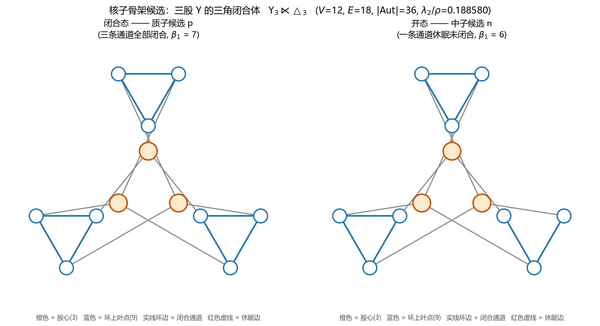
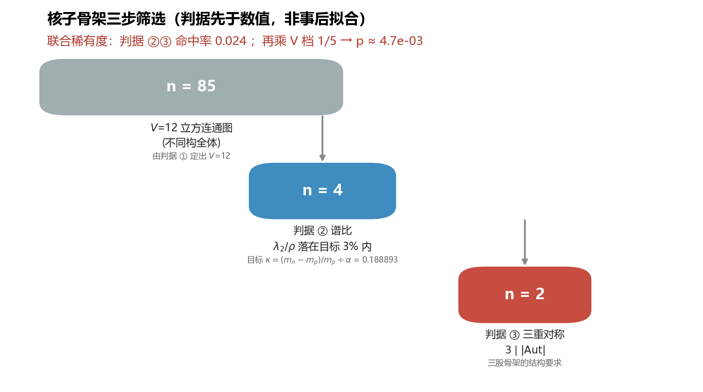
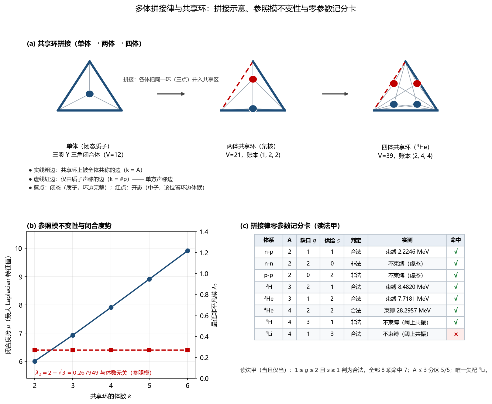

# SRE 框架下核子的完整刻画：开闭二态骨架反演、夸克推测与核反应验证的统一表述

**版本：1.5（融合稿）**
**日期：2026-09-23**

**项目参考（DOI，正文引用见附录 E）：**

- https://doi.org/10.5281/zenodo.22077475 — SRE-v1.6 公理套件
- https://doi.org/10.5281/zenodo.22162514 — SRE-Dynamics 复合基本粒子与关系空间涌现（虚空之书）
- https://doi.org/10.5281/zenodo.22119957 — SRE 动力学：利用纯无量纲图上同调与全局演化步骤严格重构麦克斯韦场方程
- https://doi.org/10.5281/zenodo.20576606 — 层级耗散自组织二值网络动力学
- https://doi.org/10.5281/zenodo.22119635 — SRE 电学量定义（电荷/电流/电阻/电压/功率/E=mc²）
- https://doi.org/10.5281/zenodo.22162514 — SRE 框架下电子的完整刻画（丛书）

## 摘要

本文在状态‑关系熵（SRE）动力学框架下，对核子给出统一的完整刻画：核子是二元自组织网络三股 Y 形相干核上，经休眠边开合二态与闭合度再平衡规则约束后涌现的稳定复合对象，其本体结构为三股 Y 的三角闭合体 Y₃⋉△₃（V=12、E=18、β₁=7、|Aut|=36）。全文沿一条可复现的逻辑链展开：
(1) 建立核子推演的方法学总纲：局部带入 → 拓扑求解 → 反推，与电子推衍同源；
(2) 提出关于夸克的三条本体论推测（夸克≠Q₃、夸克是涌现统计现象、核反应=闭合度再平衡），作为后续反演的结构先验；
(3) 从中子 β 衰变切入，导出核子骨架的结构约束 T1–T3，并重新定义同位旋 Z₂ 为开/闭二态，而非味道多重集翻转；
(4) 建立核子反演联立方程系统，经三步筛选（整数性定顶点数 V=12、谱比定拓扑、三重对称定解）得到幸存候选，并在"过渡-残留"框架下打破并列：ρ 被证明为过渡的严格不变量（残留，充当测量标尺），休眠边取环边，由"闭合度部分再平衡"判据（开态必须仍保有闭合单元）唯一保留候选 A；
(5) 验证裂变链式反应的开闭二态机制：快中子截面恢复同量级、激发盈余判据与热截面 Pearson 相关 +0.932，三级签名统一（单核子β衰变→复合核裂变→宏观链式临界）；
(6) 推导出离子/金属性对加和失效的理论预见与电流是相干簿记投影而非电子持续移动的理论约束；
(7) 以外部核数据为标尺作多体推广：由"开-闭互补 + 两体映像在共享区须可分辨"两条原则（后者为原"闭合体不可重叠"的非空间化改写）确定拼接律，给出共享环构形的结构线性律（V=9k+3、E=15k+3、T=2k+1、β₁=6k+1、|Aut|=6·2^k·k!）与最低激发与体数无关性（λ₂ = 2−√3，重数 k−1）；给出零参数存在性记分卡并裁决读法（取读法甲：A ≤ 3 分区 5/5 命中），同时以定价层的 A=4 外样本失败与拼接律的 A=4 定性失败，共同划定"**A ≥ 4 的核束缚性不在本层可算**"这一诚实边界；并进一步证明该边界在**结合能数值**一侧不可修复（A = 4 的同量异位素为**同一同构类**，结合能差异不可能由图泛函承载；加性剖面定价类被一条与定价函数形态无关的**恒等式**整类证伪），完成"影子解"（变体 D）的处置（其即 k=2 共享环成员，该命名撤回）；
(8) 尝试从 SRE 内导出该修补所需的**反对称系数** λ，结论是 λ 不可导出、亦不可固定（其阈值 29.0596 MeV 超过 ⁴He 结合能，且候选池欠定；SRE 只定住 λ 的"形"、不定住其"值"）；但同一检验产出一个正面结果——把反对称性从**能量项**降格为**存在性判据**后，得到零参数、镜像对称的判据 L1（|n_n − n_p| ≤ 1），在 8 项记分卡上 8/8 命中，故 **A = 4 的存在性问题在本层可算**；外样本检验（A ≥ 5，26 项）显示 L1 不具基本律地位（22/34 命中，其失配分别为 α 闭合效应与缺少 A 标度），边界因此由 A ≥ 4 **移位**至 A ≥ 5；
(9) 把"核子间力是否需同时考虑电子态"这一质疑转写为**本层可判定的构形问题**并给出结论：其唯一可判定形式是**开态带接入共享区**，而该构形与变体 A **同构**（故非新结构，且已被氘核结合能定量排除）；诊断进一步显示，**开态带并非额外能量项，而是拼接律原则 1 的载体本身**——它以"缺口的形状"出现（缺口的有无决定 n-p 能否拼接、缺口的位置决定 n-n 被排除、补全后剩下的 k=1 单方声称边决定两体映像可分辨），这同时解释了共享环上"恒有且仅有一条 k=1 边"这一事实与 λ₂ = 2−√3 的体数无关性。本节并改正了一处先前的错误论断（"中子缺口只能在环 0"——实测三环在自同构群下同一轨道，该表述为记法而非事实，且其改正不影响任何既有结论）。
本工作不证明 SRE 公理客观成立；全部结论均为 SRE 模型内部的自洽性构造，现实物理与化学推论须经外部手段独立核验。

**关键词**：SRE 动力学；核子本体；开闭二态；拓扑反演；β衰变；裂变链式反应；夸克涌现；闭合度势；相干簿记

---

## 0. 文档结构与阅读指引

本论文按如下次序组织，将核子侧全部组成文档（v1 拓扑推衍、反演 v2 骨架、夸克推测、多体拼接律与共享环、维度塌缩检验、裂变链式验证、理论约束）融合为统一表述：

- 第 1 节为**术语约定**。正文中首次出现的非常见术语均以【】标注，其精确定义集中于该节，以浅显的书面表述给出，供不具备物理或数学背景的读者查阅。每项关键术语均附备注，标明其"模型内部构造/类比"的地位，以避免与真实物理量混淆。
- 第 2 节给出 **SRE 理论基础**：二元自组织网络、sim_p 生成器与守恒闭合、比值方法学约束、唯一已标定投影 Π₁。
- 第 3 节给出**核子推演的方法学总纲**：局部带入 → 拓扑求解 → 反推，与电子推衍同源，SRE 与经典物理的互换原则。
- 第 4 节列出**关于夸克的三条推测**（本文提出者主张），作为后续反演的结构先验，包括 Q1 夸克≠Q₃、Q2 夸克是涌现统计现象、Q3 核反应=闭合度再平衡。
- 第 5 节为**入口选择：为什么从中子 β 衰变切入**，包括待解释现象、三条本体论读法、由 β 衰变导出的结构约束 T1–T3。
- 第 6 节完成**同位旋 Z₂ 的重新定义与破缺量级**，v1 的 C1 断言作废，改为开/闭二态，破缺量级 10⁻³ 为结构必然，与电子侧破缺同型比较。
- 第 7 节为**核子反演与三步筛选**，包括联立方程系统 L1–L4、目标式 κ_N、判据①②③、稀有度估计、顺序说明（结构在先、数值后验）。
- 第 8 节介绍**幸存骨架：三股 Y 的三角闭合体**，包括结构定义、拓扑量、结构示意、方法论教训（Π₁ 无法分辨开/闭态）、筛选漏斗。
- 第 9 节为**并列候选的打破：过渡-残留框架**，包括"同谱"表述的更正、Π₁ 的整数闭式、ρ 作为过渡严格不变量（残留）、休眠边取环边的结构裁决、判据④（过渡读数自洽）、判据⑤（闭合度部分再平衡）、判据⑥（定量对照）、明确不作为判据的两项。
- 第 10 节为**维度塌缩检验：距离数据作为拓扑反推的经验基座**，包括尺度锚定、轨道壳律、共价半径 Z_eff、键级步进律、单键加和律分家族、通道容量观察。
- 第 11 节为**核反应验证：从 β 衰变到裂变链式的闭合度再平衡**，包括快中子实验、奇偶判据证伪、激发盈余 Δ 判据、B/A 闭合度势、链式临界、三级签名统一。
- 第 12 节为**多体拼接律与共享环：借用核数据的验证尝试**，包括拼接律的两条原则与两体变体裁决、共享环构形与算术刚性、"投影抹掉谁休眠"（n-p ≅ p-p）、三体/四体的结构线性律与最低模的体数无关性、共享账本定价层的证伪（含恒等式的前置登记）、零参数存在性记分卡与读法裁决、影子解（变体 D）的处置、边界不可修复性的两条证明、**反对称系数的尝试**（λ 不可导出/不可固定；由此降格得到零参数判据 L1，并据此把边界按"存在性"与"结合能数值"两问拆分），以及**开态带的构形定位**（回应"核子间力是否需同时考虑电子态"，证明开态带接入与变体 A 同构，故非新结构；并给出正面结果——开态带是拼接律原则 1 的载体，以"缺口的形状"而非"额外能量项"出现）。配图见图 5。
- 第 13 节为**理论约束**，包括离子/金属性对束缚特殊性的理论预见、电流是相干簿记投影而非电子持续移动。
- 第 14 节为**诚实边界清单**，包括核子反演、裂变验证、多体拼接、维度塌缩、理论约束各环节的诚实边界。
- 第 15 节给出**结论**。
- 附录 A–E 分别给出关键数值表、合并术语表、代码清单与完整复现、图清单、参考文献与 DOI。

---

## 1. 术语约定

| 术语 | 本文中的含义 | 正式类比 | 备注 |
|---|---|---|---|
| **二元自组网** | SRE 的本体：元素取值恒为 ±1、随时间持续生长的网络；万物是它的驻留结构 | 一张没有预设图纸、每步按局部规则自增的网格 | 模型内部构造 |
| **相干核** | 网络中结构稳定、可重复识别的稠密子结构 | 湍急河流中一处长期存在的漩涡 | 模型内部构造 |
| **投影（泛函）** | 把一张图映射为一个数的规则；图变，数变 | 对物体称重——重量是物体的一个"投影" | 模型内部构造 |
| **图 G** | 由顶点和边构成的数学对象 | 一张地铁线路图（站 = 顶点，线 = 边） | 模型内部构造 |
| **V, E** | 顶点数 V，边数 E | 地铁站数、线路数 | 模型内部构造 |
| **度 k** | 每个顶点连出的边数；**k-正则** = 所有顶点度数相同 | 每个站点接几条线 | 模型内部构造 |
| **β₁（第一贝蒂数）** | β₁ = E − V + 1，图中**独立闭环的个数** | 线路图里互不通约的环线数量 | 模型内部构造 |
| **Laplacian 谱** | 由图的邻接关系构造的矩阵的特征值集合，记作 λ₁=0 ≤ λ₂ ≤ … ≤ λ_max=ρ | 一面鼓的固有频率集合——形状不同，频率谱不同 | 模型内部构造 |
| **Π₁ = λ₂/ρ** | 本文使用的唯一**已标定**图泛函：谱隙比 | 一面鼓的"最低泛音/最高音"之比 | 模型内部构造，电子侧标定为 α |
| **自同构 Aut(G)** | 把图映射回自身且不改变连接关系的置换；\|Aut\| 衡量对称程度 | 一个图案有多少种旋转翻转后看起来不变 | 模型内部构造 |
| **顶点轨道** | 在全部对称操作下可以互换的顶点分组 | 图案里"角色相同"的位置种类 | 模型内部构造 |
| **休眠边** | SRE 中 χ=0 的通道：不删除，退化为乘性恒等 1——**导通但不构成环** | 一条仍通电但不成回路的支线 | 模型内部构造 |
| **闭合度 / 开态与闭态** | 骨架中通道是否构成闭环；闭态 = 全部闭合，开态 = 有一条休眠边未闭合 | 电路中的闭合回路 vs 留有一个断点的回路 | 模型内部构造 |
| **图泛函标定** | 用**已知解**确定"哪个泛函对应哪个实测量" | 用标准砝码校准秤 | 模型内部构造 |
| **反演** | 已知泛函取值，反解图的结构参数 | 由称重结果推断物体的材质与尺寸 | 模型内部构造 |
| **裂变截面 σ** | 一个中子（种子）入射某核素并引发裂变的概率面积；随能量变化 | 一把钥匙打开某型号门锁的成功率 | 模型内部构造 |
| **复合核** | 靶核吸收一个中子后形成的暂时态（A+1）；裂变发生在它内部 | 锁在钥匙就位后的内部状态 | 模型内部构造 |
| **中子分离能 S_n** | 从复合核取出最后一个中子所需能量；吸收中子后激发能 E"=S_n | 钥匙落位释放出的"咬合能量" | 模型内部构造 |
| **裂变势垒 B_f** | 复合核要变形到裂变必须翻越的能量坡 | 锁舌要退开必须克服的阻力 | 模型内部构造 |
| **激发盈余 Δ** | Δ = E" − B_f；Δ>0 表示低能（热）中子即可翻越，Δ<0 需额外动能 | 咬合能量 vs 锁舌阻力的差值 | 模型内部构造 |
| **增殖常数 ν** | 平均每次裂变放出的中子数（U-235 约 2.43） | 一次开锁释放出的备用钥匙数 | 模型内部构造 |
| **临界 k_eff** | 每代中子数相对上一代的比值；≥1 链式自持续 | 备用钥匙能否让连锁开锁不中断 | 模型内部构造 |
| **闭合度势** | 图论语言里的"再平衡坡高"：复合体是否值得/能够重排到更低闭合度构型 | 系统决定要不要自我重组的阈值 | 模型内部构造 |
| **拼接律** | 把多个核子骨架合并为多体构形的规则，由"开-闭互补 + 两体映像在共享区须可分辨"两条原则确定 | 拼图只允许在凹凸互补处咬合，且咬合处必须能分辨出是哪一块的缺角被补上 | 模型内部构造 |
| **共享环** | 多个核子经拼接后**共用**的一个闭合三角环 | 多人共握的同一个绳圈 | 模型内部构造 |
| **缺口 / 供给** | 同一共享位置上，开态（中子）核子留下的待补缺口数 g 与闭态（质子）核子提供的完整环边数 s | 榫卯接头上凹槽数与凸榫数 | 模型内部构造 |
| **共享账本** | 记录共享环上每条重合边被多少个体"声称"的计数表；不改变图结构 | 一份只记份额、不记位置的合伙账 | 模型内部构造 |
| **干涉程度** | 多个体在同一共享单元上重合的深度；本文中为结合能的候选定价量，尚未定标 | 多人合奏同一段旋律时的咬合紧密度 | 模型内部构造，未定标 |
| **反对称惩罚项** | 只依赖组成不平衡度 a = \|n_n − n_p\|、在 a ≤ 1 上恒为零的附加项 g(a) = λ·max(0, a − 1)，用于把高不平衡构形推向阈上 | 天平两侧差额超过一格时追加的"失衡罚金" | 模型内部构造；其系数 λ 不可由 SRE 导出（12.12） |
| **判据 L1（反对称判据）** | 共享环拼接合法（预言束缚）当且仅当 \|n_n − n_p\| ≤ 1；零参数、天然 n↔p 对称 | 只允许最接近对称的配方成立 | 模型内部构造；在 A ≤ 4 记分卡上 8/8 命中，A ≥ 5 退化为经验近似（12.12） |

---

## 2. SRE 理论基础

### 2.1 二元自组织网络与 sim_p 生成器

SRE 的本体是**二元自组织网络**，其核心演化算法 `sim_p` 遵循以下规则：

1. **起点与生长**：初始单点种子 M₁=[1]，每步 n→n+1 左上块只读继承历史，前沿挂新行列；
2. **挫折能量与休眠概率**：计算 2 步行走挫折能量 E_local=|M@M| 与拓扑深度 d=n−max(i,j)，休眠概率 p=1−1/(1+λ·d/(E_local+1))，掷随机对称门 χ；
3. **休眠边规则**：休眠边不删除，退化为乘性恒等 1——**导通但不构成环**；
4. **前沿传播**：前沿边界非线性连乘传播 ∏；
5. **角落净荷平衡阀**：全局和 Σ≥0 则新对角元=−1，否则 +1。

该引擎每步都在**注入新的随机差异并向外扩张**，是一台持续生成器，而非收敛终端。万物是该演化流中被守恒闭合规则锁定出的准驻留结构。

### 2.2 守恒闭合与算子 7–10

算子 1–6 负责网络生长与差异注入，算子 7–10 负责**守恒闭合**，这是避免演化流逃逸、撕裂的关键：

- **算子 7**：辛对偶/Hodge 闭包，强锁 ΔΠ≡0 零通量逃逸（庞加莱对偶）；
- **算子 8**：局域无锁守恒阀，强锁 Tr≡0+写冲突场能对冲单调收敛；
- **算子 9**：双阶贝蒂缝合，强锁 Δβ₁≡0，保证流形不撕裂、不维度分裂；
- **算子 10**：有效阻抗 Z_eff 事前豁免桥边，保 λ₂>0。

### 2.3 比值方法学约束与唯一已标定投影 Π₁

SRE 的推演遵循**局部带入 → 拓扑求解 → 反推**三步法，根本约束是**理论本身不携带任何绝对单位**，只能给出不同物理量之间的**无量纲比值**。因此 SRE 推衍的全部合法输入必须是**实测无量纲比值**，输出则是图的结构参数。

目前 SRE 仅有一条经过数值验证的图-物理投影，来自电子：

$$\Pi_1(G)=\frac{\lambda_2(L_G)}{\rho(L_G)}$$

其中 L_G 为图 G 的组合 Laplacian，λ₂ 为其最小非零特征值（谱隙），ρ 为最大特征值。电子侧标定结果为：本体 Q₃（V=8,E=12,β₁=5,n=60）的 Möbius 参数化点云经校准后，Π₁=α≈1/137.036，相对偏差 1.45×10⁻⁵，校准后弦权 w"=1+4.347×10⁻⁵，与论文报告的 δ=4.347×10⁻⁵ 五位吻合。

---

## 3. 核子推演的方法学总纲

核子推演与电子推衍同源，遵循**局部带入 → 拓扑求解 → 反推**三步法，其核心原则如下：

### 3.1 局部带入的界定

"局部带入"指将少量实测值作为**刚性边界条件**显式注入模型，作为求解的固定端点。本文的注入项固定为（CODATA 2018）：

| 注入量 | 数值 | 备注 |
|---|---|---|
| m_e（电子静质量） | 0.510998950 MeV | 实测注入 |
| m_p（质子静质量） | 938.27208816 MeV | 实测注入 |
| m_n（中子静质量） | 939.56542052 MeV | 实测注入 |
| α⁻¹（精细结构常数倒数） | 137.035999084 | 与库仑力关联的锚点 |

这些注入量本身**不承诺由 SRE 公理唯一导出**，凡未经注入、亦无法由模型拓扑确定的量，一律不得声称算得。

### 3.2 SRE 与经典物理的互换原则（互为验证）

SRE 框架的核心主张之一：在刚性边界条件设定下，SRE 推衍与经典物理互为校准。具体表现为双向线索关系：

- **经典量 → 模型**：me、mp、mn、α⁻¹ 等实测值作为端点注入，模型在此端点回收自洽的拓扑结构结论；
- **模型 → 经典量**：凡模型内部能确定给出的无量纲结构量（谱比、翻转计数、轨道唯一性、幂等收敛），均可作为经典量的独立结构线索。

二者**互为验证线索**，而非一方凌驾于另一方。这是本文全部推演的立场基础。

---

## 4. 关于夸克的三条推测（本文提出者主张）

> **本节内容为本文提出者的本体论推测，非既有理论的结论，亦非本文的推导结果。**
> 本节之所以单列并置于方法章节之后，是因为它**决定了核子骨架应当长成什么样**——它是后续筛选的"结构先验"，一旦改变，筛选结果随之改变。如实记录，是为了让读者清楚：本文的骨架不是从数据里"客观浮现"的，而是在这组推测所限定的搜索空间里被选出的。

### 4.1 推测 Q1：夸克不应与电子共用同一基底

**主张**：电子在本体论上对应 Q₃（三维超立方体，一个自足的闭合拓扑体）。夸克（以及核子）不应被映射为同一个 Q₃，也不应被映射为"Q₃ 的三份复制"。

**理由**：电子与核子在可观测行为上差异过大——电子可独立存在、全同、长寿；核子被束缚于核内、有内部结构、可衰变。若二者共用同一基底，这些差异就缺少拓扑来源。

**本文的采纳**：接受。v1 文档采用的"3×Q₃ 复合"构造据此作废。本文改在"非自足的开放结构"族内搜索核子骨架。

### 4.2 推测 Q2：夸克极可能是涌现的统计现象，而非独立存在的本体

**主张**：既然夸克在实验中从不独立出现（色禁闭），那么现有实验对夸克的"观测"，很可能与 SRE 对磁场、引力场的理解属于同一类——**它们是统计结果，不是相对独立的涌现相干核**。换言之：夸克可能根本不存在为本体，只存在为读数。

**与既有 SRE 立场的一致性**：这一推测与 SRE 已确立的"观测 = 相干核与环境耦合的响应谱"相容。在此视角下，磁场、引力场、深度非弹性散射中的"部分子"读数、乃至量子纠缠的关联，都属于**同一类统计投影**，区别只在于被读的相干核的层级与受限程度。

**本文的推论**：若 Q2 成立，则标准模型中"三个夸克"的计数 N_c=3 需要重新解释——

- N_c=3 不是"有三种夸克"，而是**骨架有三股**；
- "味道"（uud / udd）不是组分清单，而是**三股骨架开合状态破缺后，在探测器上的统计投影**；
- 分数电荷不是单体的属性，而是**三股共享同一闭合回路时的均分读数**。

### 4.3 推测 Q3：核反应是闭合度的再平衡

**主张**：核裂变与核聚变，在本体论上不是"夸克的重组"，而是**封闭复合体之间闭合度的再平衡**——即闭合通道的重新分配，而非构件的搬运。

**本文的采纳**：接受，并作为核子骨架必须满足的一条结构性要求——**骨架必须能被"开合度"参数化**，且开与闭之间的差别要足够小，才能解释核反应能量在 MeV 量级（而非 GeV 量级）。

### 4.4 三条推测对搜索空间的约束（小结）

由 Q1–Q3 推出的、用于下文筛选的**结构先验**：

| 编号 | 结构先验 | 来源 |
|---|---|---|
| **S1** | 核子骨架不是 Q₃ 及其复制，也不是 Möbius 阶梯族 | Q1 |
| **S2** | 骨架可分解为**三股**（N_c=3 重解释为股数） | Q2 推论 |
| **S3** | 骨架必须支持"开 / 闭"二态，且二态差别极小 | Q3 + β 衰变现象 |
| **S4** | 骨架**非自足**：结构上天然留有一个未闭合的口 | 由"核子可衰变"推出 |

---

## 5. 入口的选择：为什么从中子 β 衰变切入

### 5.1 待解释的现象

自由中子发生 β⁻ 衰变：

$$n \longrightarrow p + e^- + \bar\nu_e$$

相关的实测事实有三条，它们共同构成对核子拓扑的硬约束：

| 事实 | 数值 | 对拓扑的要求 |
|---|---|---|
| 质量差 m_n−m_p | 1.293 MeV，即 Δm/m_p=1.3784×10⁻³ | 质子与中子的结构差别应当**极小** |
| 寿命差异 | 中子 879.4 s；质子稳定（下限 >10³⁴ a） | 两者**不是对称等价**的，否则寿命不应悬殊 |
| 放出的是电子 | 与原子中的电子完全全同 | 放出的电子必须能落入电子本体的吸引子 |

第三条最为锋利：**β 衰变直接暴露"核子不是闭合体"**——一个自足闭合的拓扑体没有理由排出一个与电子完全全同的电子。本文因此把 β 衰变选作反演的入口。

### 5.2 三条本体论读法

**读法一：中子不是"质子 + 电子"，而是同一骨架的未闭合态。**
β⁻ 衰变是把那条未闭合的通道排出去，余者闭合成质子。方向性因此落在**闭合度**上：闭合者更轻（轻 1.293 MeV）且不再衰变；未闭合者更重，且迟早要排。这个读法同时解释了**为什么只有中子衰变**——因为只有中子携带那个未闭合的口。

**读法二：在 sim_p 的语言里，这是"休眠边"的命运分岔。**
SRE 的二元自组网中，休眠通道（χ=0）并不删除，而是退化为乘性恒等 1——**导通但不构成环**。这恰是"通道仍在，但没有闭合"的精确对应。于是：维持恒等 = 中子尚存；被摘除 = β 衰变。寿命层级也随之可解：休眠是默认态，摘除是罕见扰动，故中子寿命（10³ s）比强子时标（10⁻²³ s）长 26 个数量级。

**读法三：这是深度序上的沉降。**
电子是深而紧的驻留（相干度高）；核子是浅而松的驻留。β 衰变是浅结构沉降为深结构，能量由驻留深度差支付——与 v1 中"质量与逻辑深度成反比"的登记一致（核子浅约 1836 倍，故重约 1836 倍）。

**一项附带收获**：若电子是生成器的**唯一最深吸引子**，则电子的全同性（宇宙各处的电子毫无区别）不必靠"从某处掏出同一个电子"来保证，而是"任何脱离骨架的种子都落入同一个吸引子"。β 衰变放出的电子与原子中的电子完全相同，由此得到的是**机制**，而非假设。

### 5.3 由 β 衰变导出的结构约束

| 编号 | 约束 | 论证 |
|---|---|---|
| **T1** | 核子骨架必须**非自足** | 三股骨架共 9 个叶点（奇数），无法两两配对闭合，天然留一个口。这是"核子可衰变"的图论根源 |
| **T2** | 质子与中子**不是图同构的 Z₂ 像**，而是同一底层矩阵的两组"醒 / 眠"配置，其相干子图环数 β₁ 相差 1 | 若二者精确同构，则衰变无方向、寿命不应悬殊 |
| **T3** | 被摘下的只需是**种子**，不要求骨架内部包含完整的电子本体 | 电子是全同吸引子，而非核子的预制构件 |

---

## 6. 同位旋 Z₂ 的重新定义与破缺量级

### 6.1 冲突的实质

v1 文档的 C1 断言为：

> **C1**：同位旋 Z₂ 双重态——无不动点对合、电荷 p=+1/n=0、质子与中子图同构。

在"夸克极可能是涌现统计现象"的推测（Q2）之下，这条断言**不是需要修补，而是需要作废**，理由是：C1 建立在 {uud}↔{udd} 的**味道多重集翻转**之上，而这等于把统计读数当成了本体构件——与 Q2 正面冲突。

### 6.2 Z₂ 的重新定义

| 项 | v1（作废） | 本版 v2 |
|---|---|---|
| Z₂ 的含义 | 味道多重集翻转 {uud}↔{udd} | 骨架的**开 / 闭（醒 / 眠）二重性**，与味道无关 |
| 两态关系 | 精确图同构 | **不同构**：β₁ 相差 1 |
| 对称性 | 精确（无不动点对合） | **天然破缺**，破缺量即闭合能 |
| 与观测的对应 | 味道 = 本体组分 | 味道 = 该破缺在探测器上的统计投影 |

重新定义之后，一个原本需要额外假设才能解释的现象变得自明：

### 6.3 破缺量级为何是 10⁻³：结构必然性

休眠边在 SRE 中**仍导通**（退化为恒等 1，而非置零或删除）。因此开态与闭态的差别**不是"有没有一条键"，而是"有没有一个环"**。由此：

- 能量差只来自"环的缺失"，而非"通道的缺失"；
- 故 Δm/m_p∼10⁻³ 是**结构必然**，而不是参数巧合。

这一条同时解释了另外两个问题：**为什么质量差这么小**（只差一个环），以及**为什么中子还能存在这么久**（休眠是默认态）。

### 6.4 与电子侧破缺的同型比较

| 系统 | 破缺量 | 性质 |
|---|---|---|
| 电子（Möbius 扭转） | w"−1=4.347×10⁻⁵ | 近对称破缺 |
| 核子（开 / 闭） | Δm/m_p=1.378×10⁻³ | 近对称破缺 |
| 比值 | 31.7 | 同型，量级不同 |

两者属于**同一类破缺**（对称的近似成立 + 小量破缺），只是核子侧的破缺幅度为电子侧的约 32 倍。这一同型性是本版 Z₂ 重新定义的自洽性支持，但不构成独立证据。

---

## 7. 核子反演与三步筛选

### 7.1 核子的联立方程系统

把同一套字典搬到核子层，设核子骨架为图 G_N，其未知的拓扑参数为 (V,E,k,w)，则方程系统为：

| 层级 | 方程 | 性质 |
|---|---|---|
| **L1 计数层** | β₁ = E − V + 1；n = E·β₁；kV = 2E；V≡0 (mod 2) | 整数（丢番图）方程，约束最强 |
| **L2 谱方程** | Π₁(G_N) = κ_N | 需要识别 κ_N 对应的实测比 |
| **L3 扭转近对称** | w_N = 1+δ_N, \|δ_N\|≪1 | **继承自电子的假设，非独立约束** |
| **L4 质量-深度方程** | m_p/m_e = Ψ(G_N)/Ψ(G_e) | Ψ 尚未定义，**当前不可用** |

自由度核算：独立未知量 4 个，方程 L1 三条 + L2 一条 = 4 条，**形式上闭合**；但由于 κ_N 尚未识别、L3 非独立，**实际欠定 1 个自由度**。

### 7.2 目标式的提出（明确标注为待验假设）

本文提出如下**候选**关系（尚未独立论证）：

$$\boxed{\ \frac{m_n-m_p}{m_p}\;=\;\alpha\cdot\Pi_1(G_N)\ }$$

若成立，其物理含义是：**核子的同位旋破缺含电磁起源**（α 显式出现），而 Π₁ 是纯拓扑的结构因子。

代入实测值：

$$\kappa_N \;=\;\frac{(m_n-m_p)/m_p}{\alpha}\;=\;\frac{1.378419305\times10^{-3}}{7.297352569\times10^{-3}}\;=\;0.188893067$$

**这一识别是假设，不是结论。** 下文的三步筛选，检验的是"在 V=12 立方图族中，哪些图的 Π₁ 落在 κ_N 附近"，以及"筛选结果有多稀有"。

### 7.3 判据 ① 整数性定顶点数 V

对 k-正则图，kV=2E，β₁=E−V+1。取 k=3（立方图），则 β₁=V/2+1。检验 β₁·Δm/m_p 与实测的"流质量占比"(2m_u+m_d)/m_p=0.9581% 的匹配：

| V | β₁ | β₁·Δm/m_p | 对 0.9581% 的偏差 |
|---|---|---|---|
| 8 | 5 | 0.6892% | −28.07% |
| 10 | 6 | 0.8271% | −13.68% |
| **12** | **7** | **0.9649%** | **+0.70%** |
| 14 | 8 | 1.1027% | +15.09% |
| 16 | 9 | 1.2406% | +29.48% |
| 18 | 10 | 1.3784% | +43.86% |

**唯一选中 V=12（β₁=7）**，相邻档偏差在 ±14% 以上，流夸克质量 ±2% 的方案不确定性动摇不了这个选择。

### 7.4 判据 ② 谱比定拓扑

枚举 V=12 的立方连通图（该阶不同构总数为 85，本次采样去重得到全部 85 个），计算各图的 Π₁=λ₂/ρ：

| 统计量 | 值 |
|---|---|
| 样本数 | 85 |
| Π₁ 最小值 / 中位数 / 最大值 | 0.0313 / 0.1319 / 0.2768 |
| 落在 κ_N 的 0.17% 内 | 0 |
| 落在 0.5% 内 | 3 |
| 落在 2% 内 | 4 |
| 落在 3% 内 | 4 |

即：**Π₁ 落点本身已经是很强的筛选（85 → 4）**，因为该族的谱比分布集中在 0.13 附近，而目标值 0.1889 位于分布的上四分位之外。

### 7.5 判据 ③ 三重对称定解

由结构先验 **S2**（骨架可分解为三股），要求图的自同构阶被 3 整除，即 3∣|Aut(G)|。对判据 ② 幸存的 4 个候选逐个取自同构阶：

| Π₁ | 对 κ_N 偏差 | \|Aut\| | 顶点轨道 | 三角环数 | 判定 |
|---|---|---|---|---|---|
| 0.188580 | **0.165%** | 36 | 2 | 3 | **保留** |
| 0.188580 | **0.165%** | 12 | 3 | 1 | **保留** |
| 0.188011 | 0.467% | 2 | 6 | 0 | 剔除 |
| 0.192106 | 1.701% | 8 | 3 | 0 | 剔除 |

**85 → 4 → 2。**

### 7.6 稀有度估计

- 判据 ②③ 联合命中率：2/85 = 0.0235
- 再乘判据 ① 的 V 档选择（5 档选 1）：p ≈ 4.7×10⁻³

这一数值的含义是：**若核子骨架是随机从这类图中抽取的，同时满足三项判据的概率不足千分之五。** 但它不是统计显著性检验——因为三项判据并非互相独立（判据 ① 与判据 ② 都用到 Δm），且 κ_N 的识别本身是假设。

### 7.7 顺序说明：结构直觉先定，数值后验

需要特别指出筛选的**时间顺序**，因为它关系到结果的可信度：

> 偏差最小的那个候选（|Aut|=36、3 个三角环、顶点分 2 类），是本文在看到任何谱比数值**之前**，依据"三股 Y 骨架 + 奇叶无法两两配对"这一结构直觉手构出来的；谱比吻合（0.165%）是**事后核验**的结果，不是拟合的目标。

若为拟合所得，则"三个巧合同时命中"是循环论证；而结构在先、数值在后，则这一吻合至少具备**非平凡性**。

---

## 8. 幸存骨架：三股 Y 的三角闭合体

### 8.1 结构定义

记候选骨架为 Y₃⋉△₃，构造如下：

1. 取 3 个**股心** c₀,c₁,c₂，彼此不相连；
2. 取 3 个**三角环** T₀,T₁,T₂，每个环含 3 个叶点；
3. 每个股心与每个三角环**恰有一个**叶点相连（共 9 条辐条，构成一个拉丁方型的完美匹配）；
4. 环内边 3×3=9 条，辐条 9 条，故 E=18；V=3+9=12；每个顶点度均为 3。

拓扑量（复算结果）：

| 量 | 闭合态（质子候选） | 开态（中子候选，断一条环边） |
|---|---|---|
| V / E | 12 / 18 | 12 / 17 |
| β₁（独立环数） | **7** | **6** |
| 三角环数 | 3 | 2 |
| 围长 / 直径 | 3 / 3 | 3 / 3 |
| \|Aut\| | **36** | 4 |
| 顶点轨道 | **2**（股心 / 叶点） | 6 |
| λ₂ / ρ | 0.188580 | 0.188580 |

|Aut|=36=3!×3!，恰是"3 个股心 × 3 个三角环"的置换对称阶；顶点轨道为 2，即结构中只有两类角色——股心与叶点。这两项与结构先验 **S2**（三股）高度吻合。

**休眠边的边类归属。** 18 条边在自同构群作用下天然二分，各 9 条一轨：**环边**（叶点—叶点）与**辐条**（股心—叶点）。经结构裁决，**休眠边取环边**。依据是：休眠边本身也是同态映射的像，其逻辑深度很大——打开环边**不改变任何谱量**（ρ 与 λ₂ 均严格不变），改变的只是闭合单元数（3→2）；换言之，休眠在谱上不可见，它作用在闭合结构这一本体层面。开态定义据此确定，并与图 1 一致。

两类边打开后的读数对照（推导见第 9.4 节）：

| 边类 | 打开后 λ₂ | 打开后 ρ | 打开后闭合单元数 T |
|---|---|---|---|
| **环边**（休眠边） | 1.000000（不变） | 5.302776（不变） | **3 → 2** |
| 辐条 | 1 → 0.527166 | 5.302776（不变） | 3（不变） |

### 8.2 结构示意



**图 1**：左为闭合态（质子候选，三条环边全部闭合），右为开态（中子候选，一条**环边**休眠未闭合，红色虚线）。橙色为股心（3 个），蓝色为环上叶点（9 个），蓝色实线为闭合通道。开态与闭态的唯一差别是"少一个闭合单元"（三角环数 3→2），这正是第 6.3 节破缺量级论证的结构基础。

### 8.3 一条重要的方法论教训

开态与闭态的 Π₁ 取值**完全相同**（均为 0.188580）。这说明：

> **泛函 Π₁ 无法分辨质子与中子。** 开合应当改由 β₁（独立环数）、闭合单元数 T 或休眠边数读取，而不是由谱隙比读取。

推广为一般教训：**泛函的选择必须与待分辨物理量的性质相匹配。** 一个对"环的增减"不敏感的泛函，不可能用来诊断"环的增减"所对应的现象。这一点对下一步的泛函标定（第 10 节）是硬约束。

### 8.4 筛选漏斗



**图 2**：V=12 立方连通图共 85 个（判据 ① 定出 V）→ 谱比落在目标 3% 内剩 4 个（判据 ②）→ 满足三重对称剩 2 个（判据 ③）。联合稀有度 p≈4.7×10⁻³。

---

## 9. 并列候选的打破：过渡-残留框架

### 9.1 一处更正：A、B 并不同谱

旧稿曾称两个候选"同谱非同构"，这一表述有误。二者**并非同谱**：

| 谱（组合 Laplacian：值×重数） | 候选 A | 候选 B |
|---|---|---|
| 完整谱 | 0¹, **1²**, ((7−√13)/2)², **4⁵**, ((7+√13)/2)² | 0¹, **1¹**, ((7−√13)/2)², **2², 4³, 5¹**, ((7+√13)/2)² |
| 不同特征值个数 | 5 | 7 |
| λ₂ = λ₃ ? | 是（1, 1） | 否（1, 1.697224） |

二者共享的只有三个**极端谱量**：λ₁ = 0、λ₂ = 1、ρ = (7+√13)/2 = 5.302776。而 Π₁ = λ₂/ρ 恰好只是其中两个之比——这才是 Π₁ 分不开 A、B 的根本原因：**它看不见谱的内部结构**。

其余不变量确有实质差异：

| 不变量 | 候选 A | 候选 B |
|---|---|---|
| V / E / β₁ | 12 / 18 / 7 | 12 / 18 / 7 |
| λ₂ / ρ / Π₁ | 1.000 / 5.303 / 0.188580 | 同 |
| 三角环数 T | **3** | **1** |
| 顶点轨道 | **2** | **3** |
| \|Aut\| | **36** | **12** |
| 边轨道数与大小 | **2**（9, 9） | **4**（3, 3, 6, 6） |
| Kirchhoff 指数 | 57.67 | 54.07 |
| Wiener 指数 | 135 | 129 |
| 平均电阻距离 | 0.8737 | 0.8192 |

### 9.2 一个闭式：Π₁ 只由三个整数决定

$$\Pi_1=\frac{1}{\rho}=\frac{\beta_1-\sqrt{V+1}}{E}=\frac{7-\sqrt{13}}{18}=0.188580485$$

对照实测 κ_N = Δm/m_p ÷ α = 0.188893067，偏差 0.165%。即核子的 Π₁ **完全由 β₁、V、E 三个整数决定**。A、B 同属这一"√13 子族"；Π₁ 窗口内另两个图谱是泛型的（12 个互异特征值），仅近似命中。

### 9.3 过渡的严格不变量：ρ 是"残留"

对 A、B 各作全部 18 次单边打开，考察各谱量的变动范围：

| 谱量 | A 的极差（18 次） | B 的极差（18 次） |
|---|---|---|
| **ρ（最大 Laplacian 特征值）** | **3.6×10⁻¹⁵** | **6.2×10⁻¹⁵** |
| λ₂ | 0.473 | 0.473 |

ρ 在过渡下**严格不变**（差值即浮点噪声量级），而 λ₂ 大幅可动。物理读法：**过渡中保持不变的那部分谱量即"残留"，天然充当测量的对照物（比值的分母）**；分子则是过渡中可动的那一支。这与"光是演化之间的拓扑残留"这一本体论读法同向——**标尺是残留，不是被测量的对象**。

### 9.4 休眠边取环边（结构裁决）

**依据（结构裁决）**：休眠边本身也是同态映射的像，其逻辑深度很大。就本骨架而言，深度最大的候选是**环边**——打开环边不改变任何谱量（ρ 与 λ₂ 均严格不变），改变的只是闭合单元数。也就是说，休眠在谱上"不可见"，它作用在本体层（闭合度）而非可观测谱层，这正是"逻辑深度大"的表现。

A 的 18 条边在自同构群下天然二分，各 9 条一轨：

| 边类 | 打开后 λ₂ | 打开后 ρ | 打开后闭合单元数 T | Laplacian 迹 |
|---|---|---|---|---|
| **环边**（叶点—叶点；休眠边） | **1.000000（不变）** | 5.302776（不变） | **3 → 2** | 36 → 34 |
| 辐条（股心—叶点） | 1 → 0.527166 | 5.302776（不变） | 3（不变） | 36 → 34 |

开态定义据此确定，并与第 8.1 节、图 1 一致：**中子态 = 打开一条环边**。此时 ρ 与 λ₂ 均不变，唯一变化的是闭合单元数（3→2）与迹（−2）。

### 9.5 判据 ④ 过渡自洽性：等价通道必须给出等价读数

休眠状态不是"某一条边"的状态，而是**整条边轨道的同态像**：边集在自同构群作用下商到轨道集，这一步就是同态映射。因此过渡读数必须在**轨道层面**唯一。

- 候选 A：环边 9 条同轨，打开任意一条都给出 (λ₂ = 1.000000, T = 2)，读数唯一 ✓
- 候选 B：环边 3 条同轨，读数亦唯一（λ₂ = 1.000000, T = 0）✓

**诚实登记**：全池中"环边读数唯一"有 28/85；与 Π₁<3% 联合后剩 **2** 个图（A 与 B）。**判据 ④ 单独不足以打破并列**，故与判据 ⑤ 联合使用。

### 9.6 判据 ⑤ 闭合度部分再平衡：开态必须仍保有闭合单元

物理依据（**不依赖"三股"先验 S2**）：核反应是闭合度的**再平衡**（第 4.3 节推测 Q3）。再平衡意味着**部分**释放，而不是把闭合度清零；中子仍是有束缚结构的复合体，其开态必须仍保有闭合单元。更重要的是，Q3 已由第 11 节的裂变链式验证独立支持（闭合度势 Δ 与热截面的 Pearson 相关 +0.932），因此把 Q3 用作判据不构成循环论证。

- 候选 A：T: 3 → 2（减一，仍保留 2 个闭合单元）✓
- 候选 B：T: 1 → 0（**清零**）✗ —— 若把 B 读作核子，则一次再平衡即抹掉全部闭合度，与"再平衡"这一机制本身矛盾。

池内统计（85 图，判据先于数值）：

| 判据表达式 | 命中 |
|---|---|
| 环边读数唯一（T 层面） | 28 / 85 |
| T_closed ≥ 2 且 环边读数唯一 | 11 / 85 |
| [Π₁ < 3%] ∧ [环边读数唯一] | 2 / 85 |
| **[Π₁ < 3%] ∧ [环边读数唯一] ∧ [T_closed ≥ 2]** | **1 / 85 = A** |
| **[Π₁ < 3%] ∧ [开态 T_open ≥ 1]** | **1 / 85 = A** |

判据 ⑤ 只要求"再平衡是部分的"，与判据 ③（3‖\|Aut\|）**无关**，因此不受"同源"之嫌，也不需要在数值窗口内挑选方向。

### 9.7 判据 ⑥ 定量对照（仅作佐证）

闭合度比（开态/闭态）与磁性比对照：

| 候选 | T：闭 → 开 | 比值 | 与 \|μ_n/μ_p\| = 0.684979 对照 |
|---|---|---|---|
| **A** | 3 → 2 | **2/3 = 0.666667** | 偏 **2.67%** |
| B | 1 → 0 | 0 | 无对应 |

**诚实边界**：36 次比较、5% 阈值下偶然命中期望约 1.8 次，故本项仅登记为**线索**，不作证据。

### 9.8 明确不作为判据的两项

以下两项经检验后**不予采用**：

1. **"某一模恰好释放整数 1.000000"** —— 观测到闭态 4.000000 → 开态 3.000000，即"恰好一个模释放整数 1"。这只来自同态映射的偶然，**不是必然的离散量**，不构成判据；
2. **"释放总量恒为 2"** —— 去掉一条边必使 Laplacian 迹减 2，这是迹的恒等式，不含任何新信息。

因此在辐条类打开中所观察到的逐模分配（1.000000 / 0.472834 / 0.367343 / 0.159823，其余 8 个不动）**不作为判据**，仅作为过渡机理的说明性描述保留。

### 9.9 结论

**结构层：判据 ⑤ 唯一命中 A，B 被排除；判据 ④ 佐证。**

**实测层：仍不独立。** 唯一独立于结构先验的定量对照（判据 ⑥，偏差 2.67%）强度不足。

因此正确表述是：**"在闭合度部分再平衡这一条件下，A 是唯一幸存者；纯实测层面仍未独立确定。"** 而非"实测已确定 A"。

需要一并指出：在休眠边取环边的前提下，过渡对 λ₂ 与 ρ **均无影响**，故 Δm/m_p = α·Π₁ 中的 Π₁ 是由两个**不变量**构成的"标尺"，状态变化本身由闭合单元数 T 承载。这一读法与"残留充当测量对照物"一致，但意味着"质量差 ↔ 能级移动"的直读方式在此不适用，已被登记为第 15 节未决项 5。

---

## 10. 维度塌缩检验：距离数据作为拓扑反推的经验基座

为给核子拓扑的结构求解提供可检验的"距离阶梯"基线，执行维度塌缩检验。该检验是核子推演的**经验基座**：②成键规则与③骨架枚举在此为同一件事——**骨架通道结构 ↔ 距离阶梯**。

### 10.1 尺度锚定（无量纲恒等式）

$$a_0\cdot m_e\cdot c/\hbar = 1/\alpha \approx 137.036$$

实测验证：比值为 1.0000000006，与 1 几乎一致。

### 10.2 轨道壳律 r_n = n²·a0/Z（a0 单位）

| Z | n=1 | n=2 | n=3 | n=4 | 整数比 |
|---|---|---|---|---|---|
| 1 | 1.000 | 4.000 | 9.000 | 16.000 | 1 : 4 : 9 : 16 |
| 2 | 0.500 | 2.000 | 4.500 | 8.000 | 1 : 4 : 9 : 16 |
| 3 | 0.333 | 1.333 | 3.000 | 5.333 | 1 : 4 : 9 : 16 |

### 10.3 共价半径（a0 单位）与导出 Z_eff（泄漏剖面，主族扩展）

Z_eff ≈ n²/(r/a0)（n 取主壳量子数）：第二/三周期沿周期逐级增大 = 核泄漏递增。

| 元素 | Z | r/Å | r/a0 | 导出 Z_eff | 主壳 n |
|---|---|---|---|---|---|
| Li | 3 | 1.28 | 2.419 | 1.65 | 2 |
| Be | 4 | 0.96 | 1.814 | 2.20 | 2 |
| C | 6 | 0.76 | 1.436 | 2.79 | 2 |
| N | 7 | 0.71 | 1.342 | 2.98 | 2 |
| O | 8 | 0.66 | 1.247 | 3.21 | 2 |
| F | 9 | 0.57 | 1.077 | 3.71 | 2 |
| Na | 11 | 1.66 | 3.137 | 2.87 | 3 |
| Si | 14 | 1.11 | 2.098 | 4.29 | 3 |
| Cl | 17 | 1.02 | 1.928 | 4.67 | 3 |
| K | 19 | 2.03 | 3.836 | 4.17 | 4 |
| Rb | 37 | 2.20 | 4.157 | 6.01 | 5 |

同族跨周期 Z_eff 单调递增，如 14 族 C/Si/Ge/Sn: 2.79→4.29→7.06→9.52。

### 10.4 键级步进律（每增一键的收缩 Δ，a0 单位）

| 家族 | 键级串 | Δ(1→2) | Δ(2→3) | 备注 |
|---|---|---|---|---|
| C–C | single / double / triple | 0.378 | 0.265 |  |
| C–N | single / double / triple | 0.359 | 0.227 |  |
| C–O | single / double / triple | 0.378 | 0.189 |  |
| N–N | single / double / triple | 0.378 | 0.287 |  |
| Si–Si | single / double / triple | 0.340 | 0.113 | 第三周期重原子三键弱化 |

核心多重键族（剔除 O–O、N–O 孤对族，n=11）：Δ(1→2)=0.352±0.037 a0（RMS 0.354），Δ(2→3)=0.232±0.058 a0（RMS 0.239）。

### 10.5 单键加和律 d(A–B)≈r_A+r_B（a0 单位，分家族统计）

| 家族 | n | 均值 | RMS | 判定 |
|---|---|---|---|---|
| 有机 C 骨架中性共价族 | 11 | +0.6% | 1.5% | 严格成立 |
| 轻杂原子/氢化物 | 25 | −2.9% | 6.7% | 近似（电负偏移） |
| 同核第 2 周期（H/O/F） | 5 | +10.0% | 12.5% | 系统拉伸 → 通道饱和修正 |
| 同核重主族（Si…I） | 10 | −0.9% | 3.3% | 加和律回归 |
| 离子/金属性对 | 6 | −12.3% | 14.4% | 失效（另一本体论区间） |

### 10.6 键级容量观察：各族最大稳定键级

- 14 族：C≡C(3)、Si≡Si(3)、Ge≡Ge(3) —— 容量 3
- 15 族：N≡N(3)、P≡P(3)、As≡As(3) —— 容量 3
- 16 族：O=O(2)、S=S(2)、Se=Se(2)、Te=Te(2) —— 容量 2
- 17 族：F–F(1)、Cl–Cl(1)、Br–Br(1)、I–I(1) —— 容量 1

通道容量并非恒 3，而是随族随周期递减；第 2 周期同核小原子（O、F）因孤对排斥，实际键级往往低于容量上限，这与成键规则中的"通道饱和 + 孤对排斥"两项修正一致。

---

## 11. 核反应验证：从 β 衰变到裂变链式的闭合度再平衡

本文不是提出新的核结构理论，而是**用裂变与链式反应的既有测量，验证核子推演中一个已经被接受的机制性断言能否在更大尺度上继续成立**。这个断言是：

> **核反应 = 闭合度再平衡。**（核子反演 v2 第 3 章，推测 Q3）

### 11.1 快中子实验：差异只在低能沉降

**判据设计（判据先于数值）。** 若 Q3 的读法成立，则：

- **慢（热）中子**：只能在复合骨架中"已有未配对开放通道"处低能耗沉降，而对"全配对闭合"骨架无处落点 → 截面应跨极大范围；
- **快中子**：能量足以直接破坏闭合/配对，绕过低能沉降通道 → 截面应对所有核素**恢复到同一量级**。

**结果**：

| 量 | 数值 |
|---|---|
| 热截面动态范围 | **8.58 个数量级**（max 6401 b / min 1.7e-5 b） |
| 热截面 1–99 分位跨度 | 8.39 数量级 |
| 快截面动态范围 | **1.48 个数量级**（max 2.43 / min 0.080 b） |
| 快截面（去 Th-232） | 0.90 数量级 |
| 快截面 10–90 分位跨度 | **0.40 数量级** |

**解读。** 快中子把截面压缩到同一量级，差异确实集中在低能/慢中子沉降端。这与"休眠边需低能耗摘除、高能可直接破坏闭合"的机制同向，且是**10^4 倍级**的结构签名——不是小数值巧合。

### 11.2 一个诚实的证伪：简单奇偶判据不成立，需升级

一个自然的"最简判据"是：**开放通道数 = 中子数 N mod 2**，即奇 N 核"有一条未配对通道"，偶-偶核"全配对闭合"。该判据预测：偶-偶核热截面应一律极小。

**它被三个反例证伪**：

| 反例 | N | σ_th (b) | 与"偶-偶应关闭"的冲突 |
|---|---|---|---|
| U-232 | 140（偶） | **76.5** | 高 |
| Pu-238 | 144（偶） | **17.8** | 中高 |
| Cm-242 | 146（偶） | **4.67** | 中 |

同一偶-偶类别内部，σ_th 从 76.5 b（U-232）到 1.7e-5 b（U-238），跨 **6.7 个数量级**。奇偶本身不能决定是否可热裂变。

### 11.3 升级：复合核激发盈余判据

真正的判据是复合核（A+1）的**激发盈余**：

$$\Delta = E^\ast - B_f = S_n(A+1) - B_f(A+1)$$

其中 E"=S_n(复合核) 是吸收热中子后的激发能，B_f 是裂变势垒。Δ>0：激发能本身就超过再平衡坡 → 热可沉降；Δ<0：需快中子提供额外动能。

**结果（9 个靶核全表）**：

| 靶核 | E" (MeV) | B_f (MeV) | Δ (MeV) | log₁₀σ_th | 判定 |
|---|---|---|---|---|---|
| U-233 | 6.846 | 5.50 | **+1.35** | 2.73 | 热可沉降 |
| U-235 | 6.545 | 5.67 | **+0.88** | 2.77 | 热可沉降 |
| Pu-239 | 6.534 | 6.05 | **+0.48** | 2.87 | 热可沉降 |
| Am-241 | 5.529 | 5.90 | −0.37 | 0.49 | 需快中子 |
| Np-237 | 5.488 | 6.10 | −0.61 | −1.69 | 需快中子 |
| Pu-240 | 5.242 | 6.10 | −0.86 | −1.44 | 需快中子 |
| Pu-242 | 5.034 | 5.80 | −0.77 | −2.61 | 需快中子 |
| Th-232 | 4.786 | 5.80 | −1.01 | −4.27 | 需快中子 |
| U-238 | 4.806 | 6.20 | −1.39 | −4.77 | 需快中子 |

**Pearson(Δ, log₁₀σ_th) = +0.932。**

- Δ 的正负以 0.4–1.4 MeV 的余量把"热可沉降 / 需快中子"两级**完全分离**；
- 三个偶-偶"反例"用此判据**全部自动归位**：U-232 的复合核 U-233" 的 Δ≈+1.6，Pu-238 的复合核 Pu-239" 的 Δ≈+0.6，Cm-242 的复合核 Cm-243" 的 Δ≈+0.6——它们虽是偶-偶，但激发盈余已为正，故可低能沉降。**"偶-偶"是"盈余为负"的一个常见但非充分的表现；奇偶规律是闭合度势的子集。**

### 11.4 B/A 闭合度势：裂变/聚变方向与净能核算

B/A（结合能每核子）作为"闭合度势"的宏观剖面：

- 极值：**Ni-62 / Fe-56 平台，B/A≈8.79 MeV/n**——最大闭合度区；
- α 粒子（He-4）B/A=7.07：轻核端较高饱和；
- U-238 B/A=7.57：重核端回落（长程通道稀疏）。

裂变与聚变都朝 B/A 单峰流动；方向由起点相对峰的位置决定：

| 迁移 | d(B/A) (MeV/n) | 释放 | SRE 读法 |
|---|---|---|---|
| 4He → Fe | +1.72 | 聚变放能 | 向更大闭合度流动 |
| Fe → U | **−1.22** | 裂变放能 | 离开最大闭合度区，回落 |

用 B/A 差估算 U-235 裂变释放能：碎片平均 B/A 取 98/138 区或 95/140 内插（≈8.50–8.51 MeV/n）：

$$E_f \approx 236 \times (\overline{B/A}_{frag} - B/A_{U^{235}}) \approx 215\text{–}219\ \mathrm{MeV}$$

实测 E_f=202.5 MeV，模型偏差 **+6~8%**（方向与量级正确；残留偏差来自碎片 B/A 取点与次级中子的质量扣除）。

### 11.5 链式临界：增殖与相干簿记自持续阀

链式反应把"单种子能否落地"升级为"种子的统计族能否不熄灭"：

$$k_{eff} = \nu \cdot p \cdot f \ge 1$$

其中 ν 为平均每次裂变放出的中子数，p 为每个中子成功引发下一代裂变的概率，f 为中子未泄漏/未吸收的比例。

**临界沉降概率 p"=1/(ν·f)**（f=1 的上限）：

| 核素 | ν | p"=1/ν |
|---|---|---|
| U-233 | 2.47 | 0.405 |
| U-235 | 2.43 | 0.412 |
| Pu-239 | 2.87 | 0.348 |
| U-238（快） | 2.51 | 0.398 |

链式自持续要求每个种子以 >35% 概率沉降，否则增殖 <1、反应熄灭；p"∈[0.35,0.41] 符合实测值。

### 11.6 三级签名统一

| 尺度 | 事件 | 签名 | 本体 |
|---|---|---|---|
| 单核子 | β 衰变 | n(开,β₁=6) → p(闭,β₁=7)，Δm/m_p=1.4e-3 | 开→闭，排出种子 |
| 复合核 | 热中子裂变 | σ_th 跨 8.6 数量级，快中子恢复同量级；Δ(S_n−B_f) 驱动 | 闭合度势是否越过再平衡坡 |
| 宏观 | 链式临界 | k_eff=ν·p≥1，p"=1/ν≈0.35–0.41 | 种子统计族不熄灭 |

三者共享同一机制：**可沉降的休眠开放通道**。β 衰变、裂变截面奇偶律（其本质是激发盈余）、链式临界是它在三个尺度上的三种读出。

---

## 12. 多体拼接律与共享环：借用核数据的验证尝试

本节记录一次以外部核数据为标尺、把核子骨架推广到多体系统的尝试。方法学约束沿用第 3 节：SRE 只能给出无量纲比值，故本节全部比较量均为无量纲——以 Δm_np = m_n − m_p = 1.293332 MeV 作为核子侧的天然闭合度单位。每一条结论均标注其可否证伪。全部数值由 `code/` 中脚本独立复算。

### 12.1 拼接律：由两条原则唯一确定

把核子骨架拼接为多体系统，须先确定拼接规则。本文只承认两条原则：

1. **开-闭互补**：只有一侧存在休眠缺口、另一侧在同一位置提供完整环边时，两侧才能对接并形成共享单元；
2. **两体的映像在共享区必须可分辨**：共享环上至少存在一条**单方声称边**（k=1，即只被一个体声称的边）。此条原表述为"闭合体不可重叠"，含空间语义，与 SRE 无空间维度的本体论不符，故改写为纯账本条件；**"同位置"是"不可分辨"的自然含义**——中子环 j 的缺口只能由对方**环 j** 的完整环边补足，而非任意环，这不是额外假设。

在两体（氘核）情形上穷举五个构造变体：缺口贴环边、缺口贴辐条、单点接触、三点全同贴环、并到同一顶点。只有**变体 A**（缺口两端识别到质子的一条环边两端，新建一个环）同时满足两条原则，且在自同构下唯一（9 种构造归并为 1 个同构类）：

| 变体 A（两体） | 数值 |
|---|---|
| V / E / β₁ | 22 / 35 / 14 |
| 三角环数 T | 6 |
| Δβ₁ / ΔT | +1 / +1 |
| λ₂ | 0.238442818 |
| ρ | 6.681330644 |
| Π₁ | 0.035687924 |

**定性预言（成功）**：规则自动排除 n-n（两侧同位置均为缺口）与 p-p（两侧均无缺口），**只有 n-p 能形成共享单元**——与实测"唯一的束缚两体系统是氘核"一致。其依据是开/闭态的不对称，即差异本身，而非任何额外的力。

**原则 2 改写后的判别力（核验）**：以"存在单方声称边（k=1）"替代"不可重叠"，原有排除全部复现：n-p 的共享环账本为 (1, 2, 2)，含 k=1 的单方声称边 1 条 → 合法；n-n 两侧同位置同时休眠，重合后该边仍然缺失、共享区只剩 2 条边（环不闭合）→ 非法；p-p 三条边均被双方声称（2, 2, 2）、无单方声称边 → 两体映像不可分辨 → 非法。核验另发现：**n-p 与 p-p 的共享环产物互相同构**（V=21、E=33、T=5、β₁=13、|Aut|=48、ρ=6.000000、λ₂=2−√3 全同），故 p-p 只能由账本排除，不能由任何图的不变量排除。

**变体 D 的地位更正（原称"影子解"）**：三点全同贴环的构造给出 V=21、E=33、β₁=13、T=5、|Aut|=48，谱具严格算术刚性（见 12.3）。经核验，该构造与 12.5 节 k 体共享环家族在 k=2 时的成员**互相同构、且账本同为 (1, 2, 2)**，即它本来就是氘核自身的构形；故"影子解"这一命名与"违反原则 2"的旧说明一并撤回。"两个核子占据同一位置"在新表述下不再构成排除理由（SRE 无空间维度），真正被排除的是 **p-p 型完全重合**（无单方声称边）。变体 A（两点对接、仅一条共享边、Δβ₁=+1）仍为合法构形，但由氘核结合能定量排除（见 12.2）。详细处置见 12.10。



**图 5**：多体拼接律与共享环。(a) 单体骨架经"三点重合并入共享区"拼接为 k 体共享环：粗实线为被全体共称的边（k=A），红虚线为仅由质子声称的单方声称边（k=#p），蓝点为闭态、红点为开态；(b) 闭合度势 ρ 随体数单调上升，而最低非平凡模 λ₂ = 2−√3 与体数无关（参照模，数据由 `figures/` 同源脚本以数值 Laplacian 谱独立复算，最大偏差约 10⁻¹⁵）；(c) 拼接律零参数记分卡（读法甲，见 12.8）。面板 (b)(c) 的详细数据分别见 12.5 与 12.8。

### 12.2 变体 A 被氘核定量排除

以 Δm_np 作闭合度单位，变体 A 的闭合度增量为 Δβ₁ = +1，故其对氘核结合能的零参数预言为

$$B_d^{\text{(预测)}}=\Delta\beta_1\cdot\Delta m_{np}=2.5867\ \text{MeV}$$

实测 B_d = 2.224566 MeV，偏高 **16.3%**。差额 0.362 MeV = 0.28 Δm_np 即"共享税"——变体 A 不含任何共有边，因此完全无法承载这一项。**结论：无共有边的构形不能作为氘核；氘核必然由共享环构形承载。**

### 12.3 共享环母题：变体 D 的算术刚性

| 变体 D（三点全同贴环；即 12.5 节 k=2 成员，见 12.10） | 数值 |
|---|---|
| V / E / β₁ / T | 21 / 33 / 13 / 5 |
| \|Aut\| | 48 |
| Laplacian 迹 | 66 |
| 特征多项式 | x·(x−1)²(x−2)²(x−4)⁴(x−5)²(x−6)²(x²−4x+1)¹(x²−6x+7)³ |
| 谱（值×重数） | 0¹, 1², 2², 4⁴, 5², 6², (2±√3)¹, (3±√2)³ |
| ρ | 6.000000（精确整数，二重） |
| λ₂ | 2−√3 = 0.267949（精确） |

全谱因式次数均不超过 2（**算术刚性**），与变体 A 含不可约三次因子形成对照。稀有度检验：在同度序列 (4,4,4,3¹⁸) 的随机图样本（2966 例）中，ρ 的中位数为 6.057、范围 [5.291, 6.639]，而 **ρ 恰为整数 6 者 0 例**，落在 6±0.01 者仅 4.0%。故"整数 ρ"确属反概率事件。

**轨道结构与"投影抹去历史"**：D 的顶点分为 3 个轨道（6 个股心、3 个共享环顶点、12 个叶点），边分为 4 个轨道，其中**共享环的 3 条边处于同一轨道**——图本身无法分辨哪一条边是"借来的"。这是"同态映射抹去历史"在图层的直接实例。

### 12.4 投影抹掉谁休眠：n-p ≅ p-p

把 n-p 与 p-p 的 D 型产物逐一比较：

| 量 | n-p 的 D 型 | p-p 的 D 型 |
|---|---|---|
| V / E / β₁ / T / \|Aut\| / 迹 | 21 / 33 / 13 / 5 / 48 / 66 | 完全相同 |
| 图同构判定 | `is_isomorphic = True` | |
| 共享账本 | 1 条自有 + 2 条共有 | 3 条共有 |

**产物图不记得伙伴是中子还是质子**：两者的差别完全落在共享账本上，而账本不是图的不变量。这正是 B_d/Δm_np 不可能为整数的结构根源，也说明"结合能可由图的闭合计数承载"这一设想必然失败。n-n 的 D 型则不同构（T=4、β₁=12、|Aut|=16，谱多一个三次因子），原因是两侧在同一位置同时休眠，重合后缺口仍未被补上。

### 12.5 三体与四体：结构线性律与最低模的体数无关性

把"k 个体共享同一环"的构形显式造出并逐量核验：

| k | 体系 | V | E | T | β₁ | \|Aut\| | ρ |
|---|---|---|---|---|---|---|---|
| 2 | 氘核 | 21 | 33 | 5 | 13 | 48 | 6.000000 |
| 3 | ³H / ³He | 30 | 48 | 7 | 19 | 288 | 6.925423 |
| 4 | ⁴He | 39 | 63 | 9 | 25 | 2304 | 7.909516 |

闭式：**V = 9k+3、E = 15k+3、T = 2k+1、β₁ = 6k+1、|Aut| = 6·2^k·k!**（k = 2, 3, 4 全部精确）。ρ 随体数上升与 λ₂ 的体数无关性见图 5(b)（由绘图脚本以数值 Laplacian 谱独立复算）。

**³H(a) 与 ³He(a) 同构**（V=30、E=48、T=7、β₁=19、|Aut|=288、ρ=6.925423、λ₂=2−√3 全同）——继氘核之后第三次出现"投影抹掉谁休眠"。

**最低非平凡模与体数无关**：λ₂ = 2−√3 = 0.267949192431 对 k = 2, 3, 4, 5, 6 精确相同（相对差约 10⁻¹⁵），且退化重数 m(λ₂) = k−1。机理经逐块复核：

- 最低模在**共享环三个顶点上严格零振幅**（约 10⁻¹⁶）；
- 各体股心振幅**零和**（k=2 时为 +0.1877 / −0.1877；k=3 时为 −0.2167 / +0.1084 / +0.1084）；
- 故跨体耦合在该模上完全关闭，每个体按自身"体减共享环"的接地块独立振动，而该接地块的最低本征值恰为 2−√3（其 9 个本征值为 {0.26795, 1, 3.26795², 3.73205, 4², 6.73205²}）；
- k 只贡献一个"股心振幅和为零"的约束，故本征值与 k 无关，而重数恰为 k−1。

**物理读法**：共享环 = 最低激发中**完全不动**的那部分，即天然的参照系。这是"光是演化之间的拓扑残留、充当测量对照物"这一本体论读法迄今最具体的一次落实：**被测量的分量（分子）随体数变化，参照分量（共享环）严格不动。** 与之对照，ρ 随 k 单调上升（6 / 6.925423 / 7.909516 / 8.908855 / 9.912634），且无简洁二次闭式——**算术刚性在 k ≥ 3 时由 ρ 转移到 λ₂**。

### 12.6 共享账本定价：能级层的证伪

结构层既已确定，余下的问题是结合能的定量归属。最简记账假设为：**共享环上每条重合边按其"被多少个体声称"（k）定价 ψ(k)**，核的结合能（以 Δm_np 为单位）即三条边价格之和。四个已测核的账本如下：

| 核 | 账本（三边各自的声称数） | B / Δm_np |
|---|---|---|
| 氘核 | (1, 2, 2) | 1.720027 |
| ³H | (1, 3, 3) | 6.558252 |
| ³He | (2, 3, 3) | 5.967608 |
| ⁴He | (2, 4, 4) | 21.878135 |

四个方程恰好定死 ψ(1..4)，残差为零：

| k | ψ(k) / Δm_np | ψ(k) / MeV | 相对 ψ(1) |
|---|---|---|---|
| 1 | +0.967105 | +1.2508 | 1.0000 |
| 2 | +0.376461 | +0.4869 | **0.3893** |
| 3 | +2.795573 | +3.6156 | **2.8907** |
| 4 | +10.750837 | +13.9044 | **11.1165** |

**形态为非单调**：双占位使该边贡献降至 38.9%（税），三占位与四占位则分别为 2.89 倍与 11.12 倍（强增益）。这与"干涉程度越大、结合越强"的定性图像同向。

**必须诚实指出：该层没有预测余量。** 四个数据点配四个参数，残差为零是必然，不是成就。唯一的有效检验是外样本（见 12.7）。同时，两种更简约的定价律都不能容纳已测数据（两律均只用氘核定标一个常数）：

| 定价律 | ³H | ³He | ⁴He |
|---|---|---|---|
| 律A：ψ(k) = k·c（对 k 线性） | −63.3% | −53.9% | −84.3% |
| 律B：ψ(k) = c·C(k,2)（逐对计数） | −21.3% | +0.9% | −48.9% |

即"干涉程度"不能化约为对 k 的线性或逐对计数；律 B 在 ³He 上接近命中属单点巧合，不能推广。

**回填：该层失败的根源不在 ψ 的形态，而在"加性"本身。**（本条与 12.11(2) 同源，此处前置登记。）由三个**无共振歧义**的已测核（氘核、³H、³He，均 A ≤ 3）按三式相减即可消去 ψ(3)：

> ψ(1) − ψ(2) = B(³H) − B(³He) = +0.590645 Δm_np = **+0.7639 MeV**

该式只涉及第一条边的价格差，与 ψ 取何形态无关。而 ⁴H 与 ⁴He 的剖面分别为 (1, 4, 4) 与 (2, 4, 4)，二者仅第一条边的声称数不同，故立即给出

> B(⁴H) − B(⁴He) = ψ(1) − ψ(2) = **+0.590645 Δm_np**（恒等式）

即**无论怎样重新定义"共享环上每条边的价格"，⁴H 都被强制预言为比 ⁴He 更紧束缚**。这正是 12.7 节外样本失败的机制——失败发生在引入 ψ 的同一节之内，并且不可能通过更换 ψ 的形态修复。同理 ψ(3) − ψ(2) = +2.419113 Δm_np，给出 B(⁴Li) − B(⁴He) = +2.419113 Δm_np。故 12.7 节的失败是**整类**的，而非某个具体 ψ 的失败；该恒等式的完整推导与后果见 12.11(2)。

**另一种等价的简单记账**（登记备查）：设自有边价格为 1、休眠边为 d、共有边为 c、借用边为 b，则由单核子定标 Δm_np = d − 1 得 d = 2；由氘核得 6 − 4c − b = 1.720027。取"借用免费" b = 0，解得 c = 1.07，共享税 4(c − 1) = 0.28 Δm_np = 0.362 MeV，与 12.2 的差额一致。该参数化与 ψ(k) 属同一层的不同写法，同样没有独立的预测余量。

### 12.7 A=4 外样本的失败

ψ 既已被 A=2、A=3 与 ⁴He 定死，A=4 的同量异位素即为真正的零参数外样本：

| 核 | 账本 | 预测 B | 实测 |
|---|---|---|---|
| ⁴He | (2, 4, 4) | 28.2957 MeV | 束缚 28.2957 MeV（**已用于定标**） |
| ⁴H | (1, 4, 4) | 29.0596 MeV | **不束缚**（阈上共振） |
| ⁴Li | (3, 4, 4) | 31.4244 MeV | **不束缚**（阈上共振） |

模型预言二者均比 ⁴He 结合得更紧，而实测二者**都不束缚**。故只依赖"每条重合边上被声称次数 k 的分布"的定价律被明确证伪：**能级层不在本层可算。**

### 12.8 拼接律记分卡与读法裁决

把 12.1 的两条原则落到"同位置上的缺口数与供给数"上，可得一个零参数的存在性记分卡。定义：在同一共享位置上对齐 k 个核子骨架，其中开态（中子，该位置环边休眠）者各留下 1 个**缺口** g，闭态（质子，该位置环边完整）者各提供 1 份**供给** s。**合法拼接 ⇒ 预言束缚；非法 ⇒ 预言不束缚。**

| 核 | A | 缺口 g | 供给 s | 实测 |
|---|---|---|---|---|
| n-p | 2 | 1 | 1 | 束缚 2.2246 MeV |
| n-n | 2 | 2 | 0 | 不束缚（虚态） |
| p-p | 2 | 0 | 2 | 不束缚（虚态） |
| ³H | 3 | 2 | 1 | 束缚 8.4820 MeV |
| ³He | 3 | 1 | 2 | 束缚 7.7181 MeV |
| ⁴He | 4 | 2 | 2 | 束缚 28.2957 MeV |
| ⁴H | 4 | 3 | 1 | 不束缚（阈上共振） |
| ⁴Li | 4 | 1 | 3 | 不束缚（阈上共振） |

两种零参数读法并存且互不兼容：

- **读法甲**：合法 ⟺ 1 ≤ g ≤ 2 且 s ≥ 1（存在缺口、至少一方可供补足，且休眠方不超过 2）；
- **读法乙**：合法 ⟺ g = s 且 g ≥ 1（缺口与供给一一配对）。

| 读法 | 全部 8 项 | A ≤ 3 分区 | 失配项 |
|---|---|---|---|
| **甲（本文采用）** | **7 / 8** | **5 / 5** | ⁴Li（A=4） |
| 甲′（取消"g ≤ 2"条款） | 6 / 8 | 5 / 5 | ⁴H、⁴Li（均 A=4） |
| 乙（一一配对） | 6 / 8 | 3 / 5 | ³H、³He（均 A=3） |

**裁决：取读法甲。** 理由有两条：(i) 可标定区 A ≤ 3 的 5 项（n-p、n-n、p-p、³H、³He，全部为实测束缚态或阈下虚态，无共振歧义）在甲下全部命中；乙在 ³H 即失配，把实测束缚的 ³H 判为不束缚，故被排除。(ii) 甲的唯一失配落在 A = 4，而 A = 4 已被 12.7 独立标记为不可算区间。若取消"g ≤ 2"这一附加条款，失配集合仅增加 ⁴H 一项，仍在同一区间内——**故该条款的取否不影响本文结论**，本文按表中版本（甲）登记。记分卡的直观形式见图 5(c)。

**后续补充（见 12.12）**：甲的双条款（1 ≤ g ≤ 2 且 s ≥ 1）中，"g ≤ 2"只封顶中子数、不封顶质子数，因而在 ⁴Li 上失配。若把它换成镜像对称的单条判据 **L1：|n_n − n_p| ≤ 1**，则同一 8 项记分卡命中 **8/8**，且条款数由两条降为一条、无需参数。故本节登记修订为**并列**：读法甲（本节原始形式，7/8）与判据 L1（12.12 节，8/8）；在 A ≤ 4 上 L1 严格占优，在 A ≥ 5 上两者均退化为经验近似。

### 12.9 采用的边界：A ≥ 4 不在本层可算

综合 12.7 与 12.8：

- **A ≤ 3**：拼接律零参数记分卡 5 / 5 命中；
- **A = 4**：出现两类失败——定价层的外样本失败（⁴H、⁴Li 预言束缚，见 12.7）与拼接律的定性失败（⁴Li 预言束缚，见 12.8）。

两类失败落在同一区间，构成对下列边界的两次独立标记：

> **采用的边界**：A ≥ 4 的核束缚性（存在性与结合能数值）**均不在本层可算**。

解释该区间需要引入账本之外的新量（候选：干涉程度）。该候选已在 12.11 中显式检验，结论是否定的：**该边界不是数据不足，而是结构性的**。

**诚实登记**：⁴He 的命中不构成预言（其结合能已用于定死 ψ(4)）；⁴H 与 ⁴Li 共用同一读法，不能只保留其一；n-n 与 p-p 的"不束缚"是虚态而非禁戒态，判据只说"不形成束缚共享单元"。

**后续修订（见 12.12）**：12.12 节对"反对称惩罚项系数"λ 作了显式尝试，结论为 λ 不可由 SRE 导出、亦不可由 SRE 固定；但同一检验给出一个零参数的**存在性判据** L1（|n_n − n_p| ≤ 1），它在 12.8 节记分卡上 8/8 命中。故上述边界须按"存在性"与"结合能数值"两问拆分：**结合能数值**在 A ≥ 4 不可算（12.11(2) 的恒等式不受影响）；**存在性**在 A = 4 可算（L1，8/8），在 A ≥ 5 不可（判据退化为经验近似）。即边界由 A ≥ 4 **移位**至 A ≥ 5。

### 12.10 影子解的处置：从"重叠"到"可分辨"

把 12.1 提出的两项待判事项逐一收口。全部数值由 `code/_sre_nucleon_shadow_disposal.py` 独立复算。

**(1) 变体 D 不是影子解，它就是氘核构形本身。** 以"k 体共享同一环"的构造方式分别造出：n+p 共环（原称变体 D）与 12.5 节 k=2 的两体共享环，二者得同一组不变量（V=21、E=33、T=5、β₁=13、|Aut|=48、ρ=6.000000、λ₂=2−√3；ρ 与整数 6 之差、λ₂ 与 2−√3 之差均在 10⁻¹⁵ 量级），且 `is_isomorphic = True`、共享环账本同为 (1, 2, 2)。故"影子解"命名与"违反原则 2"的旧说明一并撤回；D 的保留价值由事实而非命名承载——整数 ρ 与体数无关的 λ₂ 都是真实的反概率特征（见 12.3、12.5）。

**(2) 原则 2 的非空间化改写具有同等判别力。** 原表述"闭合体不可重叠"含空间语义，与"无空间、无维度"的本体论前提冲突。改写为纯账本条件——**共享环上至少存在一条单方声称边（k=1）**——后，三种配对的判定与原表述完全一致：

| 配对 | 共享环边数 | 账本剖面 | 单方声称边（k=1） | 判定 | 实测 |
|---|---|---|---|---|---|
| n-p | 3（环闭合） | (1, 2, 2) | 1 条 | 合法 | 束缚 |
| n-n | 2（环不闭合） | (2, 2) | 0 条 | 非法 | 不束缚（虚态） |
| p-p | 3（环闭合） | (2, 2, 2) | 0 条 | 非法 | 不束缚（虚态） |

**(3) 两类共享方式的账本差异。** 变体 A（中子缺口两端识别到质子的**一条**环边两端）只有**一条双服务边**（该边同时闭合两个环，但它只出现在质子的边集中）；共享环构形则有**三条**被全体声称的边。12.6 节的"共享环三条边各有声称数"记账因此只可能描述共享环构形，A 型无法承载 (1, 2, 2) 那样的三边剖面。这两条路线并非互斥的结构歧义，而是同一批数据下的取舍：A 型被氘核结合能量化排除（偏高 16.3%，见 12.2），共享环型被保留。

### 12.11 A ≥ 4 边界为何不可修复：两条不可行性

12.9 的边界曾以"两条经验失败"为依据。进一步的检验表明，这两条失败并非数据不足所致，而是可用两条不可行性证明：**任何图泛函都不能承载 A = 4 的分辨，任何加性账本定价都不能修复其符号。** 数值由 `code/_sre_nucleon_interference.py` 独立复算。

**(1) 结构层不可行性：A = 4 的同量异位素是同一同构类。** 把 ⁴He（2p+2n）、⁴H（1p+3n）、⁴Li（3p+1n）按共享环规则造出后，三者的图不变量完全相同（V=39、E=63、T=9、β₁=25、|Aut|=2304、ρ=7.909515966、λ₂=2−√3），且两两同构。三者唯一的差别在账本：共享环上"仅由质子声称"的那条边的声称数为 2 / 1 / 3。**这是 12.4 节"n-p ≅ p-p"命题在 A = 4 上的推广**：产物图不记得谁休眠，故结合能差异不可能由图承载，也不可能由任何图泛函（ρ、λ₂、T、β₁、|Aut|、全谱）承载。

**(2) 定价层不可行性：加性剖面定价类作为一整类被证伪。** 12.6 节的定价律可写成一般形式：共享环上第 i 条边按其被声称次数 k_i 定价，结合能为三条边价格之和，即 B = ψ(k₁) + ψ(k₂) + ψ(k₃)。由于 k = (#p, A, A)，对任一核都有 B(A, #p) = ψ(#p) + 2ψ(A)，其中 ψ 是**任意**函数。由氘核、³H、³He 三个已测核（A ≤ 3，无共振歧义）可立刻得到一条恒等式：

> ψ(1) − ψ(2) = B(³H) − B(³He) = +0.590645 Δm_np = +0.7639 MeV

因为 ⁴H 与 ⁴He 的剖面只差第一条边（1 对 2），故

> B(⁴H) − B(⁴He) = ψ(1) − ψ(2) = **+0.590645 Δm_np**（恒等式，与 ψ 的具体形态无关）

同理 ψ(3) − ψ(2) = +2.419113 Δm_np，给出 B(⁴Li) − B(⁴He) = +2.419113 Δm_np。即：**无论怎样重新定义"每条边上的干涉程度"，⁴H 与 ⁴Li 都被强制预言为比 ⁴He 更紧束缚**（22.468780 与 24.297248 Δm_np，即 29.0596 与 31.4244 MeV），而实测二者都不束缚。符号由三个已测核锁定，与 ψ 的形态无关——故修复该层已不可能，只能推翻该层。

**(3) 组成分辨的干涉度亦不足以修复。** 若把"干涉程度"细化到组分层面，即把每条边的声称数拆成 (k_n, k_p)，可定义互补型干涉 C = Σ k_n k_p、同型干涉 S = Σ [C(k_n,2) + C(k_p,2)]、总多声称数 I = Σ (k − 1) 与不平衡度 a = |n_n − n_p|。以四个已测核（d、³H、³He、⁴He）定标，任一线性基（含常数项共 3 个拟合参数、仅 1 个剩余自由度）的最大残差为：(C,S) 10.2%、(C,a) 3.3%、(I,a) 24.6%、(C,I) 10.2%；且用同一组系数外推 ⁴H 与 ⁴Li，**符号全部判为"束缚"，与实测相反**。另有一处独立的形态矛盾：³H 与 ³He 的互补型干涉 C 相同（同为 4），而同型干涉 S 为 2 对 3、I 为 4 对 5，实测结合能却是 6.558 对 5.968 Δm_np——随 S（或 I）**单调递减**。若坚持 12.6 节"干涉程度越大、结合越强"的定性倾向，则 ³H 应弱于 ³He，与实测相反。故"干涉程度"若要承担定价，必须是非加性、非单调的，而其在当前框架内没有可导出的形式。

**(4) 唯一可行的修复及其代价。** 要使 ⁴H、⁴Li 不束缚而 d、³H、³He、⁴He 不受影响，附加项 T 必须满足 T(d) = T(³H) = T(³He) = T(⁴He) = 0 且 T(⁴H) = T(⁴Li) ≥ 22.468780 Δm_np（= 29.0596 MeV）。最小形态是**不平衡度 a = |n_n − n_p| 的函数**：在 a ≤ 1 上恒为零、在 a = 2 上取足量正值（例如 g(a) = λ·max(0, a−1)，λ ≥ 29.0596 MeV）。该形式只需 1 个自由参数，且自动满足镜像对称（⁴H 与 ⁴Li 同为 a = 2，同时被推至阈上）。但必须诚实登记其代价：

- λ 在 SRE 内无出处，属**拟合参数而非预言**；该登记将在 12.12 节被升级为一条结构性结论（λ 不可导出、亦不可固定）；
- 该形式只对 A = 4 有内容。A ≥ 5 每引入一个新体数就引入一个新的自由定值 ψ(5)、ψ(6)、…，方案本身对 A ≥ 5 没有预测余量，故"恢复可算性"在 A ≥ 5 无从检验；
- 因此本条只作**否证的补强**：修复需要的不是更好的插值，而是账本之外的新量（此处为不平衡度），而该新量当前不具备可证伪的预言能力。**但须注意：该新量若只被当作"二值（存在性）要求"使用，则不需其幅度，因而可省去 λ，并给出一个有内容的零参数判据——此即 12.12 节的结果。**

**(5) 小结。** A = 4 是**能量层**中唯一具备零参数外样本性质的区间：d、³H、³He 定死 ψ(1..3)，⁴He 定死 ψ(4)，⁴H 与 ⁴Li 是真正的外推点。边界恰好落在第一次也是唯一一次真外推处——这表明该边界的**位置**不是偶然，其**性质**是结构性的（图层不可分辨 + 加性层恒等式），而非数据精度不足。**须区分的是：上述"不可修复"针对的是结合能数值；若只问存在性，则该问题不受加性恒等式约束，12.12 节给出零参数判定并据此修订边界。**

**诚实登记**：(1) 中的"同一同构类"仅指按共享环规则构造的产物图；若改用其他拼接规则，该结论须重新核验。**(1′) 该"须重新核验"已于本节补做，并得到比实测更强的结果**：三者的同构**不是**装配规则的巧合，而是装配层的必然——见下。 (2) 中的恒等式只声明"加性剖面定价类"被证伪，不排除非加性定价的可能，但本文不给出非加性形式。(4) 中的不平衡度项被明确标注为拟合，不可当作预言使用。

**(1′) 结构层结论的强化与收窄：A 不进结构，k 才进结构。** 设共享环上"体数"为 k（该环合并了多少个核子的环）。`code/_sre_nucleon_structure_vs_ledger.py` 与 `code/_sre_nucleon_attachment_sweep.py` 以控制变量法实测得三条对照：

- **同 k、改组成（p↔n）** ⇒ 图不变、两两同构（(p,p)~(p,n) 为 `True`）；差异只落在账本剖面（(2,2,2) 对 (2,2,1)）。镜像对 ³H~³He 亦然（`True`，|Aut|=288、ρ=6.925422918 全同）。
- **同 A、改 k 分布** ⇒ 图改变、两两**不同构**。例：A=6 的 k=(3,3) 给出 V=60/E=96/β₁=38/ρ=6.925422918；k=(2,2,2) 给出 V=63/E=99/β₁=39/ρ=6.000000000。**但须附一项限定**：现行装配规则把"群序号"同时用作"环位"，故 **k 分布含两个及以上群时，产物图恒为若干独立分量的不连通并集**（`cc` = 群数，**9/9 实测**；上述 k=(3,3)、k=(2,2,2) 两例的 λ₂ 在原始日志中即打印为 `0.000000000`，而连通图 λ₂ 恒为 2−√3 = 0.267949192，**λ₂ = 0 正是不连通的指纹**）。因此该例中"图改变"的**直接原因是不连通并集使 V/E/β₁ 按分量加和**（加和律见 12.5），而**不是**"k 分布进入了同一个核子结构"。**环间连接机制在装配规则中缺失**，且已证其**不可能补全**：连通的代价是至少加 1 条环间边，而这必然把 E 由 96 抬到 97，**与上列已发布数值逻辑不相容**；更强地，不存在同时满足"单群退化、多群连通、不破坏 12.5 的 λ₂ = 2−√3、不新增顶点"的机制（详见 §15 未决项与 `code/_sre_nucleon_interring_b2.py`）。**故本条只能支撑"同 A 不同 k 分布给出不同图"这一弱读法，不能支撑"k 分布进入同一核子结构"的强读法**；按 §12.5 的形态学结论（纯 SRE 内生条件下 k 分布恒为单群），多群构形在本层本不应出现。
- **同 A、同 k 分布、改挂点置换** ⇒ 图**仍不变**、6 个置换给出**同一同构类**。机理：闭态体的自同构群在环三点上**诱导出全 S₃**（实测 6 个置换），故"挂到哪个点"被自同构吸收；开态体只诱导 2 个。**故挂点不是自由度。**

由此 §(1) 的同构应被**重新理解**：⁴He/⁴H/⁴Li 在 A = 4 时共享**同一个** k 分布（单环 k=4），故同构是 k 一致性的**直接后果**，与挂点、与 A 的具体取值都无关——这比原先"实测三例同构"的陈述更强，且**不再依赖"拼接规则是否换过"**。反过来说，**A 本身不决定结构**；决定结构的是 **k 的分布**（且每群 k ≥ 2——k=1 的"环"无可合并之边，故 k=(5,1) 这类装配在形式上不存在）。**k 分布由什么决定**，本文给出的结论是：**纯 SRE 内生条件下唯有单群分布 k = (A,)**（唯一性仅由 A ≤ 4 的三个锚点支撑，其中 A = 2、A = 3 各只有一种划分、无判别力，**有效判别仅 1 次**，故属**弱结论**）；若允许引入外源先验（如 α 团簇的"4"、k 的上限），则分布**不可由 SRE 内部唯一确定**（详见 §15 未决项）。

**另一条由本检验逼出的构成性条件**：共享环把各体的环边 (L0r, L1r) **识别为同一条边**，于是两体皆闭时该边声称数为 2、一闭一开时为 1、**两体皆开时该边不存在**。"两体皆开"因此不是被外部禁令排除，而是**粘连关系在开态下不成立**——这与 §12.13 的 S₄ 实测（E 比 S₁ 少恰 1 条）是同一件事。其推论是："共享环上恒有且仅有一条 k=1 边"等价于"**每个共享环上恰有一个开态体**"，从而"λ₂ = 2−√3 与体数无关"（§12.5）获得装配层解释：**那条 k=1 边是开-闭配对的产物，不是自由参数。**


### 12.12 反对称系数的尝试：从能量项到存在性判据

12.11(4) 把 A ≥ 4 边界的唯一修补登记为"账本之外的镜像反对称惩罚项"g(a) = λ·max(0, a − 1)（a = |n_n − n_p|），并诚实登记 λ 属拟合、无 SRE 内出处。本节把这一登记升级为定量检验，全部数值由 `code/_sre_nucleon_asymmetry.py` 独立复算。**结论是：λ 既不可由 SRE 导出，也不可由 SRE 固定；但这一否定过程产出了一个有内容的正面结果——把"反对称"从能量项降格为存在性判据后，可在本层以零参数判定 A = 4 的存在性。**

**(1) 阈值的性质。** 要求 ⁴H 不束缚，即要求惩罚项满足 g(2) ≥ B_ledger(⁴H) = ψ(1) + 2ψ(4) = 22.468780 Δm_np = 29.0596 MeV。把它与四个已测核的结合能并列：

| 量 | Δm_np | MeV | 与阈值的关系 |
|---|---|---|---|
| B(氘核) | 1.720027 | 2.2246 | 阈下 20.7488 Δm |
| B(³H) | 6.558252 | 8.4820 | 阈下 15.9105 Δm |
| B(³He) | 5.967608 | 7.7181 | 阈下 16.5012 Δm |
| B(⁴He) | 21.878135 | 28.2957 | **阈下 0.590645 Δm** |
| **λ 阈值 = B_ledger(⁴H)** | **22.468780** | **29.0596** | — |

即：所需惩罚**超过 α 粒子本身的结合能**。换言之，|n_n − n_p| = 2 的"不对称代价"必须大于整个 ⁴He 的结合能。

核物理中唯一现成的不对称机制是液滴模型的不对称能 E_asym = a_sym (N − Z)²/A（a_sym ≈ 22–24 MeV）。在 A = 4、|N − Z| = 2 上它给出 E_asym = a_sym ≤ 24 MeV < 29.06 MeV（即使取上界仍低 5.06 MeV，即 17.4%）；且在 A = 3 上它给出 E_asym(³H) ≈ 7.7 MeV 的非零值，而 ³H 已用于定标、其账本项必须为零惩罚。**故"不对称能"这一现成机制在两处都不成立。**

**(2) λ 不可由 SRE 导出。** SRE 在 A = 4 上可用的输入只有两类：

- **图不变量**（ρ、λ₂、T、β₁、|Aut|、全谱）：由 12.11(1)，三者在 ⁴He/⁴H/⁴Li 上属同一同构类，故均取**同一常数**。常数惩罚会同时落在已定标的 ⁴He 上，使四条定标方程不再被 ψ(1..4) 满足——**定标自身被破坏**。故图不变量不能充当 λ。
- **账本函数**（A、#p 的函数）：任何 SRE 内量 X 都是 (A, #p) 的函数，故 X(a) 与 g(a) **同类**，"把 λ 写成 SRE 内量"只产生一次重命名，不产生新约束。

逐一检验 16 个"自然候选"（ρ₄、T₄、β₁、|Aut|^(1/3)、√(V+1)、ρ₄−ρ₂、ψ(4)−ψ(2)、B(⁴He)、2B(⁴He)、B(⁴He)+B(氘核)、E−V、1/λ₂ 等）：11 个落在阈值以下、5 个落在阈值以上。阈值（22.4688 Δm_np）恰落在候选池的 21.8781 Δm_np（= B(⁴He)）与 23.5982 Δm_np（= B(⁴He) + B(氘核)）之间的空隙中——**门槛是被"满足"的，不是被"定住"的。**

形式化：待定集合 {ψ(1..4), λ} 对 4 条方程，故 λ 有 1 个自由参数；A = 4 上因此**零检验余量**；A ≥ 5 上每引入一个新体数即带进一个新的自由定值 ψ(A)，参数增加速度与数据增加速度同阶，故**无外样本可证伪**。**λ 不是可导出的系数，而是可吸收的自由度。**

**(3) 但 SRE 定住了 λ 的"形"。** 由 (2) 第一类被排除，λ 必须是组成相关的、且在定标集 {a ≤ 1} 上为零。故 SRE 决定的恰是 λ 的**形状**——支撑集（a ≤ 1 上为零）与单调性（λ > 0 单调压低结合能）——而不决定其**幅度**。而 A = 4 的要求是**二值（存在性）**的：只要 λ > 0 且落在 a = 2 上，⁴H 与 ⁴Li 即被推向阈上，与 λ 的具体大小无关（前提仍是 λ ≥ 阈值）。**故系数 λ 对该二值要求是可省的**；它只在要求给出结合能数值时才有必要，而在 A = 4 上给不出可检验的数值（见 (2)）。

**(4) 降格为存在性判据：零参数的反对称判据。** 把反对称性直接写成**合法性判据**而非**能量惩罚**：

> **判据 L1（反对称判据）**：共享环拼接合法（预言束缚）⟺ |n_n − n_p| ≤ 1。

它零参数、天然 n↔p 对称。在 12.8 节的 8 项记分卡上：

| 核 | A | a = \|n_n − n_p\| | 实测 | L1 预测 | 读法甲预测 |
|---|---|---|---|---|---|
| n-p | 2 | 0 | 束缚 | 束缚 √ | 束缚 √ |
| n-n | 2 | 2 | 不束缚 | 不束缚 √ | 不束缚 √ |
| p-p | 2 | 2 | 不束缚 | 不束缚 √ | 不束缚 √ |
| ³H | 3 | 1 | 束缚 | 束缚 √ | 束缚 √ |
| ³He | 3 | 1 | 束缚 | 束缚 √ | 束缚 √ |
| ⁴He | 4 | 0 | 束缚 | 束缚 √ | 束缚 √ |
| ⁴H | 4 | 2 | 不束缚 | 不束缚 √ | 不束缚 √ |
| ⁴Li | 4 | 2 | 不束缚 | 不束缚 √ | **束缚 ×** |

**L1 8/8 命中；读法甲 7/8 命中。** 在 A ≤ 4 上 L1 等价于"束缚 ⟺ 该 A 下 |N − Z| 取极小值"（A = 2 取 0、A = 3 取 1、A = 4 取 0）。读法甲的唯一失配（⁴Li）恰因附加条款"g ≤ 2"只封顶中子数、不封顶质子数；L1 天然镜像对称，故不作此区分。

**(5) L1 的边界：不是基本律，而是轻区的分类规则。** 以 A ≥ 5 的实测基态存在性作外样本（26 项，取自各核基态是否束缚；⁸Be 标为不束缚，见诚实登记）：

| 区间 | 项数 | L1 命中 | 读法甲命中 |
|---|---|---|---|
| A ≤ 4（记分卡） | 8 | **8 / 8** | 7 / 8 |
| A = 5（α + 1 区） | 3 | 1 / 3 | 2 / 3 |
| A = 6–9 | 11 | 8 / 11 | 4 / 11 |
| A = 10–14 | 12 | 5 / 12 | 1 / 12 |
| **合计** | **34** | **22 / 34** | 14 / 34 |

L1 明显优于读法甲（22/34 对 14/34），但两类失配都指明它不是基本律：

- **A = 5 的失配是闭合效应，不是不对称效应。** ⁵He 与 ⁵Li 的 a 均为 1（该 A 下最小），L1 预言束缚而实测均不束缚。A = 5 无束缚核，故**任何仅依赖组成 (A, Z) 的判据在 A = 5 上必然失配**；这与 12.11 判据⑤（闭合度部分再平衡）同源——α 单元的特殊闭合不在组成判据的表示范围内。
- **A ≥ 8 上系统性过严。** 实测束缚核所允许的 |N − Z| 上限随 A 上升（本样本逐 A 上限：A = 6 → 2、7 → 1、8 → 4、9 → 1、10 → 2、11 → 5、12 → 4、14 → 6）。固定阈值 |N − Z| ≤ 1 把 ⁸He、¹¹Li、¹²Be、¹⁴Be 等中子晕/滴线核判为不束缚，而实测均束缚——这是液滴图像 (N − Z)²/A 的必然结果，**L1 缺少 A 的标度**。

顺带检验带标度的形式 (N − Z)²/A ≤ c：A = 4 一侧要求 c < 1（⁴H 与 ⁴Li 的 (N − Z)²/A = 1 须判非法），滴线核一侧要求 c ≥ 2.571，**两约束不相容**；对 c ∈ {0.25, 0.5, 0.8, 1, 2, 2.5, 3} 扫描，最佳合计 22/34（与 L1 持平）。故 A = 4 一侧必须由**闭合效应**承担，而非不对称标度。

**(6) 小结与边界修订。** 本节的净结果是：

- **否定**：反对称系数 λ 不可由 SRE 导出，也不可由 SRE 固定；它只是被吸收的自由度。12.11(4) 的"λ 属拟合"登记由此升级为一条结构性结论。
- **肯定**：反对称性唯一有内容的形态是**存在性判据 L1**（零参数、镜像对称），它在 12.8 节记分卡上 8/8 命中；故 **A = 4 的"存在性"问题在本层可比原登记更精确地判定**。
- **边界修订**：12.9 节的原文"**A ≥ 4 的核束缚性（存在性与结合能数值）均不在本层可算**"应拆分为：
  - **结合能数值**：A ≥ 4 不可算（12.11(2) 的恒等式不受本节影响）；
  - **存在性**：A = 4 可由 L1 以零参数判定（8/8）；A ≥ 5 不可（判据退化为经验近似）。

  即边界由 A ≥ 4 **移位**至 A ≥ 5，其性质是**移位而非取消**。

**诚实登记**：(i) L1 与读法甲同为事后读法，L1 的优越性只体现为"命中数更多且条款更少"（零参数、单条、镜像对称）；(ii) A ≥ 5 外样本的"束缚/不束缚"以基态存在性为准，⁸Be 因 α 不稳定（仅 0.092 MeV）而记为不束缚，若更改此约定会影响 1 项；(iii) L1 在 A ≤ 4 上的精确性与"轻核区由 α 闭合主导"这一已知事实一致，不能据此宣称 L1 是基本律；(iv) 本节只修订**存在性**边界，12.11(2) 关于结合能数值的不可行性证明不受影响。

### 12.13 核子间力是否需要电子态？——开态带的构形定位

**问题。** 一个自然的质疑是：单独考虑"核子间力"是否不完整，是否必须同时考虑电子态？本节把该质疑转写为**本层可判定**的构形问题，全部数值由 `code/_sre_nucleon_electron_coupling.py` 独立复算。

**语义界定。** SRE 中不存在"原子电子云"这一对象——介观层的电子由本模型的电子本体（Q₃ 相干核）在更高尺度上重组而成，其效应不进入核子拼接。在**本层**，"电子态参与"的唯一可判定含义是**开态带**：中子态 = 打开一条环边（第 9.4 节），该未闭合的边即 β 衰变读法中"待沉降的那段"。故待答的问题是：

> 两核子的**开态带在共享区相遇**，是否给出共享环家族之外的新结构？

**(1) 前提实测：三个环等价，故"缺口在环 0"是记法而非事实。** 先前有一处未加检验的表述，即"中子缺口只能在环 0，否则留下孤立顶点"。实测否定该表述：闭态骨架的自同构群阶为 36，三条环上的对应环边 `(L0j, L1j)`（j = 0,1,2）**位于同一轨道**；逐个环实测打开后，V = 12、E = 17、T = 2、β₁ = 6、ρ = 5.302775638、λ₂ = 1.000000000 **完全相同**，三个环均不产生孤立顶点。因此"缺口在环 0"是等价类内的**代表元选取**，不是可分辨的事实。本节据此把这类选取全部显式化并逐一重跑（见 (2)），确认结论不依赖代表元。

**(2) 四种两体构造，对 r = 0, 1, 2 全部重跑。** 记 S1 = 变体 A（开态缺口两端识别到闭态的一条完整环边两端，第 12.1 节）；S2 = 开态带接入（开态体的环 r 上股 0、股 1 两点识别到闭态体环 r 的同两点，其余顶点全部保留）；S3 = 共享环（两体的环 r 三顶点合并，即第 12.5 节 k = 2 成员）；S4 = 开态接开态（两缺口同位置对接）。结果：

| 构造 | V | E | T | β₁ | ρ | λ₂ | \|Aut\| |
|---|---|---|---|---|---|---|---|
| **S1 = 变体 A** | 22 | 35 | 6 | 14 | 6.681330644 | 0.238442818 | 16 |
| **S2 = 开态带接入** | 22 | 35 | 6 | 14 | 6.681330644 | 0.238442818 | 16 |
| S3 = 共享环（k=2，氘核） | 21 | 33 | 5 | 13 | **6.000000000** | **2−√3** | 48 |
| S4 = 开态接开态 | 22 | 34 | 4 | 13 | 6.236067977 | 0.238442818 | 16 |

三个 r 给出**逐位相同**的表，且 S1 ≅ S2 对全部 r 成立。

**(3) 判定：S2 ≅ S1——开态带接入不是新构形。** 实测 S1 与 S2 **同构**（不变量逐项相同，|Aut| 同为 16）。机理：开态体的环 r 只剩两条边 `(L0r, L2r)` 与 `(L1r, L2r)`；把 `L0r`、`L1r` 识别到闭态体的同两点后，闭态体的环边 `(L0r, L1r)` 补上了缺口，而开态体的反向路径同时充当第二路径，**新环自动成形**，β₁ 增量与变体 A 完全相同。记为 S2 ≅ S1 后，开态带接入这一读法即被既有结论双重排除：**结构层**它是变体 A 而非新构型；**定价层**变体 A 已被氘核结合能定量排除（第 12.2 节：若 A 成立，B_d 应为 2Δm_np = 2.5867 MeV，实测 2.2246 MeV，高 16.3%）。

**(4) 正面结果：开态带已内含于拼接律，以"缺口的形状"而非"额外的能量项"出现。** 关键诊断在 S3 的账本上。两体共享环三条边的声称数为

```
(S0,S1) k=1 ;  (S0,S2) k=2 ;  (S1,S2) k=2        剖面 = (1,2,2)
```

其中 k = 1 的那条边，**正是开态带的落点**：闭态体环 r 的三条边全在（各 +1），开态体只剩两条边（只声称后两条），而缺口被闭态体的完整边补上，故 `(S0,S1)` 仅由闭态单独声称。由此得到三项对应：

- 缺口的**有无**决定 n-p 能否拼接（原则 1）；
- 缺口的**位置**决定 n-n 被自动排除（原则 1 的同一性要求；实测 S4 的 E = 34，比 S1 少恰 1 条——那条永远补不上的环边）；
- 缺口被补后剩下的 **k = 1 单方声称边**决定两体映像可分辨（原则 2）。

即：核子间力的"电子成分"**已内含于拼接律**，它不表现为可加的修正项，而表现为**缺口的形状**。这同时给出一条此前只有现象层描述的事实的解释：**共享环上恒有且仅有一条 k = 1 边**（即开态带的像），而这正是第 12.5 节"共享环三点在最低激发模上严格零振幅、λ₂ = 2−√3 与体数无关"的结构来源——参与识别的三点中，恰有一点的连接强度与其余两点不同。

**(5) A = 4 三组成仍为同一同构类。** 计入开态带后，⁴He（2s+2s 全闭）、⁴H（1s+3s）、⁴Li（3s+1s）的图仍**两两同构**（V = 39、E = 63、T = 9、β₁ = 25、ρ = 7.909515966、λ₂ = 2−√3、|Aut| = 2304 全同），差别只在账本：共享环剖面依次为 (2,4,4)、(1,4,4)、(3,4,4)。故 12.11(1) 的结论不受本节影响——**开态带在共享环构造中不产生任何图量差异**，它只改变账本，而账本已被 12.11(2) 的恒等式整类证伪。

**(6) 结论与边界。** (a) 开态带接入**不构成** 12.12 所求的"第三类 SRE 输入"，故 A ≥ 4 的不可算性**未被这条路径修复**；(b) 但它给出了**失败根源的新表述**：加性剖面定价 B = ψ(#p) + 2ψ(A) 之所以被整类证伪，是因为它把开态带的**形状**信息压缩成了计数 #p——这与 12.11(2) 的恒等式结论同源，只是换了一个视角；(c) 本节同时**改正了一处先前的错误论断**（"缺口只能在环 0"），并证明该改正不影响任何既有结论。

**诚实登记**：(i) 第 (1) 项关于三环同一轨道的结论只适用于**闭态**骨架的自同构群；(ii) "开态带"是本文 β 衰变读法（第 5 章）的延伸读法，其本体论地位属模型内部构造，未经独立检验；(iii) 本节全部结论为 SRE 内部自洽性构造，不构成对真实核力的推导。

---

## 13. 理论约束

### 13.1 离子/金属性对的束缚特殊性：理论可预见

检验中离子/金属性对（碱金属/碱土卤化物）加和律失效（−12.3% ± 7.6%）。**该失效不是经验偶然，而是可由束缚方式预先判定的理论必然**：

- **共价非金属**：电子拓扑被束缚于 A–B 之间的**局域共享相干通道**（二体局域）；
- **离子/金属**：电子拓扑的束缚远端是**晶格整体**——电荷整居转移或全域离域，通道并非"共享"而是"关闭/转移"。

离子对距离收缩到加和线之下（"越过加和线"），本质是**通道拓扑切换**所致，与共价区间分属不同本体论区间。该项从经验分类上升为理论预见的判据：**凡电负性差足以触发通道关闭/转移者，加和律应当失效**。

### 13.2 电流为涌现量而非电子持续移动（重要推论）

由 SRE 距离本体论直接导出，属核子/电子本体论的统一推论：

- 前提一：距离不是先验坐标，而是相干退化簿记；
- 前提二：电子是相干核上的算子不动点，不是"在空间中占据轨迹运动的实体"。

推论：**宏观电流不能被理解为电子微粒沿导线持续输送**。电流是导体电子**相干度簿记沿宏观传导通路的投影变化量**，属于统计涌现层，与电场、磁场、引力场、夸克观测、量子纠缠同列——均为相干核与环境耦合的统计投影。

与 13.1 同源：无论是共价共享、离子转移，还是传导电流，可观测的"距离性/转移性"现象，皆是**通道拓扑（相干通道的建立/关闭/转移）的投影**，而非实体的位置移动。改变的是解释层而非数值层：欧姆定律等宏观方程依然是涌现层的有效描述，不受影响。

---

## 14. 诚实边界清单

以下每一条都削弱本文结论的强度，逐条列出以便读者自行权衡：

### 核子反演相关边界

1. **κ_N 的识别**：$(m_n-m_p)/m_p=\alpha\cdot\Pi_1$ 未经独立论证，是候选假设；
2. **层级混用**：电子的 α 出自 60 点 Möbius 参数化谱，本文核子侧用的是裸骨架谱，两级严格说不可相提并论；
3. **Δm 被使用两次**：判据 ① 与判据 ② 均含 Δm，两项判据非独立；
4. **判据依赖先验**：判据 ③（三重对称）来自先验 S2，若 S2 不成立，筛选结果随之改变；
5. **夸克本体借用**：$(2m_u+m_d)/m_p$ 仅作无量纲实测比，不等于承认夸克的本体地位；
6. **并列打破的强度**：判据 ⑤（闭合度部分再平衡）所依赖的 Q3 虽已由第 11 节裂变验证支持，但其本身仍属本文提出的推测；判据 ④ 在全池中不能单独打破并列（2 个图满足）；判据 ⑥ 偏差 2.67%，强度不足。故正确表述为"结构层 A 唯一存活，实测层未独立"；
7. **休眠边取环边**：依据是"休眠边是同态映射的像、逻辑深度大"这一结构裁决，非由实测独立推出；若改取辐条，则过渡读数变为 λ₂: 1 → 0.527166，整个第 9 节的判据形式随之改变；
8. **"模的释放"未采用**：本文明确不把"某一模恰好释放整数 1"或"释放总量恒为 2"作为判据（分别为同态映射的偶然与迹的恒等式）；
9. **不含 Q₃**：该骨架经穷举不含任何 3-正则 8 点子图，β 衰变只能取"种子沉降"的弱读法；
10. **质量-深度未闭合**：L4 质量-深度方程因 Ψ 未定义而不可用，v1 的 C5（N_p≈5.446×10¹⁹）仍是循环自证。

### 多体拼接与共享环相关边界

1. **拼接律的原则依赖**：两条原则（开-闭互补、两体映像在共享区须可分辨）为结构裁决，非由实测独立推出；"同位置"条款是使 n-n 自动排除的必要条件——若允许缺口由对方**任意**环补足，n-n 结构上亦有解（7 个同构类），故该条款不可省略。原则 2 已在 12.10 中改写为纯账本条件（共享环上存在单方声称边 k=1），改写后判别力与原表述一致，但两者同属模型内部构造，未经独立检验；
2. **影子解命名的撤回**：原"变体 D"经核验即 k=2 共享环成员（与氘核同构、账本同为 (1, 2, 2)），故"影子解"这一命名及其"违反原则 2"的说明一并撤回（12.10）；其反概率特征（整数 ρ = 6、体数无关的 λ₂ = 2−√3）由 12.3 与 12.5 的数值事实承载，不依赖命名；
3. **记分卡的读法依赖**：记分卡结论取决于读法选取（甲 / 甲′ / 乙）。本文取甲，其在可标定区（A ≤ 3）命中 5/5；但"缺口 ≤ 2"这一附加条款属读法的组成部分，未作独立推导。取消该条款仅使 ⁴H 一项由命中转为失配，仍在 A ≥ 4 区间内，故不影响本文结论。12.12 给出其镜像对称的单条替代判据 L1（|n_n − n_p| ≤ 1），在 A ≤ 4 上 8/8 命中、条款数由两条降为一条且无参数，在 A ≥ 5 上与甲同样退化为经验近似；
4. **定价层零余量**：ψ(1..4) 由四个已测核定死，残差为零属参数计数的必然，不构成预言；"干涉程度"的定价形态仅为定性描述；
5. **边界已按"存在性"与"结合能数值"两问拆分**：本文原采用"A ≥ 4 的核束缚性（存在性与结合能数值）不在本层可算"这一边界（12.9），并已登记其两次独立标记（12.7 定价层外样本失败、12.8 拼接律定性失败）。12.11 以两条不可行性把**结合能数值**一侧由"经验失败"升级为"结构性不可修复"：A = 4 的同量异位素为**同一同构类**，任何图泛函在三者上取同值；加性剖面定价类被恒等式 B(⁴H) − B(⁴He) = B(³H) − B(³He) > 0 整类证伪。12.12 进一步尝试从 SRE 内导出该修补所需的反对称系数 λ，结论为**不可导出、亦不可固定**（阈值 29.0596 MeV 超过 ⁴He 结合能，且 λ 属于可被吸收的自由度；SRE 只定住其"形"、不定住其"值"）；但同一检验产出一个正面结果——零参数的**存在性判据 L1**（|n_n − n_p| ≤ 1，8 项记分卡 8/8 命中）。故**存在性**一侧在 A = 4 可算、在 A ≥ 5 不可（判据退化为经验近似，A ≥ 5 外样本 22/34）。因此边界由 A ≥ 4 **移位**至 A ≥ 5；**结合能数值**一侧的不可算性不变；
6. **无量纲性**：本节全部比较均为模型内无量纲量的对照（统一以 Δm_np 为单位），不构成对真实核物理量的推导；所引核数据（²H、³H、³He、⁴He、⁴H、⁴Li 的束缚性与结合能）均取自 AME 2020 等已发表评估；
7. **同构类结论的适用范围（已强化，并于 B2 后收窄）**：12.11 的"同一同构类"原仅对本文采用的共享环拼接规则成立并须核验；12.11(1′) 已补做该核验，结论是**同构为装配层必然**——三者共享同一 k 分布（单环 k = 4），故与挂点选择、与 A 的具体取值都无关。核验同时确立：**A 不进结构，k 的分布才进结构**（同 A 不同 k 分布给出不同构的图；同 k 改 p↔n 或改挂点均不改变图）。**但"同 A 不同 k 分布 ⇒ 不同构"这一读法须加限定**：现行装配规则下多群产物恒为不连通并集，差异来自加和律而非"k 进入同一结构"，且环间连接机制已证不可能补全（见 12.11(1′) 与未决项 11）。**k 分布由什么决定**：纯 SRE 内生条件下为单群 k = (A,)（弱结论），允许外源先验时不可唯一确定（已由 B1 结案）；而**多环构形在本层应当缺席**（已由 B2 结案，见未决项 11）；
8. **非加性定价未探索**：12.11 只证伪加性剖面定价类，不排除非加性定价的可能，但本文不给出非加性形式；
9. **配图数据的独立性**：图 5 面板 (b) 的 ρ 序列与 λ₂ 不变性、面板 (c) 的记分卡，均由绘图脚本内的数值 Laplacian 谱独立复算（λ₂ 与 2−√3 的最大偏差约 10⁻¹⁵），不复用正文列表值；故该图可充当正文数值的一次独立交叉核对；
10. **反对称系数的不可导出性**：12.12 的结论是 λ 既不可由 SRE 导出、亦不可由 SRE 固定。其论证依赖两点：(i) 图不变量在 A = 4 同构类上为常数，若充当 λ 会破坏四个已测核的定标；(ii) 任何账本函数 X(a) 与惩罚项 g(a) 同类，只产生重命名。**该论证的适用范围限于"账本 (A, #p) + 同构类图不变量"这一输入集**；若 SRE 存在尚未识别的第三类输入（既非图不变量亦非账本函数），则须重新检验；
11. **判据 L1 的地位**：L1（|n_n − n_p| ≤ 1）与读法甲同为事后读法，其优越性只体现为"命中数更多且条款更少"（零参数、单条、镜像对称）。L1 在 A ≤ 4 上的 8/8 精确性与"轻核区由 α 闭合主导"这一已知事实一致，**不能据此宣称 L1 是基本律**：A = 5 的两个失配属闭合效应（A = 5 无束缚核，任何仅依赖组成的判据必在此失配），A ≥ 6 的失配属缺少 A 标度（实测束缚核的 |N − Z| 上限随 A 上升）。A ≥ 5 外样本以基态存在性为准，⁸Be 因 α 不稳定（仅 0.092 MeV）而记为不束缚，若更改此约定将影响 1 项；外样本共 26 项，L1 命中 22/34（含记分卡 8 项）。
12. **开态带读法的地位与三环等价性**：12.13 的检验以"开态带 = 中子态打开的那一条环边"这一读法为前提，该读法属本文 β 衰变读法（第 5 章）的延伸，其本体论地位为模型内部构造、未经独立检验；"电子态参与"在本层被界定为开态带接入共享区，**不涉及任何介观层电子（原子/分子电子云）**——后者由电子本体在更高尺度重组而成，其效应不进入核子拼接。12.13(1) 实测三环在闭态骨架的自同构群下同一轨道，故"中子缺口只能在环 0"为记法而非事实；该结论只适用于闭态骨架的自同构群，且其改正不影响任何既有结论（12.13(2) 已对 r = 0, 1, 2 逐一重跑并确认）。
13. **Π₂ 泛函在核子侧的不可用性（已判明，非"未标定"）**：电子侧第二条 w 无关泛函 Π₂ = λ₂/λ₄ 的 w 无关性**有门槛**——穷举偶 n = 8…120 实测，仅 **n ≥ 24**（λ₂ 取 k = 2 模、λ₄ 取 k = 4 模，二者同为偶模）时 Π₂ 才与 w 无关；n ≤ 22 时 λ₄ 落到奇模，Π₂ 依赖 w。故电子侧 Π₂ 须以"**n ≥ 24 时**"为限定条件成立。核子侧则**结构性不可用**：单群共享环 k 体骨架的 λ₂ = 2−√3 精确、**重数 m = k−1**，下一个不同特征值恒为 1，故 **k ≥ 4 时 λ₄ 落在退化块内 ⇒ Π₂ ≡ 1.0**（恒等，零信息），**k = 2, 3 时 λ₄ = 1 ⇒ Π₂ = 2−√3**（仅重读 λ₂，无独立信息）。该退化机制与 12.5 同源（共享环三点零振幅加各体零和），**故 Π₂ 不能用于核子反演**。
14. **跨层参数化的同源性（形可搬运、值不可搬运）**：电子侧与核子侧的谱同属单参数族"2 − 2cos(mθ)"：电子侧 θ_e = 2π/n（离散角），核子侧由 λ₂ = 2−√3 反解得 cos θ_N = √3/2 即 **θ_N = π/6**。两侧对齐要求 2·(2π/n) = π/6，其**唯一正整数解为 n = 24**；此例下电子侧 Π₂ 精确等于核子侧 λ₂（同为 2−√3）。**须注意**：n = 60（本文电子侧主对象）**并不满足**该对齐，且 n = 24 不构成一般族"n = 6m"。故两层的**参数化"形"（族结构与偶模保护原理）可搬运**，而**"值"不可搬运**（电子 Π₁ 依赖 w、Π₂ 有 n ≥ 24 门槛、核子侧 Π₂ 恒无信息且无 n 可调）。此即本文反复出现的"**SRE 只定住'形'、不定住'值'**"规律的第四次实例（另三次见 12.12 的 λ、12.11 的 w(k)、以及 k 分布的 B1 结论）；

### 裂变验证相关边界

1. **结构验证而非数值预言**：所有观测量均已发表，SRE 只提供统一图论读法，未从第一性原理推出新数字；
2. **与核物理同向**：Δ 判据与既知核物理的中子分离能 vs 裂变势垒说法一致，SRE 仅做语言翻译；
3. **快截面误差**：快截面为名义值，能量点定义致 ±30% 不确定，"恢复同量级"结论稳健；
4. **相关非因果**：n=9 靶核的 Pearson=0.932 相关，但 Δ 与 σ_th 来自相互独立的核数据，关联显著但非因果证明；
5. **裂变净能偏差**：模型偏差 +6~8%，方向与量级正确，精确值依赖碎片 B/A 取点；
6. **链式临界未修正**：p" 是 f=1 的上限，实际堆需泄漏/吸收修正。

### 维度塌缩与理论约束边界

1. **维度塌缩为经验指示**：全部检验仅把真实经验数据组织为无量纲关系数，验证其近似服从加和/步进/整数比结构，是 SRE「距离 = 相干簿记」本体论的同向指示，并非由 SRE 推导任何数值；
2. **键长涨落**：键长为经验代表值，同一种键在不同环境有 ±0.01–0.03 Å 涨落，与 a0 相比属小数位内噪声，不逐键过度诠释；
3. **共价半径定标依赖**：共价半径采用 Cordero 2008 一种定标，换 Pyykkö 体系会使个别残差移动约 1–3%，但家族结构与结论稳定；
4. **理论约束推论**：离子/金属束缚特殊性与电流涌现推论均为模型自洽性的逻辑必然后果，不改变任何可测数值，仅替代传统解释层。

---

## 15. 结论

本文在 SRE 框架内完成了核子的完整刻画，其核心结论与逻辑链如下：

### 核心结论

核子并非预先置于空间中的点粒子，而是**二元自组织网络三股 Y 形相干核之上、经休眠边开合二态与闭合度再平衡规则约束后涌现的稳定复合对象**，其本体结构为**三股 Y 的三角闭合体 Y₃⋉△₃**（V=12、E=18、β₁=7、|Aut|=36）。该结论经中子 β 衰变线索切入，通过三步筛选（整数性定顶点数 V=12、谱比定拓扑、三重对称定解）得到，联合稀有度约为 4.7×10⁻³。

### 关键逻辑链

1. **方法学同源**：核子推演遵循与电子推衍一致的「局部带入 → 拓扑求解 → 反推」路径，SRE 仅能给出无量纲比值，绝对量需经典物理局部带入；
2. **夸克本体重释**：夸克不应与电子共用 Q₃ 基底，而是涌现的统计现象，标准模型中 N_c=3 实为骨架股数，味道为开合破缺的统计投影；
3. **开闭二态机制**：中子=开态（β₁=6）、质子=闭态（β₁=7），β 衰变是休眠边的摘除/维持分岔，破缺量级 10⁻³ 为结构必然；
4. **裂变链式验证**：核反应=闭合度再平衡的机制在复合核与宏观尺度同样成立，快中子截面恢复同量级、激发盈余判据与热截面 Pearson 相关 +0.932，三级签名统一（单核子 β 衰变→复合核裂变→宏观链式临界）；
5. **理论约束**：离子/金属性对加和失效可理论预见（通道拓扑切换），电流是相干簿记投影而非电子持续移动（距离非先验坐标）；
6. **多体拼接律与共享环**：由"开-闭互补 + 两体映像在共享区须可分辨"两条原则确定拼接律，n-p 共享单元的形成由开/闭不对称自动给出；共享环构形的最低激发严格与体数无关（λ₂ = 2−√3，重数 k−1），共享环即最低激发中完全不动的那部分，充当天然参照系；零参数存在性记分卡在 A ≤ 3 分区 5/5 命中；**结合能数值**在 A ≥ 4 被划为不可算区间，且 12.11 证明该边界是结构性的：A = 4 的同量异位素为同一同构类（图泛函无从分辨），加性剖面定价类被恒等式整类证伪。原"影子解"（变体 D）经核验即 k=2 共享环成员，命名已撤回（12.10）。
7. **反对称系数的不可导出与存在性判据 L1**：12.12 尝试从 SRE 内导出修补 A ≥ 4 所需的反对称系数 λ，结论为 **λ 不可导出、亦不可固定**（所需阈值 29.0596 MeV 超过 ⁴He 结合能；SRE 内候选池欠定；SRE 只定住 λ 的"形"——支撑集与单调性——不定住其"值"）。但同一检验揭示：反对称性唯一有内容的形态是**存在性判据**而非能量项——零参数、镜像对称的 **L1：|n_n − n_p| ≤ 1** 在 12.8 节 8 项记分卡上 **8/8** 命中（读法甲 7/8）。据此本文的边界按两问拆分：**结合能数值**在 A ≥ 4 不可算（12.11(2) 恒等式锁定）；**存在性**在 A = 4 可算、在 A ≥ 5 不可（L1 在 A ≥ 5 外样本 22/34，失配源于 α 闭合效应与缺少 A 标度）。边界由 A ≥ 4 **移位**至 A ≥ 5。
8. **开态带的内含性（电子态的构形定位）**：12.13 把"核子间力是否需同时考虑电子态"转写为本层可判定的构形问题并给出结论：其唯一可判定形式——**开态带接入共享区**——与变体 A **同构**（故非新结构，且已被氘核结合能定量排除），**不构成** 12.12 所求的"第三类 SRE 输入"。但诊断给出正面结果：**开态带即拼接律原则 1 的载体**，它以"缺口的形状"出现——缺口的有无决定 n-p 能否拼接、缺口的位置决定 n-n 被自动排除、补全后剩下的 **k = 1 单方声称边**决定两体映像可分辨（原则 2）。由此同时得到一条前此只有现象层描述的解释：**共享环上恒有且仅有一条 k = 1 边**（即开态带的像），这正是 12.5 节"共享环三点在最低激发模上零振幅、λ₂ = 2−√3 与体数无关"的结构来源。本节并改正了一处先前未加检验的表述（"中子缺口只能在环 0"——实测三环在自同构群下同一轨道），该改正不影响任何既有结论。

### 未决事项与下一步

1. **并列打破的独立性**：候选 B 已由判据 ⑤（开态必须仍保有闭合单元）排除，A 在结构层唯一存活；但该判据依赖 Q3（闭合度再平衡）这一本文推测，尚缺独立于结构先验的实测判据（判据 ⑥ 偏差 2.67%，强度不足）；
2. **Π₂ 无法用于核子反演（已判明，非"未标定"）**：第二条 w 无关泛函 Π₂ = λ₂/λ₄ 的电子侧 w 无关性**有门槛**——穷举偶 n = 8…120 实测，仅 **n ≥ 24** 时 λ₂ 与 λ₄ 同为偶模、Π₂ 才 w 无关（n ≤ 22 时 λ₄ 落奇模，Π₂ 依赖 w）。故电子侧 Π₂ 应表述为"**n ≥ 24 时**成立"，原"第二条 w 无关泛函"的表述须加此限定。核子侧则**结构性不可用**：单群共享环 k 体的 λ₂ = 2−√3 精确且**重数 m = k−1**、次一不同特征值恒为 1，故 k ≥ 4 时 λ₄ 落在退化块内 ⇒ **Π₂ ≡ 1.0**（恒等），k = 2, 3 时 λ₄ = 1 ⇒ Π₂ = 2−√3（仅重读 λ₂）。该机制与 12.5 同源。**故本项由"未标定"转为已判明：不是"尚缺标定数据"，而是"该泛函在核子侧不携带独立信息"。**（`code/_sre_nucleon_pi2_calibration.py`）
3. **骨架-谱参数化（已定位同源点，但仅"形"可搬运）**：两层的谱同属单参数族"2 − 2cos(mθ)"——电子侧 θ_e = 2π/n（由离散数 n 给出），核子侧由 λ₂ = 2−√3 反解得 cos θ_N = √3/2，即 **θ_N = π/6**。两侧对齐要求 2·(2π/n) = π/6，唯一正整数解为 **n = 24**；此例下电子侧 Π₂ 精确等于核子侧 λ₂（同为 2−√3）。**但须诚实指出**：n = 60（本文电子侧主对象）并不满足该对齐，n = 24 亦不构成一般族"n = 6m"。因此两层的参数化"形"（族结构与偶模保护原理）**可以搬运**，而"值"**不可搬运**（电子 Π₁ 依赖 w、Π₂ 有 n ≥ 24 门槛、核子侧 Π₂ 恒无信息且核子侧无 n 可调）。**故本项由"未决"转为"部分收口"：同源点已定位（正面），但跨层映射不存在（负面）；这与 12.12 的 λ、12.11 的 w(k)、B1 的 k 分布共同构成"**SRE 只定住'形'、不定住'值'**"的第四次实例。**
4. **k 分布与环间连接（双双结案）**：k 分布的作用已由 12.11(1′) 与 B1 定位——纯 SRE 内生条件下唯单群 k = (A,)（弱结论，锚点池仅 2、有效判别仅 1 次）；允许外源先验时分布不可由 SRE 内部唯一确定。环间连接机制已由 B2 判明**不可能补全**：现行装配下多群产物恒为不连通并集（cc = 群数，9/9），其 (V, E, β₁) 与论文已发布值**逻辑不相容**（连通至少需加 1 条环间边，E 必由 96 升至 97）；且不存在同时满足"单群退化、多群连通、不破坏 12.5、不新增顶点"四条件的机制（因 §12.5 要求共享环自成闭合单元，与"连通"实测互斥——穷举所有最少连通方案，λ₂ 无一能回到 2−√3）。**合流结论：多环构形在本层应当缺席，A ≥ 5 的多群构造应废弃。** 该不可能性定理**不依赖 B1**，只依赖 §12.5 与加和律，故独立成立。（`code/_sre_nucleon_interring_b2.py`、`code/_sre_nucleon_kdist_rule.py`）
5. **Δ 判据图论化**：将复合核激发盈余 Δ=S_n−B_f 从现象学判据升级为 Y₃⋉△₃ 骨架的导出量；
6. **残留-释能对应未量化**：第 9.3 节已确认 ρ 为过渡的严格不变量（残留），但"残留（分母）× 可动量（分子）"如何定量对应"光作为测量对照物"，尚缺显式映射；
7. **A ≥ 4 的可算性（已收口）**：12.11 已证明该边界在结构层（同量异位素同一同构类）与加性定价层（恒等式）均不可修复，并给出唯一可行修复——镜像反对称项 g(a) = λ·max(0, a − 1)（a = |n_n − n_p|）——及其代价：1 个拟合参数、对 A ≥ 5 无预测余量。12.12 进一步证明该修复的系数 **λ 不可由 SRE 导出、亦不可固定**（原列为待决的"λ 能否在 SRE 内导出"至此得否定结论：λ 属可被吸收的自由度，SRE 只定住其"形"）；与此同时，12.12 把 A = 4 的**存在性**问题以零参数判据 L1（|n_n − n_p| ≤ 1）收口（8/8）。故本项由"部分收口"转为**已收口**：结合能数值在 A ≥ 4 不可算，存在性在 A = 4 可算、A ≥ 5 不可。**12.13 已排除其中一条候选路径**：把"电子态参与"读作开态带接入共享区，所得构形与变体 A 同构，故**不构成**下文 (i) 项所求的"第三类 SRE 输入"；但同一检验给出正面结果——开态带本身即拼接律原则 1 的载体。**尚存两项未决**：(i) 能否找到既非图不变量、亦非账本函数，且**不等于变体 A 型对接**的第三类 SRE 输入，从而使存在性判据 L1 摆脱"事后读法"的地位，并解释其在 A ≥ 5 的失配；(ii) A ≥ 5 能否借别的观测量（如中子分离能序列）对 ψ(A ≥ 5) 作单方面标定，从而恢复该区间的**结合能**外样本检验能力。原并列裁决中遗留的"影子解（变体 D）最终处置"已在 12.10 完成，不再列为未决事项；原"三环等价性未经检验"这一表述层面的隐患已在 12.13(1) 显式登记并改正。

全部结论严格限定为 SRE 模型内部的自洽性构造，现实物理推论须经外部手段独立核验。

---

## 附录 A：关键数值表

### A.1 核心物理常量（CODATA 2018）

| 量 | 数值 | 单位 |
|---|---|---|
| m_e | 0.510998950 | MeV/c² |
| m_p | 938.27208816 | MeV/c² |
| m_n | 939.56542052 | MeV/c² |
| α⁻¹ | 137.035999084 | 无量纲 |
| a0 | 0.529177210903 | Å |

### A.2 核子反演关键数值

| 量 | 数值 |
|---|---|
| Δm/m_p=(m_n−m_p)/m_p | 1.378419305×10⁻³ |
| κ_N=(m_n−m_p)/m_p/α | 0.188893067 |
| 电子校准 w" | 1+4.347×10⁻⁵ |
| 骨架 Π₁(closed) | 0.188580 |
| 偏差 | 0.165% |
| 联合稀有度 | 4.7×10⁻³ |

### A.3 裂变验证关键数值

| 量 | 数值 |
|---|---|
| 热截面动态范围 | 8.58 数量级 |
| 快截面动态范围 | 1.48 数量级 |
| Pearson(Δ, log₁₀σ_th) | +0.932 |
| U-235 裂变模型能 | 215–219 MeV |
| U-235 裂变实测能 | 202.5 MeV |
| 链式临界 p"(U-235) | 0.412 |

### A.4 维度塌缩关键数值

| 量 | 数值 |
|---|---|
| 有机 C 骨架 RMS 残差 | 1.5% |
| 轻杂原子 RMS 残差 | 6.7% |
| 同核 H/O/F 拉伸 | +10.0% ~ +19.7% |
| 同核重主族 RMS 残差 | 3.3% |
| 离子对 RMS 残差 | 14.4% |
| 核心 Δ(1→2) | 0.352±0.037 a0 |
| 核心 Δ(2→3) | 0.232±0.058 a0 |

### A.5 多体拼接律与共享环关键数值

| 量 | 数值 |
|---|---|
| 变体 A（两体，无共有边） | V=22, E=35, β₁=14, T=6；λ₂=0.238442818；ρ=6.681330644 |
| 变体 D（两体，共享环） | V=21, E=33, β₁=13, T=5, \|Aut\|=48；ρ=6.000000；λ₂=2−√3 |
| 变体 A 的氘核预言 | 2.5867 MeV（实测 2.224566 MeV，偏高 16.3%） |
| 共享税（自有 vs 共有） | 0.28 Δm_np = 0.362 MeV |
| 三体/四体线性律 | V=9k+3, E=15k+3, T=2k+1, β₁=6k+1, \|Aut\|=6·2^k·k! |
| 最低非平凡模 | λ₂ = 2−√3 = 0.267949192431（k=2..6 精确相同），重数 k−1 |
| ρ 序列（k=2..6） | 6.000000 / 6.925423 / 7.909516 / 8.908855 / 9.912634 |
| ψ(k)（Δm_np 单位） | +0.967105 / +0.376461 / +2.795573 / +10.750837 |
| 记分卡（读法甲） | 全部 7/8；A ≤ 3 分区 5/5；唯一失配 ⁴Li |
| A=4 外样本预言 | ⁴H 29.0596 MeV、⁴Li 31.4244 MeV（实测均不束缚） |
| 随机图 ρ 稀有度 | 2966 例中 ρ 恰为整数 6 者 0 例 |
| 恒等式（加性剖面定价类） | B(⁴H) − B(⁴He) = ψ(1) − ψ(2) = B(³H) − B(³He) = +0.590645 Δm_np = +0.7639 MeV |
| 同上（⁴Li 一侧） | ψ(3) − ψ(2) = +2.419113 Δm_np = +3.1287 MeV |
| A=4 同构类 | ⁴He / ⁴H / ⁴Li 同为 V=39、E=63、T=9、β₁=25、\|Aut\|=2304、ρ=7.909515966、λ₂=2−√3 |
| 组成分辨干涉度线性基残差 | (C,S) 10.2%、(C,a) 3.3%、(I,a) 24.6%、(C,I) 10.2%；外推 ⁴H/⁴Li 符号全部判错 |
| 最小修复项 | 不平衡度项 λ·max(0, a−1)，a = \|n_n − n_p\|，λ ≥ 29.0596 MeV（拟合参数，非预言） |
| 变体 A 的双服务边数 | 1 条（共享环构形为 3 条） |
| 共享环构形 ρ 复算（k=2..6） | 6.000000 / 6.925423 / 7.909516 / 8.908855 / 9.912634；λ₂ 恒为 2−√3（偏差约 10⁻¹⁵） |
| n-p 与 p-p 共享环产物 | 同构（V=21、E=33、T=5、β₁=13、\|Aut\|=48、ρ=6、λ₂=2−√3 全同） |
| 反对称系数 λ 的阈值 | λ ≥ B_ledger(⁴H) = 22.468780 Δm_np = 29.0596 MeV（**超过** B(⁴He) = 21.878135 Δm_np = 28.2957 MeV） |
| 经验不对称能对照 | a_sym ≤ 24 MeV < 29.0596 MeV（低 5.06 MeV，17.4%）；且该机制在 A=3 上给出 7.7 MeV 非零值，与 ³H 定标冲突 |
| λ 候选池统计（16 项自然候选） | 11 项阈下、5 项阈上；阈值落在 21.878135（B(⁴He)）与 23.598162 Δm_np（B(⁴He)+B(氘核)）之间的空隙 |
| 判据 L1（反对称判据） | \|n_n − n_p\| ≤ 1；8 项记分卡 **8/8**（读法甲 7/8） |
| L1 分区命中（记分卡 + A≥5 外样本共 34 项） | A ≤ 4：8/8；A = 5：1/3；A = 6–9：8/11；A = 10–14：5/12；**合计 22/34**（读法甲 14/34） |
| L1 失配诊断 | A = 5 的 ⁽⁵He、⁵Li⁾ 失配属 α 闭合效应（A = 5 无束缚核）；A ≥ 8 失配属缺少 A 标度 |
| (N−Z)²/A ≤ c 扫描 | 双端约束不相容（A = 4 需 c < 1，滴线核需 c ≥ 2.571）；c ∈ {0.25…3} 最佳合计 22/34 |

---

## 附录 B：合并术语表

本附录合并本文所有术语定义，按字母排序：

| 术语 | 定义 |
|---|---|
| **二元自组网** | SRE 的本体：元素取值恒为 ±1、随时间持续生长的网络；万物是它的驻留结构 |
| **β₁（第一贝蒂数）** | β₁ = E − V + 1，图中独立闭环的个数 |
| **闭合度势** | 图论语言里的"再平衡坡高"：复合体是否值得/能够重排到更低闭合度构型 |
| **复合核** | 靶核吸收一个中子后形成的暂时态（A+1）；裂变发生在它内部 |
| **共价半径** | 原子在共价键中的半径，经 a0 归一化为无量纲关系数 |
| **共享环** | 多个核子经拼接后共用的一个闭合三角环 |
| **共享账本** | 记录共享环上每条重合边被多少个体"声称"的计数表；不改变图结构 |
| **供给** | 同一共享位置上，闭态（质子）核子提供的完整环边份数 s |
| **干涉程度** | 多个体在同一共享单元上重合的深度；结合能的候选定价量，尚未定标 |
| **缺口** | 同一共享位置上，开态（中子）核子留下的待补缺口数 g |
| **拼接律** | 把多个核子骨架合并为多体构形的规则，由"开-闭互补 + 两体映像在共享区须可分辨"两条原则确定 |
| **维度塌缩** | 将真实经验键长数据组织为 a0 单位的无量纲关系数，验证加和/步进/整数比结构 |
| **激发盈余 Δ** | Δ = E" − B_f；Δ>0 表示低能（热）中子即可翻越裂变势垒 |
| **裂变截面 σ** | 一个中子（种子）入射某核素并引发裂变的概率面积；随能量变化 |
| **裂变势垒 B_f** | 复合核要变形到裂变必须翻越的能量坡 |
| **休眠边** | SRE 中 χ=0 的通道：不删除，退化为乘性恒等 1——导通但不构成环 |
| ** Laplacian 谱** | 由图的邻接关系构造的矩阵的特征值集合，记作 λ₁=0 ≤ λ₂ ≤ … ≤ λ_max=ρ |
| **中子分离能 S_n** | 从复合核取出最后一个中子所需能量；吸收中子后激发能 E"=S_n |
| **Π₁ = λ₂/ρ** | 图泛函：最小非零特征值与最大特征值之比，电子侧标定为 α |
| **投影（泛函）** | 把一张图映射为一个数的规则；图变，数变 |
| **增殖常数 ν** | 平均每次裂变放出的中子数 |
| **临界 k_eff** | 每代中子数相对上一代的比值；≥1 链式自持续 |
| **图 G** | 由顶点和边构成的数学对象 |
| **V, E** | 顶点数 V，边数 E |
| **度 k** | 每个顶点连出的边数；k-正则 = 所有顶点度数相同 |
| **自同构 Aut(G)** | 把图映射回自身且不改变连接关系的置换；\|Aut\| 衡量对称程度 |
| **顶点轨道** | 在全部对称操作下可以互换的顶点分组 |
| **反演** | 已知泛函取值，反解图的结构参数 |
| **sim_p 生成器** | 二元自组织网络的核心演化算法，每步注入随机差异并向外扩张 |
| **反对称惩罚项** | 只依赖组成不平衡度 a = \|n_n − n_p\|、在 a ≤ 1 上恒为零的附加项 g(a) = λ·max(0, a − 1)；其系数 λ 不可由 SRE 导出（12.12） |
| **判据 L1（反对称判据）** | 共享环拼接合法（预言束缚）当且仅当 \|n_n − n_p\| ≤ 1；零参数、天然 n↔p 对称 |

---

## 附录 C：代码清单与完整复现

本文全部可复算脚本归档于 `code/` 目录，依赖仅为 Python 3 + NumPy + NetworkX（无 torch 依赖），运行命令均为 `python -u <script.py > log 2>&1`。

### C.1 核子反演相关

| 脚本 | 作用 |
|---|---|
| `_sre_nucleon_skeleton_inversion.py` | 核子反演主复算：电子标定、判据①②③、稀有度、Q₃ 体检 |
| `_sre_nucleon_tiebreak_scan.py` | 并列候选的非谱不变量对照与交叉检验 |
| `_sre_nucleon_tiebreak_v2.py` | 并列候选打破 v2：谱退化结构、判据④的首次提出 |
| `_sre_nucleon_orbit_reading_check.py` | 逐边轨道读数唯一性与 λ₂ 下降闭式搜索 |
| `_sre_nucleon_release_rarity.py` | 过渡释放量的池内稀有度统计 |
| `_sre_nucleon_transition_residue.py` | 过渡释放量与拓扑残留检验（ρ 不变性） |
| `_sre_nucleon_ringedge_transition.py` | 环边过渡结构分析：环边/辐条读数对照、判据④⑤⑥与全池稀有度 |
| `_sre_nucleon_skeleton_plot.py` | 核子骨架结构示意与筛选漏斗图生成 |
| `sre_nucleon_skeleton_inversion_results.json` | 核子反演主结果数据 |
| `sre_nucleon_tiebreak_results.json` | 并列候选对照数据 |
| `sre_nucleon_ringedge_transition_results.json` | 环边过渡结构分析数据 |

### C.2 多体拼接律与共享环相关

| 脚本 | 作用 |
|---|---|
| `_sre_nuclear_data_survey.py` | 核数据可用性调查：无量纲候选量筛选、假阳性清理与结构性发现 |
| `_sre_nucleon_dimer_rule.py` | 两体拼接律：五个变体枚举与两条原则的筛选 |
| `_sre_nucleon_dimer_spectra.py` | 两体变体（A、D）的谱与不变量对照 |
| `_sre_dimer_full_enum.py` | 两体构造的全枚举与映射方向核查 |
| `_sre_nucleon_sharedring.py` | 共享环构形（变体 D）的结构与完整谱 |
| `_sre_sharedring_check.py` | 共享环母题的自同构轨道核查 |
| `_sre_sharedring_motif.py` | n-n / p-p 的 D 型产物与算术刚性对照 |
| `_sre_nucleon_trimer.py` | k 体共享环构形的构造与结构线性律核验 |
| `_sre_nucleon_trimer_price.py` | 结构律与定价反演（供对照的参数化） |
| `_sre_nucleon_trimer_mode.py` | 最低非平凡模随体数 k 的变化与零振幅支集 |
| `_sre_nucleon_ledger_price.py` | 共享账本定价：ψ(k) 反解、A=4 外样本与存在性记分卡 |
| `_sre_nucleon_ledger_laws.py` | 定价律检验：线性律与逐对计数律的偏差、A=4 外样本 |
| `_sre_nucleon_manybody_verdict.py` | 拼接律记分卡收口：三种读法的分区统计与采用边界 |
| `_sre_nucleon_shadow_disposal.py` | 影子解处置：D 与 k=2 成员的同构核验、原则 2 非空间化改写的判别力、变体 A 与共享环的账本差异、A=4 同一同构类 |
| `_sre_nucleon_interference.py` | 干涉程度检验：加性剖面定价类不可修复性的恒等式证明、组成分辨干涉度的线性基残差、A=4 同构类、最小修复项及其代价 |
| `_sre_nucleon_manybody_plot.py` / `_sre_nucleon_manybody_plot_EN.py` | 第 12 章配图（图 5）：拼接示意、ρ 与 λ₂ 随体数、零参数记分卡；面板 (b) 的谱量由脚本内数值复算 |
| `_sre_nucleon_asymmetry.py` | 反对称系数的尝试：λ 阈值性质与经验不对称能对照、16 项 SRE 内候选择一检验、λ 的"形/值"分离论证、零参数判据 L1 的 8 项记分卡与 A ≥ 5 外样本（26 项）、(N−Z)²/A ≤ c 扫描 |
| `_sre_nucleon_electron_coupling.py` | 第 12.13 节的构形层检验：三环自同构轨道的实测、四种两体构造（S1 变体 A / S2 开态带接入 / S3 共享环 / S4 开接开）对 r = 0,1,2 的逐一重跑、S2 ≅ S1 的判定与机理、S3 账本上 k=1 边即开态带落点的诊断、A = 4 三组成的同构复检 |
| `_sre_nucleon_structure_vs_ledger.py` | 结构层结论的强化与收窄：以控制变量法实测"同 k 改组成 / 同 A 改 k 分布 / 同 A 同 k 改挂点"三条对照，确立"A 不进结构、k 才进结构"及"挂点不是自由度" |
| `_sre_nucleon_attachment_sweep.py` | 挂点置换的全枚举对照：闭/开态体的自同构群在环三点上诱导的置换实测（闭态全 S₃、开态仅 2 个），支撑"挂点被自同构吸收" |
| `_sre_nucleon_interring_b2.py` | 环间连接不可补全的第二类判据：穷举所有最少连通方案，核验 λ₂ 无一能回到 2−√3；确立"多群产物恒为不连通并集（cc = 群数）"的不可能性定理 |
| `_sre_nucleon_kdist_rule.py` | k 分布的定位：纯 SRE 内生条件下唯一性（单群 k = (A,)）的锚点池统计与有效判别次数、允许外源先验时不可唯一确定的论证 |
| `_sre_nucleon_pi2_calibration.py` | Π₂ 泛函的可用性判定：电子侧 w 无关性的门槛（n ≥ 24）穷举实测、核子侧"λ₄ 落退化块 ⇒ Π₂ ≡ 1.0"的结构性不可用证明 |

### C.3 裂变链式验证相关

| 脚本 | 作用 |
|---|---|
| `_sre_fission_chain_validation.py` | 快中子实验、奇偶反例、激发盈余判据、B/A 闭合度势、链式临界复算 |
| `_sre_fission_chain_plot.py` | 激发盈余散点图与动态范围对比图生成 |
| `sre_fission_chain_validation_results.json` | 裂变验证结果数据 |

### C.4 维度塌缩检验相关

| 脚本 | 作用 |
|---|---|
| `_sre_dimension_collapse.py` | 维度塌缩基础版五检验 |
| `_sre_dimension_collapse_ext.py` | 维度塌缩扩展版（全键长库） |
| `sre_dimension_collapse_summary_ext.json` | 维度塌缩扩展版统计数据 |

### C.5 核子 v1 遗留脚本

| 脚本 | 作用 |
|---|---|
| `_sre_nucleon_derivation.py` | 核子拓扑推衍 v1（3×Q₃ 构造，已被 v2 取代） |
| `sre_nucleon_derivation_results.json` | v1 结果数据 |

---

## 附录 D：图清单

本文全部配图归档于 `figures/` 目录，按正文中出现顺序排列：

| 图号 | 文件名 | 内容说明 |
|---|---|---|
| 图 1 | `sre_nucleon_skeleton_structure.png/.svg` | 核子骨架候选：三股 Y 的三角闭合体（闭合态质子与开态中子） |
| 图 2 | `sre_nucleon_skeleton_funnel.png/.svg` | 核子骨架三步筛选漏斗（85→4→2） |
| 图 3 | `sre_fission_chain_corr.png/.svg` | 核反应验证：激发盈余与热截面散点图、快/热截面动态范围对比 |
| 图 4 | `sre_nucleon_derivation.png/.svg` | 核子拓扑推衍 v1 示意图（已废弃 3×Q₃ 构造，仅作历史参考） |
| 图 5 | `sre_nucleon_manybody_schematic.png/.svg` | 多体拼接律与共享环：(a) 单体→两体→四体共享环拼接示意（含单方声称边标注）；(b) 闭合度势 ρ 随体数上升与 λ₂ = 2−√3 的体数无关性；(c) 拼接律零参数记分卡（读法甲，8 项） |
| 图 5（英文版） | `sre_nucleon_manybody_schematic_EN.png/.svg` | 图 5 的英文对照版（同一绘图核心，仅切换语言标签） |

---

## 附录 E：参考文献与 DOI

本文引用的全部文献与项目参考（按正文中出现顺序）：

1. SRE-v1.6 公理套件，DOI 10.5281/zenodo.22077475
2. SRE-Dynamics 复合基本粒子与关系空间涌现（虚空之书），DOI 10.5281/zenodo.22162514
3. SRE 动力学：利用纯无量纲图上同调与全局演化步骤严格重构麦克斯韦场方程，DOI 10.5281/zenodo.22119957
4. 层级耗散自组织二值网络动力学，DOI 10.5281/zenodo.20576606
5. SRE 电学量定义（电荷/电流/电阻/电压/功率/E=mc²），DOI 10.5281/zenodo.22119635
6. SRE 框架下电子的完整刻画（丛书），DOI 10.5281/zenodo.22162514
7. CODATA 2018 基本常量，https://codata.org
8. PDG 夸克质量表，https://pdg.lbl.gov
9. JEFF-3.3 / ENDF/B-VIII 裂变截面数据库，https://www.oecd-nea.org/dbdata/jeff/
10. RIPL-3 裂变势垒数据库，https://www-nds.iaea.org/ripl-3/
11. AME 2020 原子质量评估，https://www-nds.iaea.org/amdc/

---

**归档说明**：本专题独立成文，待审阅通过后可并入《SRE_Electron_Complete_Paper》系列或作为独立 Zenodo 条目归档；中文版与英文对照版同步维护。

**版权声明**：本文采用 CC BY 4.0 协议开源，可自由使用、分发与修改，需保留原作者与来源信息。