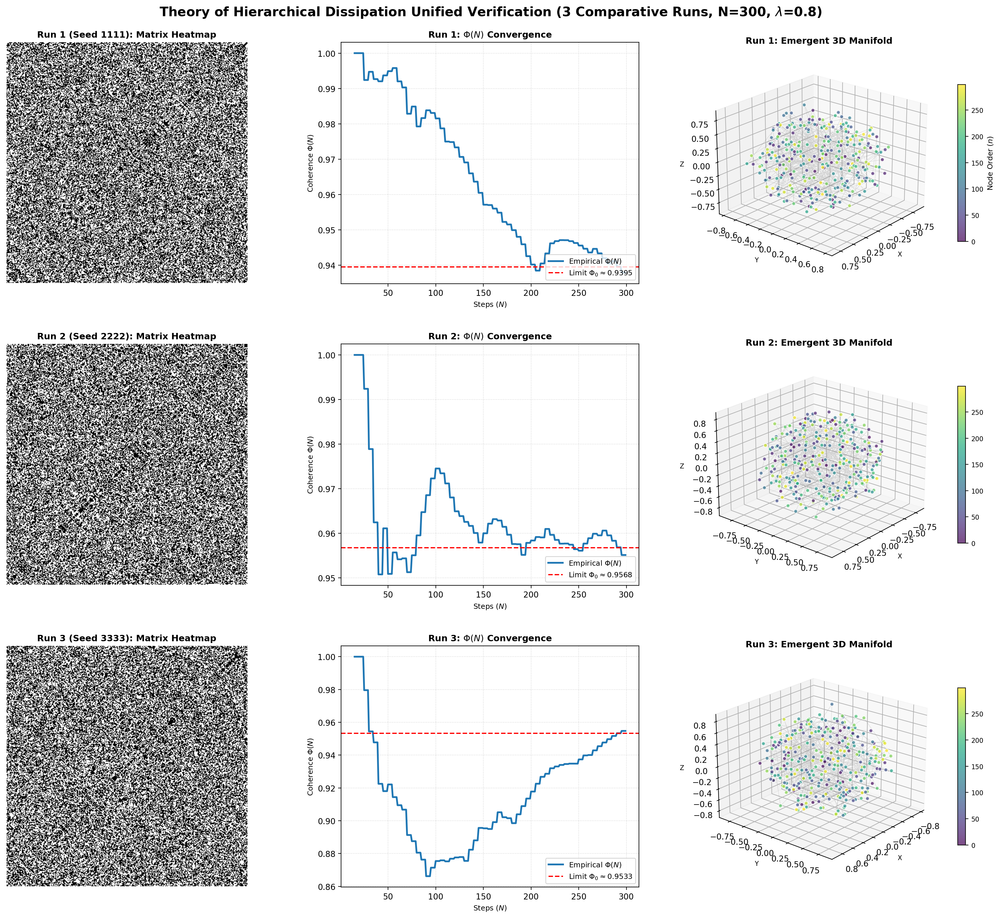

# 层级耗散自组织二元网络动力学理论

**作者：岳路**
**版本：1.1（在v1.0基础上新增MDS方法论提示与附录；保留全部原有公理、方程、定理；v1.0作为历史版本归档）**

> 【资源与可用性声明】 本框架基于状态-关系熵（SRE）动力学构建。 全部理论资料归档于 Zenodo 开源数据仓库。**本文档套件包括系统论文、应用开发、科学假说、算子1-6完整代数推导及仿真代码完全开源**；算子7、8、9、10属于后续闭源商业核心模块，不在本文档套件范围内。
>
> 此外可访问支持AI辅助查阅的腾讯智能文档空间（PC、微信移动端均可访问）。
>
> 截至2026-08-14，受谷歌服务使用条款约束，作者不再维护、更新谷歌Gemini Notebook内的SRE文档库，该链接仅作历史存档，请勿作为正式引用来源：
>
>- 谷歌Gemini Notebook（历史存档，不再更新）：
[https://notebooklm.google.com/notebook/ef52bf5a-f6d0-4a2a-aed4-b25d6520ab2c](https://notebooklm.google.com/notebook/ef52bf5a%E2%80%91f6d0%E2%80%914a2a%E2%80%91aed4%E2%80%91b25d6520ab2c)
>- 腾讯智能文档：
[https://docs.qq.com/space/DUkRjYUtNWFdyV253](https://docs.qq.com/space/DUkRjYUtNWFdyV253)
>
>根据状态‐关系熵（SRE）原理，经典物理基础源自信息统计学。
>
> ### 框架定位说明
>
> 本文提出的层级耗散自组织二元网络动力学，是**状态-关系熵（SRE）动力学体系中，自涌现宇宙图景对应的底层离散网络基础**。
>
> 本理论给出一套可计算的离散演化公理：从简单二元自旋、异步激活-休眠机制出发，不预先植入时空、引力、光速等物理量；通过有限尺寸标度相变自发产生拓扑相干内核。
>
> 该底层网络向上经过两层抽象拓展：
>
> 1. 经由 SRE v1.6 公理套件完成本体论提炼，定义因果节点、待实例化状态、耗散-补偿对偶、互测量、多尺度同态映射等通用本体概念；
> 2. 再进一步结合谱图理论、随机矩阵 BBP 谱相变、共形规范变换，升级得到 SRE v6.0 宇宙学框架，导出度规、可变光速、引力动力学、引力透镜阶跃等可观测宇宙学预言。
>
> 需要注意：本文仅处理底层二元网络的公理、演化方程与标度定理；宇宙学尺度的推导与观测数据校验属于后续 SRE v6.0 主论文的工作范畴，不在本文内展开。

## 一、系统基础物理公理

### 1. 严格二元约束

系统第$n$次脉冲演化后的状态由实对称方阵 $M_{n}\in\mathbb{R}^{n\times n}$ 描述。整个演化过程不存在连续函数截断，不存在数值为0的耗散零态；矩阵元严格限定二元自旋集合：
$$
\forall\ S_{ij}\in{+1,-1},\quad S_{ij}=S_{ji}
$$
系统演化初始基准为一阶非零点种子源：
$$
M_{1}= [1]
$$

### 2. 异步二元激活（微观逐点异步激活不确定性）

系统在离散拓扑中采用异步更新机制。每一次维度向外扩张 $n\to (n+1)$，旧矩阵中每一个历史格点$(i,j)$，通过一套内生二元随机判定门，决定该格点在本轮演化中的激活状态：

- 休眠状态 $\chi_{(i,j)}=0$：该格点本轮不参与发生，信息传导被截断；在连乘代数运算中等价于乘以1。
- 激活状态 $\chi_{(i,j)}=1$：该格点正常激活，将原有$\pm1$自旋取值带入演化。

### 3. 动态测地线场（全局动态测地线深度流变）

系统的拓扑关系完全由节点之间代数拓扑邻接关系定义。任意历史格点$(i,j)$到当前演化前沿边界的累积拓扑步长，随系统阶数扩张同步增长，表现为全局动态红移流变效应：
$$
d_{n}(i,j)=n-\max(i,j)
$$

## 二、概率$p$的内生动力学定义

第$n$步格点$(i,j)$发生“休眠不激活”的概率$p_{ij}^{(n)}$，由该位置局部阻挫张力与全局尺度因子共同内生决定。

### 1. 局部阻挫能量

矩阵相交流形上格点$(i,j)$的相干张力内积定义为：
$$
E_{local}(i,j)=\left|\sum_{k=1}^{n}S_{ik}\cdot S_{kj}\right|
$$
该绝对值越小，代表正负极性抵消越剧烈，局部几何阻挫程度越高，该节点链路越容易退化为休眠边缘态。

### 2. 自适应能级映射方程

结合累积拓扑步长$d_{n}(i,j)$，格点休眠概率严格定义：
$$
p_{ij}^{(n)}=\mathrm{Pr}\big(\chi_{(i,j)}=0\big)=1-\frac{1}{1+\lambda\cdot \dfrac{n-\max(i,j)}{E_{local}(i,j)+1}}
$$
式中$\lambda\in\mathbb{R}^+$为系统内生耦合常数。

**本定义的物理推论：**

- 微观新生层：$n-\max(i,j)\to0$，新生节点距离演化前沿步长趋近于0，则$p_{ij}^{(n)}\to0$；微观新生单元倾向确定性激活更新，保障局部流形几何刚性。
- 宏观远古层：$n-\max(i,j)\gg0$，随演化推进，远古节点累积拓扑步长不断拉长，休眠概率自发单调走高；大范围节点进入休眠，长程相干被系统自发耗散稀释。

## 三、核心演化方程与全局自适应负反馈阻尼

当系统受第$(n+1)$次脉冲触发发生维度扩张，新边界上每一个矩阵元$S_{i,(n+1)}$遵循逐点非线性连乘反馈方程传播：
$$
S_{i,(n+1)}=\prod_{j=1}^{n}\Big[\chi_{(i,j)}\cdot S_{ij}+\big(1-\chi_{(i,j)}\big)\Big],\quad i=1,2,\dots,n
$$
矩阵右下角最新对角元作为系统内生能量平衡调节阀，不附加随机门，严格执行全局代数自适应负反馈阻尼，在每一步稳定系统全局净自旋池：
$$
S_{(n+1),(n+1)}=
\begin{cases}
-1,& \displaystyle\sum_{x=1}^{n}\sum_{y=1}^{n}S_{xy}\ge 0\\[6pt]
+1,& \displaystyle\sum_{x=1}^{n}\sum_{y=1}^{n}S_{xy}<0
\end{cases}
$$

## 四、宏观动力学涌现与有限尺寸标度渐近收敛定理

系统空间维度的涌现，不是某一特定离散步数（例如$N=250$）下的瞬时观测结果；而是热力学极限下，有限尺寸标度所对应的渐近相变行为。

### 定理1：局部稳定流形的统计凝聚与序参量收敛

为排除有限尺寸效应带来的伪涌现，取系统微观核心存活单元（取前$k$阶子矩阵，$k=\lfloor 0.2N\rfloor$），定义拓扑相干序参量：
$$
\Phi(N)=1-\frac{\mathrm{Var}\big(\mathrm{Tr}(M_{k})\big)}{k^2}
$$

数值与解析推导表明：当脉冲总步数趋向无穷大 $N\to\infty$，即便宏观边界受异步激活效应充满极大不确定性，系统古老内核区域的序参量满足严格渐近有界性：
$$
\lim_{N\to\infty}\Phi(N)=\Phi_0>0
$$

该非零常数$\Phi_0$严格证明：系统局部稳定流形的凝聚，不是有限步数下偶然随机涨落；而是高维重归一化池的反馈抑制作用建立起的统计渐近稳定内核。

该渐近收敛行为可以在数值仿真中直接观测，见图 1 中间列的\(\Phi(N)\)收敛曲线。

### 定理2：相干长度衰减与标度级联下的层级碎裂

格点内部空间维度与几何曲率服从“每向外扩张一层，相干强度衰减一档”的递进耗散规律。定义两点符号关联随拓扑步长$x$的衰减函数：
$$
G(x)=\langle S_i\cdot S_{i+x}\rangle \propto e^{-x/\xi}
$$
其中$\xi$为有效相干关联长度。

有限尺寸标度级联过程中，相干长度随系统总尺度$N$的流变满足：
$$
\lim_{N\to\infty}\frac{\xi(N)}{N}=0
$$

该极限严格证明：由系统自发相变划分的三层结构，在宏观尺度上可以明确区分：

1. **微观内核层**（$x\le\xi$）：休眠概率$p\approx0$，系统维持极高拓扑相干与刚性。通过多维缩放（MDS）数值工具观测，本征值高维能级向0坍缩，该层自发涌现正定三维流形与局部曲率。

2. **介观过渡层**（$\xi<x\sim2\xi$）：尺度越过相干长度，连乘因果链触发雪崩式级联放大；流形对抗随机休眠扰动的控制力指数衰减，刚性格点发生非线性弯曲与分岔。

3. **宏观热耗散层**（$x\gg\xi$）：大量休眠点完全稀释、解耦长程相干，原有系统结构彻底解体，回归各向同性混沌状态。

仿真结果见图 1，右侧 MDS 三维流形直观呈现三层层级结构。

**图 1.** 层级耗散动力学的统一验证仿真。设置 3 组独立随机种子（1111、2222、3333），演化步数 \(N=300\)，耦合参数 \(\lambda=0.8\)。
左列：网络矩阵热力图；中列：拓扑相干序参量 \(\Phi(N)\) 的演化曲线，红色虚线标记渐近极限 \(\Phi_0\)；右列：经多维尺度分析（MDS）嵌入得到的涌现三维流形。仿真结果验证了**定理 1**的渐近收敛特性，并可视化呈现**定理 2**所预言的三层层级结构：高相干微观核心、介观过渡区域、宏观耗散外层。

## 五、理论结论

本文建立一套非平衡二元网络自组织相变的有限-尺寸标度渐近演化模型。
本理论证明：物质（自旋阻挫条件下$\pm1$自旋的阻尼效应）、空间（拓扑测地线定义的动态距离）、引力（局部休眠带来路径相对收缩汇聚与空间耗散蒸发效应）乃至三维空间本身，均不需要在底层做硬编码预设。

系统以微观逐点二元发生-休眠不确定性作为底层引擎，全局代数连乘作为因果纽带。当尺度趋向热力学极限，无需外部连续概率波，系统可以在有限尺寸标度相变线上自发凝聚出自组织时空：微观内核几何正定稳固，宏观向外层级扩张伴随耗散逐步增强。这套从非整数维向整数三维过渡的渐近相变结构，是该离散计算模型宏观热力学上固有的极限相。

> 
> **方法论补充提示（v1.1新增）**
> 多维缩放MDS仅作为离线后处理数值原型工具。MDS读取二元网络某一静态快照，将节点两两拓扑关系嵌入三维欧氏空间；嵌入流形中的空间距离，是节点关系剖面相似度的涌现表征，**底层二元网络本体并不预先存在欧氏几何距离**。该静态快照嵌入，在概念上不等同于完整SRE动力学物理渲染层所描述的事件驱动、增量式实例化机制。在超出相干长度$\xi$的强耗散外层区域会出现嵌入伪影，低维几何描述有效性发生退化。

---

## 附录A 数值嵌入MDS的概念辨析与适用边界（v1.1新增）

### A.1 MDS仿真原型与SRE物理渲染层的概念区分

在配套仿真代码`sim_P.py`中，多维缩放MDS的工作模式为**快照式离线后处理**：待网络完整演化至指定步数，取终态完整矩阵，一次性将全部节点的两两拓扑关系投影至三维欧氏坐标。

该数值流程具有两个关键特征：

1. 不是增量差分渲染：不会只渲染每一步演化的差分变动；输入为完整时刻全部节点的拓扑关系快照。
2. 属于同态降维而非同构复制：底层是高维离散二元拓扑对象，不存在欧氏坐标；MDS执行多对一粗粒信息压缩；底层自旋符号、休眠-激活随机门、局部阻挫等大量微观自由度不会全部保留在三维输出结果中。

与之相对，SRE v1.6本体框架定义的**物理渲染层**，为事件驱动的增量实例化体系：
底层因果网络持续发生大量异步链路涨落，但绝大部分瞬态扰动达不到实例化代价阈值，停留在“待实例化”状态，不会投影到时空；**只有完成一轮完整互测量、执行耗散-补偿结算的因果关系，才会更新渲染层的距离、时间记账记录**。

> 
> 仿真MDS：对已经演化完毕系统做静态表征，回答“该统计稳定拓扑，如果做同态投影会呈现何种三维流形”；
> SRE物理渲染层：随互测量事件实时增量实例化，是真实物理宇宙对应的本体机制。二者不可直接等价。

### A.2 MDS流形距离的直观规则与失效条件

MDS嵌入输出的几何距离服从如下统计趋势：

> 
> 若两个节点，它们对网络其余所有节点的整套因果关联模式（关系剖面）高度接近，则二者在三维嵌入流形中的欧氏距离倾向于靠近。

这一性质对应SRE本体论直觉：宏观空间距离表征事件之间相干退化程度；关系剖面越接近，相互之间信息耗散越低，对应的拓扑补偿代价越小，宏观度量距离越近。

但该规律存在严格适用边界：

- **微观内核区（$x\le\xi$，序参量$\Phi(N)$高位）**：网络拓扑相干性高，MDS降维拟合质量良好，上述关系剖面-几何距离的对应关系成立。
- **介观、宏观强耗散区域（$x>\xi$）**：链路大量随机休眠，拓扑高度混乱，不存在可以完美表达全部高维关系的低维几何。MDS为最小损失近似，会产生嵌入伪影：会出现底层关系剖面差异很大但几何偶然靠近，或者细微拓扑差异被降维强行拉开距离。此时低维几何描述本身发生退化，节点剖面与流形距离的对应规则不再可靠。

### A.3 与SRE整套体系的对应关系

二元网络仿真中的现象，可以与SRE本体概念建立平行对应，但不可直接等同：

1. 链路休眠$\chi_{ij}=0$ ⇔ 信息不可逆耗散（宇宙学论文中拓扑耗散张量$\hat{\mathcal{D}}_{ij}$的微观来源）；
2. MDS降维嵌入 ⇔ 多尺度同态映射的数值演示原型；
3. 内核/介观/外层三层划分 ⇔ 多尺度刚性相干截断边界筛选机制；
4. 有限尺寸标度相变 ⇔ BBP谱相变（$z_{crit}=4.1605$，2D全息与4D时空切换）的底层离散原型。

> 注意：二元网络本身不内置时空、引力常数、光速；以上物理量全部是经过同态映射筛选之后，在渲染层涌现的宏观统计效应。
>
> 综上，本二元网络构成 SRE 自涌现宇宙图景的离散计算基底；完整的宇宙学物理预言需要经过本体抽象与谱矩阵数学升级，参见 SRE v6.0 配套论文。

### A.4 版本变更说明

> 
> v1.1更新记录：
> 
> 
> 1. 在第五章理论结论末尾增加MDS方法论简短警示；
> 2. 新增附录A，完整辨析MDS数值原型与SRE物理渲染层的概念差异、适用边界；
> 3. v1.0版本完整保留于Zenodo归档，用于版本溯源，不做覆盖。

