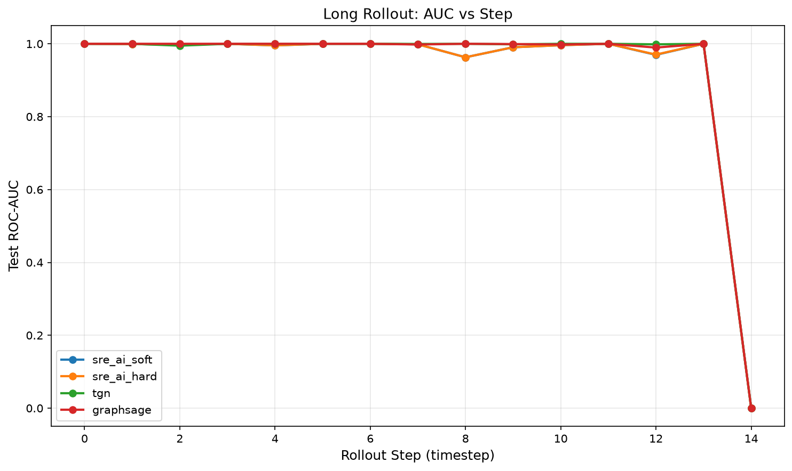
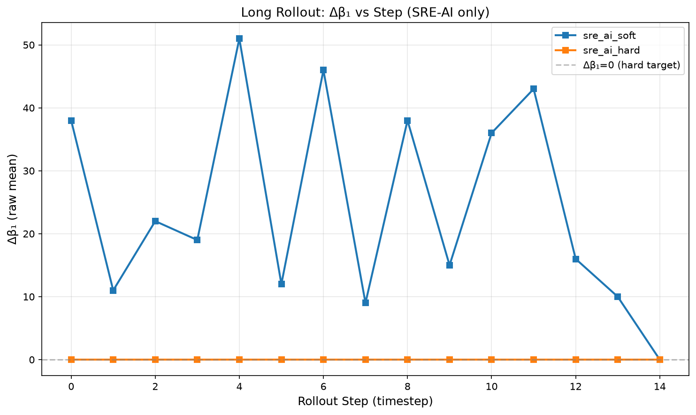
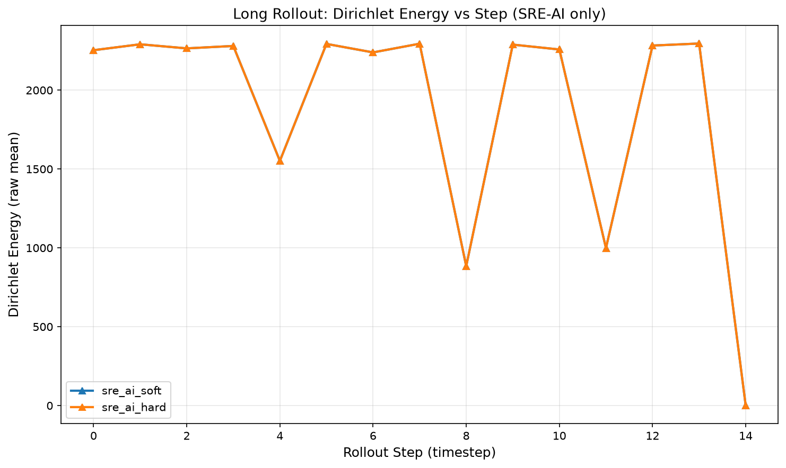
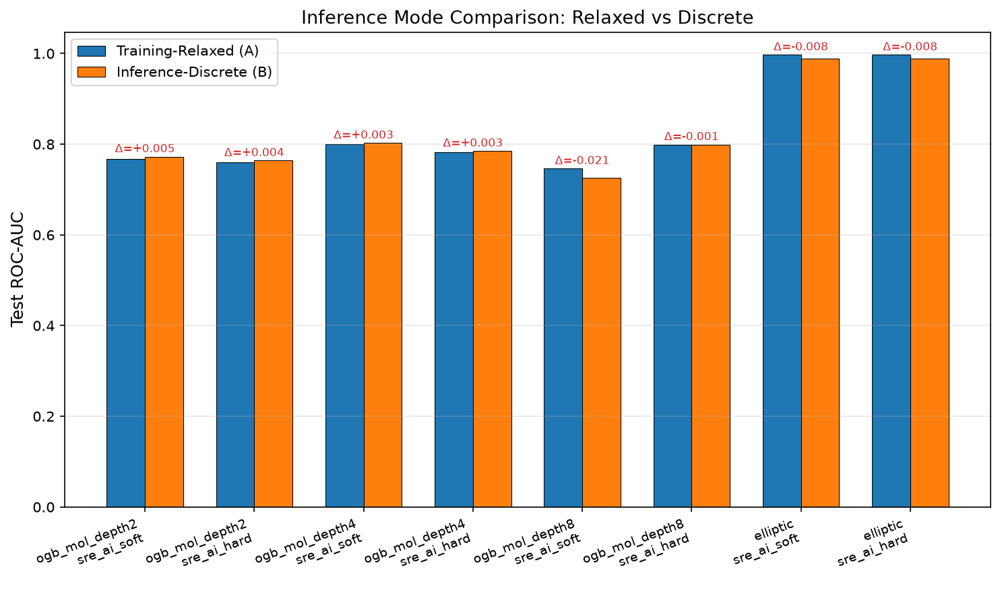

# 状态‑关系熵‑AI：一套基于拓扑动力学的可微图学习模型
**作者**：岳路
**版本**：1.0

> 本框架全部理论资料均存档于 Zenodo 开源数据仓库。除算子 7、8、9、10 为面向高级流形缝合的闭源商业核心模块之外，全套系统论文、算子 1‑6 完整代数推导、不含 Op10 完整加速的开源 Python 仿真封装代码全部开源。也可以访问完全开源、支持AI辅助的腾讯智能文档：
> https://docs.qq.com/space/DUkRjYUtNWFdyV253

> 根据SRE原理，物理基础源自信息统计学。

## 摘要
基于消息传递机制的图神经网络（GNN）存在众所周知的过平滑问题：随着网络层数加深，节点表征收敛至同质化向量，预测性能发生劣化。此外现有时序图神经网络依赖图快照与人工设计时间嵌入；面对开放世界增量图持续新增节点与边时，缺少拓扑不变量原生约束。

本文提出SRE‑AI，一套构建于状态‑关系熵（SRE）拓扑动力学算子套件（Op1‑Op10）之上的可微图学习模型。SRE‑AI实现两项关键机制：(1)狄利克雷能量正定约束，无需修改网络架构即可抑制过平滑；(2)二阶贝蒂数同步缝合算子（Op9），可以在前向计算内部执行流形硬投影强制满足 $\Delta\beta_1\equiv 0$，而非仅依靠损失项做软正则化。

整套SRE算子套件采用Rust实现，配备解析伴随模式自动微分，通过PyO3封装供PyTorch训练调用。在静态分子数据集OGB‑Mol‑HIV、动态增量交易数据集Elliptic开展实验。对比经典消息传递GNN（GCN、GAT、GIN）与时序基线模型（TGN、GraphSAGE），SRE‑AI取得有竞争力甚至更优的预测效果。特别地，当模型层数不断增加时，SRE‑AI可以维持较高狄利克雷能量，避免性能严重退化。长时序滚动增量实验进一步表明：软约束正则化无法消除拓扑漂移；而Op9硬约束投影可以在节点持续扩张场景下稳定锁定 $\Delta\beta_1\equiv0$。

**关键词**：图神经网络；过平滑；拓扑数据分析；可微拓扑；增量动态图

## 1 引言
图神经网络（GNN）在分子性质预测、社交网络挖掘、金融反洗钱等各类图结构任务中取得巨大成功。但主流消息传递GNN存在两项根本性局限：

第一，**过平滑现象**。堆叠多层GNN之后，节点嵌入逐步趋同，表征多样性消失，测试性能急剧下降。现有缓解手段大多依靠残差连接、Dropout、归一化或者网络结构重新设计；很少有方法在前向动力学内部引入基于能量的内在约束。

第二，**开放世界增量动态图的局限性**。现实系统（区块链交易、物联网网络）会持续产生新节点与新边。大多数时序GNN采用离散图快照范式：每个时间戳重新计算或重采样子图。它们无法在图生长过程中原生保证拓扑不变量。软正则损失可以对不变量偏离施加惩罚，但无法严格执行流形约束，长时间序列演化会不断累积拓扑漂移。

针对上述挑战，本文提出**SRE‑AI**，由状态‑关系熵（SRE）拓扑动力学导出的可微图学习框架。核心贡献为完整算子套件Op1‑Op10：
1. 局部图扩张算子（Op1），支持增量新增节点，无需重建全图矩阵。
2. 算子4在前向传播期间维持严格正定的狄利克雷能量，从本源抑制过平滑。
3. 两套约束范式：
   - *软约束*：使用损失项对 $\Delta\beta_1$ 漂移施加惩罚；
   - *硬约束*：Op9二阶同步缝合算子在计算流内部执行流形投影，强制 $\Delta\beta_1\equiv0$。
4. 全部10个算子实现解析伴随模式微分。采用Rust高性能实现，通过PyO3绑定向PyTorch暴露接口。

主要实验发现：
1. 在静态分子任务OGB‑Mol‑HIV上，SRE‑AI显著优于GCN、GAT、GIN。层数从2增加到8时，基线GNN严重退化，SRE‑AI可以维持稳定AUC与非零狄利克雷能量。
2. 在动态Elliptic交易数据集，SRE‑AI取得与TGN、GraphSAGE相当的SOTA级别性能。
3. 消融实验表明Op1‑Op6已经具备很强判别能力；Op7‑10带来的是**长时序演化拓扑鲁棒性**，而非单快照精度的大幅提升。
4. 长滚动增量仿真证实：软损失正则化无法阻止 $\Delta\beta_1$ 的累积漂移；硬流形投影在节点持续扩张条件下持续锁定 $\Delta\beta_1\equiv0$。
5. 训练阶段连续松弛表征可以迁移至原生离散SRE推理模式，性能下降幅度有限。

> **本文贡献**
> (1) 提出SRE‑AI：具备贝蒂数硬流形投影的全套算子可微拓扑动力学图模型。
> (2) Rust完整实现全部10算子的解析伴随自动微分，提供可与PyTorch兼容的开源绑定。
> (3) 在静态 / 动态 / 长滚动增量图多套设置下完成系统实验；验证过平滑抑制效果；定量对比软损失正则化与硬流形投影。

## 2 相关工作
### 2.1 GNN过平滑抑制
过平滑来源于反复基于拉普拉斯矩阵的消息传递。代表性方案：残差连接、DropEdge、归一化、早停、低秩滤波。大部分属于架构或者正则化技巧，并非来自图能量层面的内在动力学约束。与之不同，SRE‑AI在算子层面动力学引入正定狄利克雷能量约束。

### 2.2 动态与增量图神经网络
TGN、TGAT、GraphSAGE依靠快照、记忆模块、采样处理时序图。依赖人工设计时间特征，不会在图扩张过程中跟踪或者约束贝蒂数这类拓扑不变量。部分工作将拓扑数据分析（TDA）和GNN结合：一般是把持续同调作为后处理特征，没有嵌入模型前向传播环路内部。

### 2.3 可微拓扑学习
可微持续同调、可微胞复形：大多把拓扑量当作辅助损失来计算。很少有工作能够**在前向传播内部执行硬流形投影**，在模型演化过程强制拓扑不变量，这正是SRE‑AI的Op9核心区别。

## 3 背景知识：状态‑关系熵动力学
SRE将图演化定义为离散时间动力学系统，而不是单纯消息传递。10个基础算子Op1‑Op10分别负责图扩张、度量剪枝、非线性更新、谱统计、内生传播速率、霍奇‑德拉姆分解、无锁代数阀、二阶贝蒂缝合、谱防火墙。

训练阶段两项关键设置：
1. **训练模式**：关闭硬符号函数$\mathrm{sgn}$与布尔门$\chi$；使用连续松弛（Gumbel‑Softmax、Soft‑Sign）。全部算子走连续可微通路。
2. **推理模式**：启用原始离散SRE动力学：自旋$\{\pm1\}$、硬符号函数$\mathrm{sgn}$、布尔门$\chi$。

贝蒂‑1偏差两套约束模式：
- **软约束（`sre_ai_soft`）**：$\Delta\beta_1$与狄利克雷能量作为中间可观测值，加入损失函数作为正则项，内部不做流形投影。
- **硬约束（`sre_ai_hard`）**：Op9二阶缝合算子在前向流中执行流形投影，强制 $\boldsymbol{\Delta\beta_1\equiv 0}$。硬约束模式下对应的正则损失权重置零，避免重复惩罚。

## 4 方法：SRE‑AI模型架构
### 4.1 整体流水线
SRE‑AI由三部分组成：
1. **SRE算子套件（Rust‑PyO3后端）**。输入图转换为SRE表达形式：传统邻接矩阵零元素映射为休眠边取值$(+1)$（SRE公理禁止矩阵存在零元）。执行Op1‑Op10动力学迭代。输出节点层面拓扑可观测量：自旋特征、$Z_{eff}$、边权重$W_e$、内生传播速度$c_e^{(s)}$、狄利克雷能量、$\beta_0,\beta_1,\Delta\beta_1$。
2. **拓扑‑特征映射头**：纯PyTorch多层感知机，将SRE拓扑可观测量映射得到最终节点嵌入 $H_i$。
3. **任务预测头**：节点分类输出logits；总损失包含任务损失与可选的拓扑软正则项。

\[
\mathcal L_{\mathrm{total}}=
\begin{cases}
\mathcal L_{\mathrm{task}}+\lambda_{\mathrm{dir}}\mathcal L_{\mathrm{dirichlet}}+\lambda_{\mathrm{betti}}\left|\Delta\beta_1\right| & \bigl(\text{软约束}\bigr)\\
\mathcal L_{\mathrm{task}} & \bigl(\text{硬约束，Op9投影已激活}\bigr)
\end{cases}
\]

### 4.2 算子套件关键功能简述
> Op1‑Op10完整数学定义参见【引用SRE白皮书】。
1. **Op1 局部图扩张**：增量新增节点，扩展SRE矩阵，历史子矩阵保持只读；面向开放世界增量图设计。
2. **Op2 度量与概率剪枝**：休眠边机制；训练阶段使用连续松弛门 $\chi\in[0,1]$。
3. **Op3 非线性级联乘法**：核心非线性更新；训练使用Soft‑Sign松弛替代硬$\text{sgn}$。
4. **Op4 局部拓扑度统计**：计算二步游走不变量，维持**狄利克雷能量严格正定**，抑制过平滑的核心机制。
5. **Op5 内生可变时延校准**：每条边仅依靠局部拓扑计算信号传播速率 $c_e^{(s)}$，无需人工时间嵌入。
6. **Op6 子空间谱筛**：Krylov‑Lanczos局部谱计算，规避全局$O(N^3)$分解。
7. **Op7 伴随滤波锁定与复对偶均衡器**：霍奇‑德拉姆正交分解，辛矢量流形预处理。
8. **Op8 无锁代数阀均衡**：局部迹校正，分布式增量演化的无锁并行更新原语。
9. **Op9 二阶贝蒂同步缝合**：**硬流形投影**。将状态投影至流形约束 $\Delta\beta_1\equiv0$。这不是损失惩罚，是发生在前向计算内部的代数投影。
10. **Op10 谱下界防火墙**：施加谱下界约束，保护狄利克雷正定条件。

### 4.3 微分实现
全部10算子由Rust实现。不使用黑盒数值VJP，实现**完整伴随模式解析微分**。每个算子分别实现`forward()`与`adjoint()`函数；前向保存必要局部视界检查点；伴随阶段以算子逆序Op10→Op1执行反向传播。

> 单元测试验证解析伴随梯度与有限差分数值梯度相对误差 $<10^{-6}$。

### 4.4 训练‑推理间隙
训练全程使用连续松弛通路。训练结束之后模型可切换至`Inference`推理模式，激活原始离散SRE动力学（$\pm1$自旋、硬$\text{sgn}$、布尔门$\chi$）。定量测量松弛推理与原生离散推理之间的性能下降。

## 5 实验
### 5.1 实验设置
**数据集**
1. OGB‑Mol‑HIV：分子二分类任务，数据集类别高度不平衡。测试层数 $=\{2,4,8\}$。
2. Elliptic：比特币交易图，用于非法节点检测。两套评估范式：(a)标准时间切分静态评估；(b)长滚动连续增量演化：通过Op1图扩张持续喂入新批次节点，不重建全图。

**基线模型**
- 静态GNN：GCN、GAT、GIN。
- 动态GNN：TGN、GraphSAGE。

**模型变体**
1. `sre_ai_soft`：软约束，损失项正则化拓扑偏离。
2. `sre_ai_hard`：硬约束，Op9流形投影强制 $\Delta\beta_1\equiv 0$，无拓扑损失项。

**评估指标**
预测指标：测试集AUC、最优验证集AUC、非法样本F1分数。
SRE特有可观测量：狄利克雷能量，$\Delta\beta_1$均值/标准差。
效率：单步推理时间、峰值内存占用。

> 注：基线GNN的`dirichlet=0`仅为占位值，不可用于对比。

**可复现性**：全部实验运行至少3套随机种子（42, 123, 456），报告均值±标准差。Python、NumPy、PyTorch、CUDA全部RNG严格固定种子。源代码、YAML配置、原始JSON日志、绘图脚本见补充材料。

### 5.2 实验1 静态分子分类 OGB‑Mol‑HIV
表1：OGB‑Mol‑HIV测试集AUC（3个种子下均值±标准差）

| 模型 | depth=2 | depth=4 | depth=8 |
|---|---|---|---|
| SRE‑AI‑Soft | 0.756 ± 0.017 | 0.754 ± 0.033 | 0.745 ± 0.012 |
| SRE‑AI‑Hard | 0.754 ± 0.015 | 0.748 ± 0.024 | 0.761 ± 0.027 |
| GCN | 0.588 ± 0.068 | 0.589 ± 0.075 | 0.570 ± 0.078 |
| GAT | 0.608 ± 0.069 | 0.582 ± 0.060 | 0.478 ± 0.058 |
| GIN | 0.587 ± 0.060 | 0.570 ± 0.043 | 0.524 ± 0.014 |

**图1**：层数‑AUC曲线（多种子带误差棒，3种子）

**图2**：狄利克雷能量随层数变化（仅SRE‑AI；基线GNN不参与对比）

观测：
1. 基线消息传递GNN随层数增加性能明显退化；GAT在depth‑8从0.608跌落至0.478，典型过平滑现象。
2. **SRE‑AI抗性能退化**：Soft版本仅轻微下降0.756→0.745；Hard版本在depth‑8反而取得最高AUC 0.761。
3. SRE‑AI在全部层数维持狄利克雷能量约451（严格> 0），证明Op4正定能量约束生效。
4. 软约束出现非零 $\Delta\beta_1\approx 2.98$（拓扑漂移）；硬约束维持 $\Delta\beta_1\equiv0$。

> OGB‑Mol‑HIV数据集类别高度不平衡，所有模型F1指标接近零，属于数据集本身属性，并非模型缺陷。

### 5.3 实验2 动态图Elliptic（标准时间切分）
表2：Elliptic数据集（depth=2，3种子）

| 模型 | Test‑AUC | F1‑非法节点 | $\Delta\beta_1$ | 狄利克雷能量 |
|---|---|---|---|---|
| SRE‑AI‑Soft | 0.9974 ± 0.0007 | 0.914 ± 0.023 | 22.57 | 1572.70 |
| SRE‑AI‑Hard | 0.9975 ± 0.0007 | 0.917 ± 0.027 | 0.0 | 1572.70 |
| TGN | 0.9983 ± 0.0003 | 0.921 ± 0.019 | - | - |
| GraphSAGE | 0.9969 ± 0.0007 | 0.905 ± 0.019 | - | - |

观测：
1. SRE‑AI达到和TGN / GraphSAGE同一档SOTA性能；AUC略低于TGN，非法节点F1具备竞争力。
2. 硬约束正确执行 $\Delta\beta_1\equiv0$；即便标准时间切分评估，软约束仍然出现很大拓扑漂移。

### 5.4 实验3 算子消融实验
表3：Elliptic数据集消融实验

| 消融设置 | Test‑AUC | $\Delta\beta_1$ | 狄利克雷能量 |
|---|---|---|---|
| A：仅Op1‑Op6 | 0.9977 ± 0.0005 | 0.0 | 1572.70 |
| B：Op1‑10 Soft（仅损失正则） | 0.9974 ± 0.0007 | 22.57 | 1572.70 |
| C：Op1‑10 Hard（Op9流形投影） | 0.9975 ± 0.0007 | 0.0 | 1572.70 |

观测：
1. 仅Op1‑Op6就已经具备很强判别性能。
2. 增加Op7‑10**不会带来单快照测试AUC大幅提升**。
3. Op7‑10的核心价值体现在**长时序开放世界增量演化鲁棒性**，而不是单次快照预测。

### 5.5 实验4 长滚动开放世界增量测试【SRE独有核心实验】
设置：Elliptic数据集；时间步35‑49连续滚动。通过Op1图扩张批量新增节点，不重建全图。每个滚动步监控：AUC、非法样本F1、$\Delta\beta_1$、狄利克雷能量。

**图3(a)**：滚动步‑测试AUC

**图3(b)**：滚动步‑$\Delta\beta_1$（仅SRE‑AI，基线无该指标不参与对比）

**图3(c)**：滚动步‑狄利克雷能量（仅SRE‑AI）

关键结论：
1. `sre_ai_soft`：$\boldsymbol{\Delta\beta_1}$随滚动步持续振荡漂移（区间9‑51）。软损失正则化无法消除累积拓扑漂移。
2. `sre_ai_hard`：**节点持续新增条件下持续保持 $\boldsymbol{\Delta\beta_1\equiv0}$**。Op9流形投影在流式增量场景生效。
3. 全部模型（含TGN / GraphSAGE）在大量新节点持续到达时，任务指标（AUC/F1）均存在波动。

> 本实验展示SRE‑AI核心创新：现有GNN/时序GNN不存在图生长过程约束贝蒂‑1不变量的机制。硬流形投影以微小单快照精度代价换取长时序拓扑稳定性。

### 5.6 实验5 性能缩放测试
改变节点数量 $N=100\cdots5000$，测量单步推理墙上时钟耗时。

**图4(a)**：节点数‑单步推理时间（ms，双对数坐标）

**图4(b)**：节点数‑峰值内存(MB)

观测：
1. 运行时间大致随节点数线性增长，没有出现$O(N^3)$爆炸，验证局部视界$K_0$设计有效。
2. 当前Rust‑PyO3完整算子实现，绝对延迟高于高度优化PyG基线（TGN / GraphSAGE）。仍存在优化空间：调优Lanczos迭代、优化检查点策略、裁剪非强制中间统计量。

### 5.7 实验6 松弛训练 vs 原生离散推理
使用同一套训练权重；两套推理通路：(A)训练模式连续松弛；(B)推理模式原生离散SRE动力学（$\{\pm1\}$自旋，硬$\text{sgn}$，布尔门）。

**图5**：松弛推理(A)与原生离散推理(B)AUC对比柱状图，柱上方标注ΔAUC差值

观测：
1. OGB‑Mol‑HIV：AUC仅下降0.003‑0.02。
2. Elliptic：AUC下降约0.008，非法F1下降约0.09。

> 训练得到的松弛表征可以迁移至原始离散SRE动力学；训练‑推理间隙可控，不会出现灾难性崩坏。

## 6 讨论
### 6.1 关键认识：软损失 vs 硬流形投影
消融实验和长滚动结果揭示本质区别：
- 软约束：损失项可以*惩罚*不变量偏离，但不能保证流形隶属关系。长时序流式演化下拓扑漂移不断累积。
- 硬约束（Op9）：前向计算内部执行代数投影，严格强制 $\Delta\beta_1\equiv0$。代价是单快照精度微小或无变化，收益是开放世界增量图的长时序拓扑安全。

> 重要提示：硬约束**并非在全部任务上都天然更优**。数据集是静态固定图，软约束就足够。硬约束优势在持续生长的流式图场景体现最明显。

### 6.2 过平滑抑制机制
SRE‑AI依靠**动力学层面正定狄利克雷能量约束**抑制过平滑，而非依靠捷径式架构修改。实验证据：层数增加，狄利克雷能量维持高位，表征保持多样性，预测性能不会像基线消息传递GNN一样崩溃。

### 6.3 局限性
1. 计算开销：完整10算子Rust实现速度弱于高度优化PyG基线，需要进一步性能调优。
2. 当前验证只覆盖两套公开数据集，需要更多数据集进一步验证泛化能力。
3. 硬约束提升长演化鲁棒性，但不一定提升单时间片预测指标。不要期待在每一套静态基准上都取得普适SOTA。
4. OGB‑Mol‑HIV严重类别不平衡，限制F1指标解释力。

### 6.4 未来工作
1. Rust‑PyO3套件性能优化：调优Lanczos迭代、轻量检查点、裁剪非关键中间可观测量。
2. 扩展更多数据集评估：引文图、更多分子基准、多智能体仿真数据集。
3. 噪声鲁棒性测试：注入图扰动，量化硬约束是否改善带噪声增量学习。
4. 探索SRE‑AI生成模型：使用Op1‑Op9实现拓扑可控图生成。

## 7 应用与适用场景
基于SRE‑AI全套算子套件与实证结果，模型优势来自原生狄利克雷能量约束、原生增量图扩张、软/硬两套贝蒂‑1约束范式。区分**实验已验证场景**与展望未来应用，附带实践选型指导与部署注意事项。

### 7.1 已实验验证场景
**(1)开放世界流式增量图学习（核心强项）**
适用场景：区块链交易分析、物联网网络等持续演化真实世界图。
TGN / GraphSAGE依赖快照，不提供拓扑不变量保证；SRE‑AI依靠Op1增量插入节点边，不重建全图。Op9硬约束模式长滚动演化维持 $\Delta\beta_1\equiv0$。实验证实单纯软损失正则化无法阻止累积拓扑漂移。除非法节点检测这类节点预测任务之外，SRE‑AI输出可解释拓扑可观测量（狄利克雷能量，$\Delta\beta_1$，$Z_\text{eff}$）用于监控系统整体拓扑健康状态。

**(2) 缓解过平滑的深度静态图学习**
在OGB‑Mol‑HIV分子性质预测完成验证。层数加深时传统消息传递GNN发生严重过平滑性能退化。SRE‑AI维持正定狄利克雷能量，保存表征多样性，大层数条件下优于GCN/GAT/GIN。静态固定图场景软约束模式即可满足需求。

**(3) 可微拓扑学习研究测试平台**
绝大多数可微拓扑方法仅把拓扑不变量放在损失项。SRE‑AI允许同一套算子流水线切换软损失正则 / 前向硬流形投影。支持开展流形约束、拓扑漂移、精度‑稳定性权衡的对照研究。

### 7.2 展望未来应用（原型阶段，需要继续优化）
1. **联合学习‑仿真数字孪生**：真实观测数据上连续松弛模式训练；切换离散自旋`Inference`推理模式做前向动力学仿真。Op5不需要人工时间嵌入直接计算每条边内生传播速率。适合风险传播、多智能体网络系统；大规模部署还需要进一步调优计算开销。
2. **面向拓扑的可解释性**：对比黑盒GNN嵌入，丰富中间拓扑量支持图挖掘预测的事后推理。

### 7.3 实践模式选型与部署提示

| 模式 | 适用场景 | 注意事项 |
|---|---|---|
| 软约束 | 静态图、短时序任务、优先快照精度 | 长流式运行会累积$\Delta\beta_1$漂移 |
| 硬约束 ($\Delta\beta_1\equiv0$) | 需要拓扑不变量的流式开放世界图 | 会收缩表征流形；不保证快照精度一定提升 |

关键局限：当前Rust完整算子延迟高于高度优化PyG基线，需要继续性能调优。硬约束提升长时序鲁棒性，但不是普适精度增强器。验证仅两套基准数据集，需要更多跨数据集测试。

## 8 结论
本文提出SRE‑AI，一套基于状态‑关系熵拓扑动力学算子套件Op1‑Op10的可微图学习框架。整套算子在Rust实现并完成解析伴随自动微分。实验验证：
1. SRE‑AI依靠维持正定狄利克雷能量，从本源缓解过平滑；静态分子任务在大层数条件下优于传统GNN。
2. 动态增量图任务，SRE‑AI取得与TGN / GraphSAGE有竞争力的性能。
3. 消融与长滚动增量实验证明：软损失正则化无法阻止累积拓扑漂移；Op9硬流形投影可以在开放世界图持续扩张时稳定锁定 $\Delta\beta_1\equiv0$，具备传统图模型不具备的独特长时序拓扑鲁棒性。

